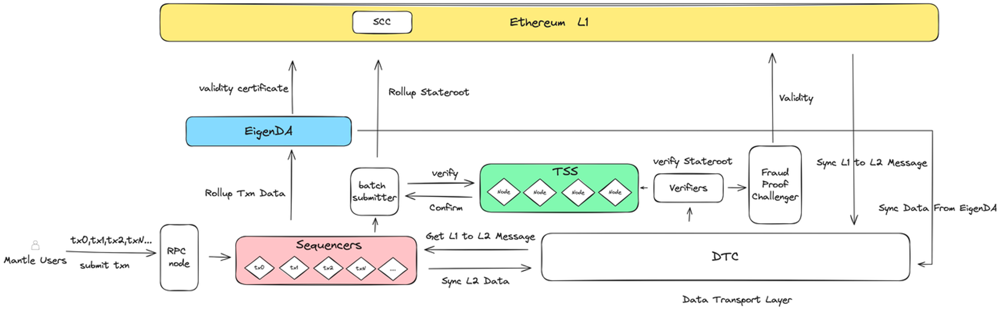

# Content/内容

### 目标

本节的目标是总结 Mantle 的架构设计。

### **EigenDA（Mantle DA）**

Alice 在 Mantle 区块链上的转账之旅已经完成，过程展示了 Mantle 架构的高效和安全性。她的交易被 Sequencers 处理并打包，通过数据传输层（DTL）在网络中传播。交易状态通过阈值签名方案（TSS）验证，然后由 Batch Submitter 提交到 State Commitment Chain（SCC）智能合约，确保 Layer 1 上的记录。同时，EigenDA 存储了完整的交易数据，保持数据可访问和可验证。最后，Verifier Node 作为一个额外的安全层，确保整个网络的数据完整性和正确性。
Alice 的 Mantle 转账之旅展示了 Mantle 如何在保证交易速度和降低成本的同时，确保交易的安全性和透明度。

下面列出更详细的交互过程，方便我们更好地理解每个模块的工作原理：

1. Mantle Users：用户通过 RPC 节点提交交易。
2. Sequencers：节点接收了用户的交易后，Sequencers 负责将它们打包成区块。这些区块包含了所有交易的数据，包括交易的具体信息，比如交易双方的地址、转账金额、智能合约调用的数据等。
3. 数据传输层（DTL Service）：该服务负责同步由 Sequencers 创建的区块数据。一旦 Sequencers 创建好了区块，DTL 就会从 Sequencers 那里获取这些新创建的区块数据，并将它们同步到整个 Layer 2 网络的其他组件中。
4. Verifier Node：Verifier Node 从 DTL 同步 Layer 2 的区块数据，并负责检查数据的有效性。它负责验证 Sequencers 提交的每个交易块的 Stateroot，确保它与已知的正确状态匹配。这是通过与 Layer 1 的数据进行对比来完成的，确保 L2 的数据准确无误。
5. Batch Submitter：此组件收集更新的 StateRoot，并将它们发送到阈值签名方案（TSS）模块。一旦 TSS 节点确定更新的 StateRoot 是有效的，Batch Submitter 就会将 StateRoot 的签名数据发布到 L1 上的 SCC 合约。
6. 阈值签名方案（TSS）模块：该模块内的节点验证 Batch Submitter 提供的 StateRoot。如果验证为有效，它们就对 rollup batches 进行签名。
7. SCC（State Commitment Chain）：SCC 是一个部署在 Layer 1 上的智能合约，它接收来自 Batch Submitter 的已签名 StateRoot ，并将其记录在以太坊主链上。
    - 可以把 SCC 简单理解为 Layer 2 到 Layer 1 的桥梁，任何人都可以通过检查 Layer 1 上的 SCC 合约来验证 Layer 2 的状态更新是否已被正确地记录。
    - 如果 Layer 2 上的数据有任何被质疑的情况，SCC 上的信息可以用于验证和解决争议。
8. EigenDA（Mantle DA）：这是存储 rollup 交易数据的地方，确保数据完整性和可访问性。
9. Verifiers and Fraud Proof：Verifiers 还可以随时从 Mantle DA 提取数据来检查其有效性，如果他们发现问题，那么 Verifiers 可以通过提交 Fraud Proof 来挑战它。
    - Challenges：为了解决这个挑战，这个 Fraud Proof 包含的 Layer 2 数据（可能是引发争议的交易和状态更新）会被发布到 Layer 1 网络；
    - Verify：Layer 1 的智能合约将使用这些数据来执行状态转换，如果状态转换验证失败，说明 Layer 2 的更新确实有误。这样的机制提供了一种方法来纠正Layer 2 上的错误，确保整个网络的正确性。

### **总结**

通过探索 Alice 在 Mantle 区块链上的转账过程，我们不仅深入理解了 Mantle 的高效和安全性，还看到了如何在保持交易速度和降低成本的同时，确保交易的安全性和透明度。

非常感谢您参与并完成本次关于 Mantle 的课程。我们衷心希望这次深入学习 Mantle 的旅程不仅为您提供了有价值的区块链知识，而且能够激发您对区块链技术的持续兴趣。
区块链作为一个不断发展和变革的领域，充满了新的挑战和机遇。我们希望您能够保持好奇心、继续探索，期待在未来的学习之旅中再次与您相遇！