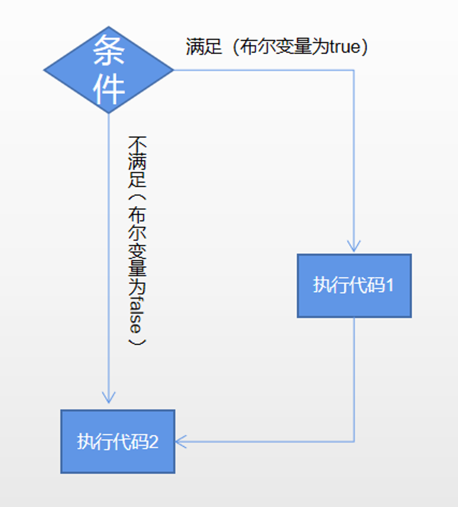

# Content/概念

### Concept

在上一课中，我们学习了 *变量*以及最基础的变量类型int,uint。*变量*有三个属性：名称、类型和值。在本课中，我们将学习另外一个变量类型，布尔变量。

*布尔变量*（也称为 `bool`）只有两个值：*true* 或 *false，*通常用于判断。

- 比喻
    
    你可以把*布尔变量*当作开关，它可以是开启（对应*true*）或关闭（对应*false*）的状态。
    
- 真实用例
    
    在ERC20的[approve](https://github.com/OpenZeppelin/openzeppelin-contracts/blob/8186c07a83c09046c6fbaa90a035ee47e4d7d785/contracts/token/ERC20/ERC20.sol#L340-L351)授权函数中，需要一个bool类型的变量emitEvent来表示此次授权是否需要提交事件(emit event)
    
    ```solidity
    function _approve(address owner, address spender, uint256 value, bool emitEvent) internal virtual {
        ...
        if (emitEvent) {
            emit Approval(owner, spender, value);
        }
    }
    ```
    

### Documentation

使用bool关键字定义布尔变量

```solidity
bool a = true;
bool b = false;
```

### FAQ

- 什么时候使用*布尔变量*？
    
    在编程中，*布尔变量*通常用于控制程序的流程。
    
    例如，如果你需要让某个代码段在**特定条件**才能运行，可以使用一个*布尔变量*来表示该条件是否已经满足。
    
    如果*布尔变量*是 *true*，则代码将运行，但如果为 *false*，则代码将跳过该部分并继续执行下一个。
    
    

# Example/示例代码

```solidity
pragma solidity ^0.8.7;

contract Book {
    bool a = true;
    bool b = false;
    //逻辑非
    bool c = !a; // 此处c为false，我们对a的值进行了逻辑非操作，并将其赋值给 c
    bool d = !c; // 同理，d此处为true

    //与运算
    bool e = d && a; // e 为 true，因为 d 和 a 都是 true
    bool f = e && b; // f 不会是 true，因为 b 不是 true
    bool g = e && true; // g 为 true

    //或运算
    bool h = true || false; // h 为 true
    bool i = false || true; // i 为 true
    bool j = false || false; // j 为 false

    //另一个常见的操作是 ==，它将在两个值相等时返回 true ，否则返回 false 。
    bool k = a == true; // k = true，其实就相当于：bool k = (a == true)

    //最后，我们还需要不等操作 !=，它将在两个值不同时返回 true ，否则返回 false 。
    bool l = a != true; // j为false，因为 a 是 true
}
```
