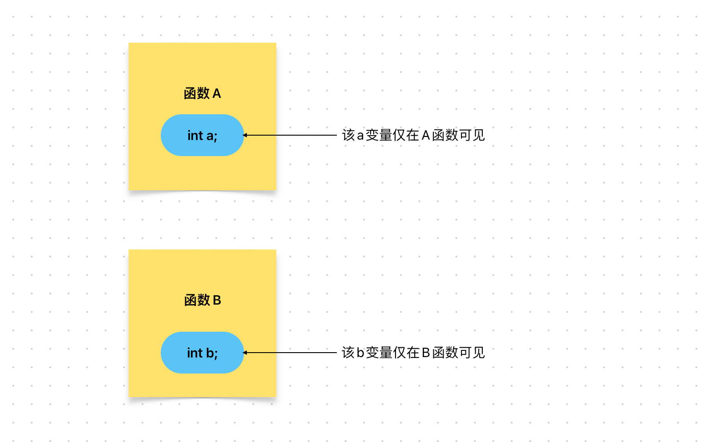

# Content/概念

### Concept

在上一节，我们学习了*状态变量*。这节我们继续将学习局部变量。

- 比喻
    
    上一节中我们提到如果合约代表一个学校，那么状态变量就相当于学校的信息，该信息将公开在区块链上，并共学校内所有人维护。
    
    那么局部变量就相当于班级信息，每个班级只能够知道自己班级的信息以及学校的信息。而不能获取其他班级（函数）的班级信息（局部变量）
    
- 真实用例
    
    在ERC20的[***approve***](https://github.com/OpenZeppelin/openzeppelin-contracts/blob/1523a4f071f101d4bcbffcd4b87dd1b03080ec26/contracts/token/ERC20/ERC20.sol#L141-L144)函数中就使用了局部变量***owner***来记录调用者地址，这就是只属于这个函数的变量（信息）。
    
    ```solidity
    function approve(address spender, uint256 value) public virtual returns (bool) {
        address owner = _msgSender();
        _approve(owner, spender, value);
        return true;
    }
    ```
    

### Documentation

要定义一个 局部变量，需要将其定义在函数内部。

```solidity
contract ContractName {
	function example() public {
	    int a;//局部变量
			a = 3;
	}
}
```

### FAQ

- 什么是局部变量？
    
    *局部变量*是在函数内部声明的变量，其作用域仅限于该函数内部。
    
    
    
- 不同函数之间的局部变量可以被查询吗？
    
    不能
    
    例如，在下段代码会报错，因为*函数**B***无法访问*函数**A***中的*局部变量**a***。
    
    ```solidity
    contract MyContract {
        function A() public {
            int a;  //局部变量
        }
    		function B() public {
            a += 1;  //报错
        }
    }
    ```
    
    使用局部变量可以在程序执行期间暂时存储数据，并且在不需要该数据时释放内存。
    
    例如，在制作蛋糕时需要许多不同的材料，例如面粉、鸡蛋、糖等。在制作蛋糕的过程中，这些材料被视为局部变量，因为它们仅在蛋糕制作的过程中使用，蛋糕制作完成后就被消耗（消失）了。

# Example/示例代码

```solidity
pragma solidity ^0.8.0;

contract Example {
	uint c;  // 状态变量
	function getResult() public returns(uint){
	  uint a = 1; // 局部变量
	  uint b = 2; // 局部变量
	  uint result = a + b;
		c = result; 
	  return result; //返回局部变量
	}
}
```
