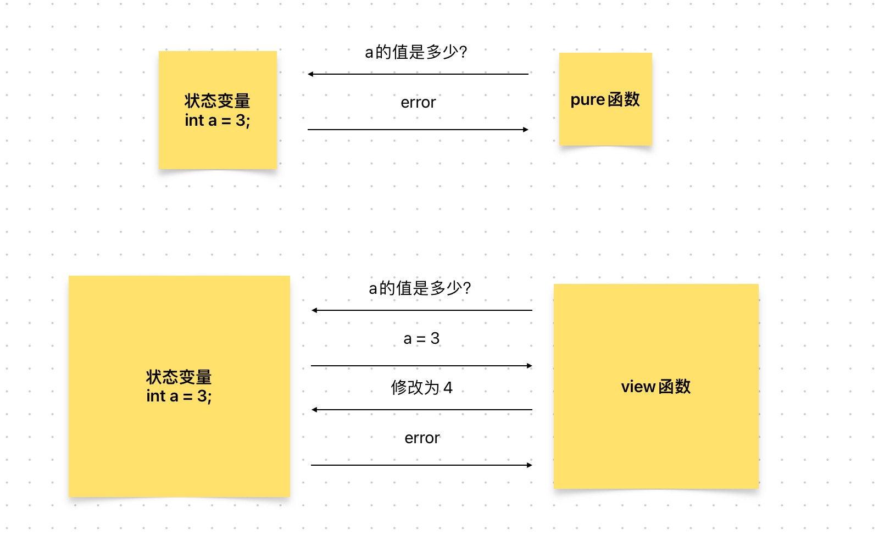

# Content/概念

### Concept

上一节中我们学习了*pure*函数，现在我们将介绍另一种函数：view（视图）函数。

- 比喻
    
    我们之前提到*pure*函数就像计算器，那么view函数就像只具有“读”权限的数据库，它既可以使用参数进行计算，也可以在数据库中查找数据进行运算。
    
    而**其他函数**就像是同时具有“读写”权限的数据库，它可以将计算后的结果重新写入数据库当中。
    
- 真实用例
    
    在ERC20合约中，***[totalSupply](https://github.com/OpenZeppelin/openzeppelin-contracts/blob/9ef69c03d13230aeff24d91cb54c9d24c4de7c8b/contracts/token/ERC20/ERC20.sol#L99)***函数用于返回该代币的发行总量。由于它访问了状态变量***_totalSupply***，因此不能用`pure`，而使用`view`。
    
    ```solidity
    function totalSupply() public view virtual returns (uint256) {
        return _totalSupply;
    }
    ```
    

### Documentation

要定义一个view函数，我们使用关键字`view`。

```solidity
function add() public view {
	//function body 
}
```

### FAQ

- pure函数 vs view函数
    
    view函数不会修改状态变量，但可能使用（读取）状态变量，而pure函数甚至不会读取状态变量。
    
    
    
    <aside>
    💡 如果一个函数是*pure*函数，则同时它也是一个*view*函数。
    
    </aside>
    
- 能更详细的讲一讲什么是view函数吗？
    
    一个*view*函数可以读取状态变量，但不能修改它。
    
    例如，假设你想知道你银行账户的余额，你会向银行发送一个查询请求，并等待收到响应。在这个过程中，你只是读取了你的账户余额信息，但没有修改它。
    
    如果某个函数告诉你某些信息，但不对区块链进行任何更改，那么它就是一个*view*函数。

# Example/示例代码

```solidity
pragma solidity ^0.8.0;

contract Example {
    int c = 10;
    //这是一个pure 函数
    function add(int a, int b) public pure returns(int) {
        return a + b;
		}
		//这是一个view函数，但不是pure函数
		function addView(int a) public view returns(int) {
		    //这里使用了状态变量c;
		    //所以不是pure函数，但我们没有修改信息，所以它是view函数
		    return a + c;
		}
		//这既不是pure函数也不是view函数
		function addNotPure(int a, int b) public returns(int) {
		    //这里修改了状态变量c;
		    c = a + b;
		    return c;
		}
}
```

