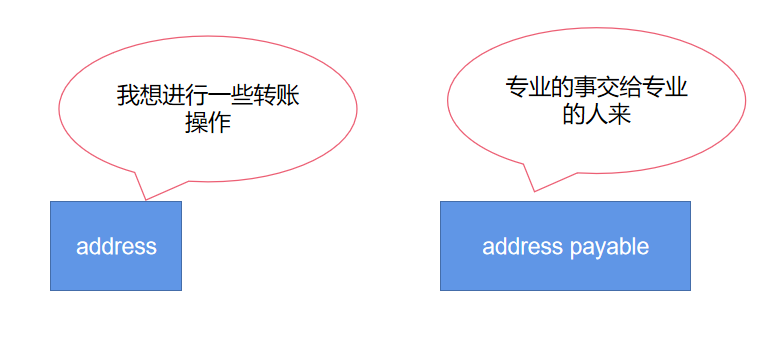

# Content/概念

### Concept

在上一课中，我们学习了address类型。但是该类型缺少一个重要的功能，即：**转移资金**（以太币）。

> 在solidity中，只能对申明为`payable`的地址进行转账。
> 



- 比喻
    
    就像只能对白名单中的地址转账一样，我们只能对有payable修饰的地址转账。  
    
- 真实用例
    
    在OpenZepplin的[ERC2771Forwarder](https://github.com/OpenZeppelin/openzeppelin-contracts/blob/8186c07a83c09046c6fbaa90a035ee47e4d7d785/contracts/metatx/ERC2771Forwarder.sol#L162-L165)合约中，参数refundReceiver被定义为payable，这也就意味着该地址可以接收转账。
    
    ```solidity
    function executeBatch(
        ForwardRequestData[] calldata requests,
        address payable refundReceiver
    ) public payable virtual {
        ...
    }
    ```
    

### Documentation

要定义一个address payable类型的变量，我们使用关键字 `payable`。

```solidity
address payable add;

//类型转换
address add1 = 0x5B38Da6a701c568545dCfcB03FcB875f56beddC4;
address payable add2 = payable(add1); //使用 payable() 显式转换
address add3 = add2; //隐式转换

//转账
//从当前合约向address1转移5 Wei
address1.transfer(5);
```

### FAQ

- 为什么要使用payable？
    
    转移资金的操作存在潜在着风险。使用 address payable 类型可以让转移行为变得清晰明了。
    
    
    
- 何时应该将地址定义为address payable？
    
    如果我们想要从自己的账户向该账户转移资金，那么我们应该将其标记为address payable。
    
    ```solidity
    address payable receiver;
    receiver.transfer(amount);
    ```
# Example/示例代码

```solidity
pragma solidity ^0.8.0;

contract AddressArray {
  address payable add = payable(0x5B38Da6a701c568545dCfcB03FcB875f56beddC4); //显示转换
	address b = add; //隐式转换
	uint balance = b.balance; //获取b的余额
	function trans() public payable{
		//这将从当前合约向地址b转移10 Wei
		add.transfer(10);
	}
}
```
