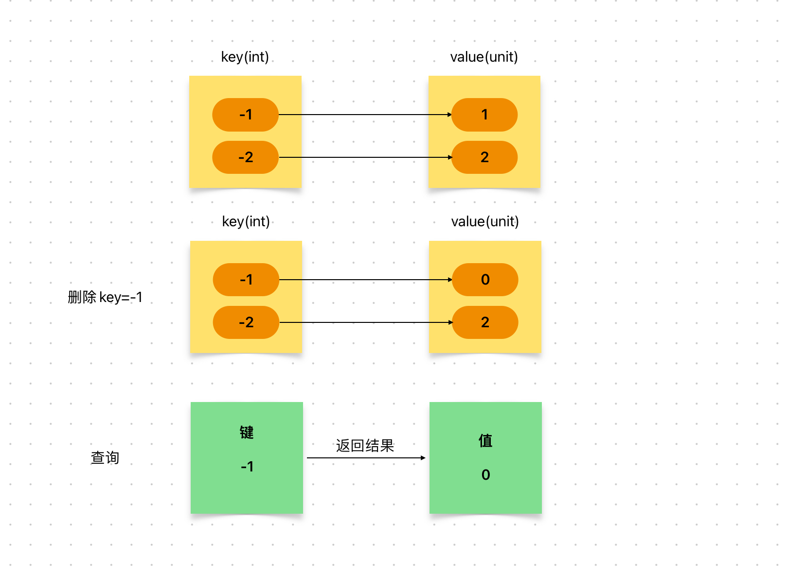

# Content/概念

### Concept

在之前，我们已学习了mapping的定义，修改以及查询操作。

最后我们来学习*mapping*的最后一个操作：删除。

<aside>
💡 删除其实只是把key对应的value重新置为默认值

</aside>

- 比喻
    
    如果*mapping*是电话簿，那么我们可能会有删除某个联系人的操作，这时我们就需要删除*mapping*中的某一个键值对。
    
- 真实用例
    
    在***TimelockController***合约的***[cancel](https://github.com/OpenZeppelin/openzeppelin-contracts/blob/9ef69c03d13230aeff24d91cb54c9d24c4de7c8b/contracts/governance/TimelockController.sol#L341)***函数中，使用`delete`来删除***_timestamps***这个mapping中***id***所对应的值。
    
    ```solidity
    function cancel(bytes32 id) public virtual onlyRole(CANCELLER_ROLE) {
        ...
        delete _timestamps[id];
    }
    ```
    

### Documentation

要删除键值对，我们使用关键字`delete`。

```solidity
delete balance[address(0x123)];
```

### FAQ

- 删除操作意味着什么？
    
    在这里，删除实际上等同于将该值指定为默认值。
    
    例如，如果是 uint256 类型，则被删除的元素的值将变为 *0*。
    
    因此，在执行删除操作后，仍然可以通过访问相应键的方式来获取该元素的值，只不过该值现在是**默认值**而已。
    
    
    
    返回默认值不是通用行为，在其他编程语言中，它可能会报错。

# Example/示例代码

```solidity
contract A {
    // 定义映射，将地址映射到 uint 类型的余额
    mapping(address => uint) public balance;
    // 添加函数，往指定地址的余额中加上 10
    function add() public {
        balance[address(0x0000000000000000000000000000000000000123)] = 10;
    }
    // 删除函数，删除指定地址的余额记录
    function deleteF() public {
        delete balance[address(0x0000000000000000000000000000000000000123)];
    }
    // 更新函数，将指定地址的余额增加10
    function update() public {
        balance[address(0x123)] += 10;
    }
}
```