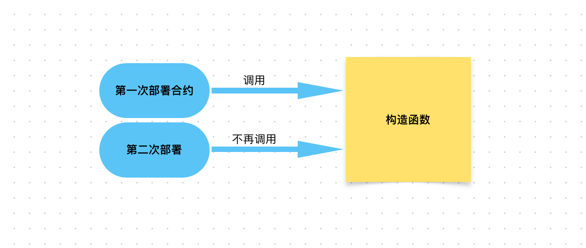

# Content/概念

### Concept

这节我们将学习一个特殊的函数：构造函数。

*构造函数*是在合约部署时自动调用且只被调用一次的函数。

- 比喻
    
    如果合约是印章的话，那么构造函数就像是我们购买印章时要求在印章上刻字的流程。
    
    通过构造函数，我们可以在印章成型之前，按照我们的要求先“初始化”它。
    
- 真实用例
    
    在ERC20合约中，有一个[构造函数](https://github.com/OpenZeppelin/openzeppelin-contracts/blob/9ef69c03d13230aeff24d91cb54c9d24c4de7c8b/contracts/token/ERC20/ERC20.sol#L59-L62)如下，可以通过构造函数来指定该ERC20 Token的*name*和*symbol*。 
    
    ```solidity
    constructor(string memory name_, string memory symbol_) {
        _name = name_;
        _symbol = symbol_;
    }
    ```
    

### Documentation

构造函数 没有名称和返回值：

1. 名称，不需要显式命名。由于每个类中只能有一个构造函数，它将在对象创建时被自动调用。
2. 返回值，没有返回值，因为构造函数是用于初始设置的。

因此，要定义构造函数，我们只需要使用关键字 `constructor`，后跟参数。

```solidity
constructor(int a, bool b) {
	//函数体
}
```

### FAQ

- 为什么需要构造函数？
    
    有两个原因：
    
    1. **访问控制**。例如，我们想要发行自己的代币，并且我想定义只有我才能铸造代币。我们可以通过`构造函数`在部署时设置——谁部署了合约，谁就是所有者。
    2. **确保合约正确的初始化**。因为一旦合约部署上链，所有人即可和合约交互，因此我们需要通过`构造函数`来保证合约部署后所有需要初始化的变量都已经正确的初始化。
- 什么是构造函数？
    
    构造函数是在合约部署时自动调用且只被调用一次的函数。
    
    
    
    如果你没有定义构造函数，那么在部署合约时，Solidity 将创建一个不执行任何操作的空构造函数。
# Example/示例代码

```solidity
// SPDX-License-Identifier: GPL-3.0
pragma solidity >=0.7.0 <0.9.0;

contract A {
    uint public a;
		//构造函数，初始化变量a
    constructor(uint a_) {
        a = a_;
    }
}

contract B {
		//一个空的构造函数
    constructor() {}
}
```