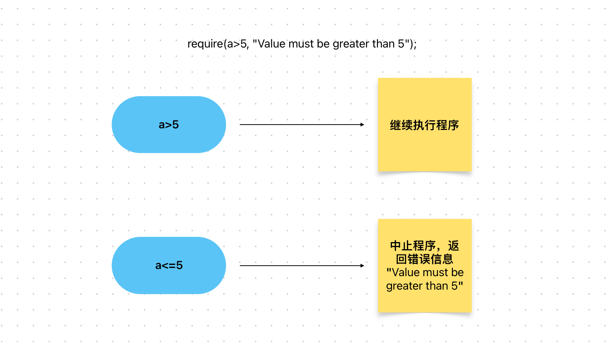

# Content/概念

这节我们将学习require。

*require*顾名思义，是一种类似于断言的语法，如果*require*当中的条件没有满足，此次调用将会失败。

- 比喻
    
    想象你要去电影院观看一部电影，但是你需要购买一张门票才能进入。电影院在入口处设有售票窗口，并且售票员会检查你是否持有有效的门票。在这个场景中，require语法就像售票员的检查，用于确保你持有有效的门票才能进入电影院观看电影。
    
- 真实用例
    
    在Openzepplin的***CompTimelock***合约中***[queueTransaction](https://github.com/OpenZeppelin/openzeppelin-contracts/blob/9ef69c03d13230aeff24d91cb54c9d24c4de7c8b/contracts/mocks/compound/CompTimelock.sol#L102-L120)***函数使用了require语句来断言调用者（msg.sender）是**admin**地址。
    
    如果不是，此次调用将会被**回滚**。
    
    ```solidity
    function queueTransaction(
        address target,
        uint256 value,
        string memory signature,
        bytes memory data,
        uint256 eta
    ) public returns (bytes32) {
        require(msg.sender == admin, "Timelock::queueTransaction: Call must come from admin.");
        ...
    }
    ```
    

### Documentation

为了检查条件是否成立，我们使用关键字`require`，然后跟上条件，如果不满足条件，则报告错误消息。

```solidity
require(recipient != address(0), "Recipient address cannot be zero");
```

require 语句的第一个参数是一个布尔表达式，如果为 *true*，则继续执行程序。如果为 *false*，则会中止执行，并将第二个参数作为错误消息发送到调用者。第二个参数 是可选的。

<aside>
💡 solidity暂不支持中文编码，错误信息请用英文编写。

</aside>

### FAQ

- 为什么我们需要require？
    
    “错误处理”是每段代码中的重要部分。我们都希望事情按照某种方式进行，但实际上往往不是这样。在许多情况下，事情并不会按照我们的期望进行。
    
    例如，买火车票时售票员期望我们提供身份证明，如果无法提供有效的身份证明，售票员会拒绝卖票。
    
    我们需要使用require来确保事情按照我们的期望进行，并在它们没有按照我们的期望运行时采取适当的行动。
    
- require的意义是什么
    
    `require`用于检查某些条件是否成立。如果条件不成立，将会抛出异常并中止执行。例如：
    
    ```solidity
    require(a > 5);
    require(a > 5, "Value must be greater than 5");
    ```
    
    
    

# Example/示例代码

```solidity
pragma solidity ^0.8.4;

contract VendingMachine {
    address public owner = address(0x123);

    function buy(uint amount) public {
				//我们将在下一课中解释msg.sender
        require(msg.sender == owner, "Not authorized.");
        // 执行购买操作。
    }
}
```
