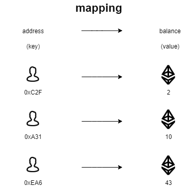

# Content/定义 balances 映射

为了跟踪每个地址拥有多少代币，我们需要一种数据结构来存储这些信息。

`mapping`是一种特殊的数据结构，它允许我们创建一个**键-值**对的映射，其中键是**地址**(*address*)，值是**代币余额**(*uint*)。这意味着我们可以将每个地址与其代币余额相关联。

使用映射的好处是，它使得我们可以快速查找每个账户的余额，因为映射是一种高效的数据结构。

*映射*的高效性体现在以下几个方面：

1. 快速查找：由于映射中的键是唯一的，因此可以通过键直接访问相应的值，不需要遍历整个数据结构。
2. 动态增删：映射可以动态添加或删除键-值对，因此可以很方便地实现代币的转账功能。通过修改映射中的相应键值对，可以快速更新账户地址的余额。
3. 空间占用小：映射只需要存储键和对应的值，相对于数组等其他数据结构来说，空间占用较小。



**Syntax**

Value types Mapping

- 提示
```solidity
contract Example{
    //例如这里的apples就可以记录每个地址持有的apple数量
    mapping (address => uint256) private apples;
}
```