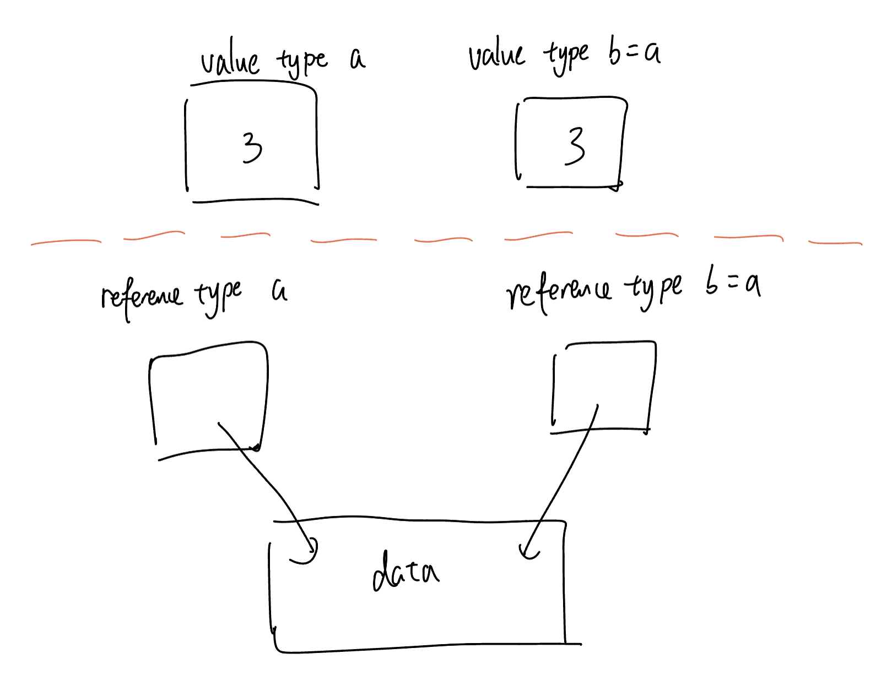

# Content/概念

### Concept

到目前为止，我们已经学习了五种变量类型：int、uint、bool、address 和 mapping。

它们还可以分为两类：值类型和引用类型。

- 比喻
    
    要想区分值类型和引用类型，我们引入一个鞋盒例子，值类型表示你在盒子里放一双鞋 - 你将值存储在变量中。
    
    而引用类型表示你在鞋盒中放一个带有地址的便条。
    
    这意味着什么？如果你使用“*b = a*”将一个变量的值分配给另一个变量，如果它们是值类型，则更新*a*不会影响*b*。然而，如果它们是引用类型，则更新*a*也会同时更新*b*。
    
- 真实用例
    
    在ERC20中，***[_balances](https://github.com/OpenZeppelin/openzeppelin-contracts/blob/9ef69c03d13230aeff24d91cb54c9d24c4de7c8b/contracts/token/ERC20/ERC20.sol#L39)***就是一个引用类型，而***[_totalSupply](https://github.com/OpenZeppelin/openzeppelin-contracts/blob/9ef69c03d13230aeff24d91cb54c9d24c4de7c8b/contracts/token/ERC20/ERC20.sol#L43)***是一个值类型。
    
    ```solidity
    mapping(address => uint256) private _balances;  //引用类型
    
    uint256 private _totalSupply; //值类型
    ```
    

### Documentation

到目前为止，我们学了四种值类型变量：*int*、*uint*、*bool*、*address*。

和唯一引用类型变量：mapping

```solidity
uint a = 10;
int aa = -3;
bool b = true;
address c = address(0x234);

mapping(int => mapping(int => address)) map;
```

### FAQ

- 在赋值时，值类型和引用类型分别是怎么运行的？
    
    
    
    <aside>
    💡 在 Solidity 的 mapping 中，实际上不允许执行 b=a 这样的赋值操作。这是一个特例，在其他引用类型中是可以的，只有在 mapping 中不允许。
    
    </aside>
    

# Example/示例代码

```solidity
// SPDX-License-Identifier: MIT
pragma solidity ^0.8.0;

contract Example {
    mapping(int256 => address) map;

    function types() public {
        uint256 a = 1;
        uint256 b = a;
        a = 2; //a 已更新，但 b 保持不变
				b = 4; ///b 已更新，但 a 保持不变

				map[1] = address(0x123);
    }
}
```
