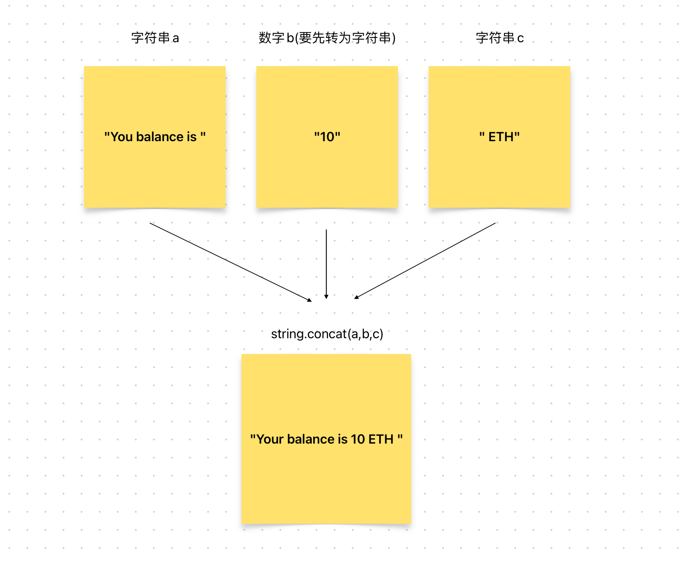

# Content/概念

### Concept

在上一节中，我们学习了字符串的定义。

那么在本节中，我们将继续学习字符串的**连接**操作。

- 比喻
    
    如果把字符串看作是一段文字的话，那么字符串的拼接就是把这些文字给连接起来形成一篇完整的文章。
    
- 真实用例
    
    在 NFT 的 ERC721 标准中，每个 NFT 都由代币 ID 唯一标识。 ERC721 标准中的 ***[tokenURI](https://github.com/OpenZeppelin/openzeppelin-contracts/blob/9e3f4d60c581010c4a3979480e07cc7752f124cc/contracts/token/ERC721/ERC721.sol#L96)*** 函数用于通过将两个字符串连接在一起为每个 NFT 创建唯一的 URI：基本 URI 和令牌 ID。
    
    基础 URI 对于合约中的所有 NFT 都是通用的，而代币 ID 对于每个 NFT 都是唯一的。 通过将这两个字符串连接在一起，***[tokenURI](https://github.com/OpenZeppelin/openzeppelin-contracts/blob/9e3f4d60c581010c4a3979480e07cc7752f124cc/contracts/token/ERC721/ERC721.sol#L96)*** 函数为每个 NFT 创建一个唯一的 URI。 该 URI 用于访问有关 NFT 的信息，例如其名称、图像或其他详细信息。
    
    下面是ERC721标准中***[tokenURI](https://github.com/OpenZeppelin/openzeppelin-contracts/blob/9e3f4d60c581010c4a3979480e07cc7752f124cc/contracts/token/ERC721/ERC721.sol#L96)***函数的代码实现：
    
    ```solidity
    function tokenURI(uint256 tokenId) public view virtual override returns (string memory) {
        ...
        string memory _tokenURI = _tokenURIs[tokenId];
        string memory base = _baseURI();
        ...
        return string.concat(base, _tokenURI);
    }
    ```
    
    在OpenZepplin的***ERC721URIStorage***当中，就使用了`string.concat`对***_tokenURI***和***base***两个字符串进行拼接
    

### Documentation

要连接字符串，我们可以使用 `string.concat` 函数。

```solidity
//定义两个字符串变量（str_1 ******和 str_2）
string memory str_1 = "hello ";
string memory str_2 = "world";

//将上面的两个字符串变量传递给 concat 函数，
//该函数将返回这两个字符串的拼接结果"helloworld"
string memory result = string.concat(str_1, str_2);
```

### FAQ

- 字符串连接的使用场景？
    
    一些常用到字符串连接的场景包括：
    
    - 构建消息：我们可以使用字符串连接将多个消息片段组合成一条消息。
    - 格式化输出：可以使用字符串连接以可读的方式格式化输出。例如，我们可能会将字符串和数字连接起来以显示余额为“Your balance is 10 ETH”。
        
        

# Example/示例代码

```solidity
pragma solidity ^0.8.0;

contract StringExample {
	string public greeting = "Hello, ";
  string public name = "Alice";
  //result的值为"Hello, Alice"
	string result = string.concat(greeting, name);
    
  string public message;
  function setMessage(string memory _newMessage) public {
			//将字符串 "Hello, " 与_newMessage进行拼接，然后存储在 message 变量中
      message = string.concat("Hello, ", _newMessage);
  }
}
```
