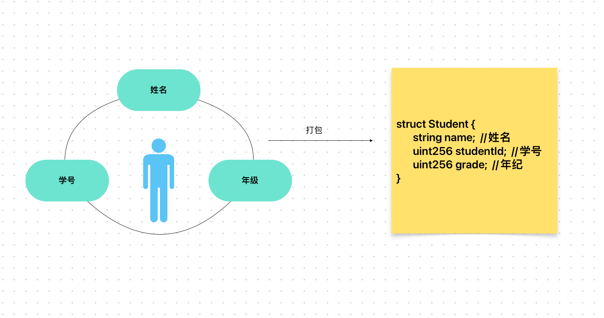

# Content/概念

### Concept

在本节中，我们将学习另一种类型，称为结构体。

在Solidity中，结构体是一种用户自定义的数据类型，其中可以包含多个不同类型的属性。

例如一个学生可以有很多属性，比如姓名、学号、年级等。我们可以将这些属性封装到一个结构体中。



- 比喻
    
    结构体可以存储很多信息，并且把他们有结构的存储起来。
    
    这就像你的简历，个人简介可以看作是一个数据结构，而个人优势又是另一个数据结构，但他们都是简历这个结构体的一员。
    
- 真实用例
    
    在OpenZepplin提供的***[AccessControl](https://github.com/OpenZeppelin/openzeppelin-contracts/blob/9ef69c03d13230aeff24d91cb54c9d24c4de7c8b/contracts/access/AccessControl.sol#L50C1-L50C22)***合约中使用到了struct结构来表示一个管理员角色的信息，其中包括地址→是否有权限的映射和***adminRole***的哈希。
    
    ```solidity
    struct RoleData {
        mapping(address account => bool) hasRole;
        bytes32 adminRole;
    }
    ```
    

### Documentation

要定义一个结构体，首先你需要使用`struct`关键字，其后是结构体的名字。然后需要用`{}`将其属性括起来，`{}`里面每个属性用“`；`”隔开，结构体属性的定义与状态变量的定义相同，只是没有作用域这个概念。

```solidity
struct Cat {
  string name;
  address owner;
  uint256 age;
}
```

### FAQ

- 为什么使用结构体？
    
    结构体能更加方便的组织和管理相关的数据，使代码更加清晰和易于理解。
    
    例如我们可以创建多个"Student"结构体，每个结构体对应着一个特定的学生，并包含其所有属性，这能更好的组织和管理学生数据。
    

# Example/示例代码

```solidity
pragma solidity ^0.8.0;

contract Example {
  //这里我们定义了一个名为Student结构体，其有name，studentId，grade三个属性
  struct Student {
    string name;
    uint256 studentId;
    uint256 grade;
  }
}
```

