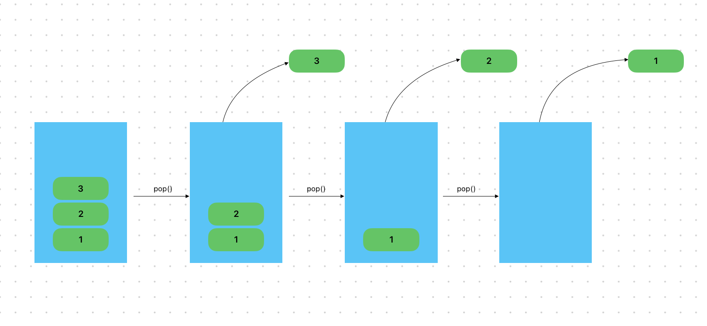

# Content/概念

### Concept

在上一节中，我们学到了如何在动态数组的末尾添加一个元素。而在这章中，你将会学习一个将动态数组最后一个元素删除的方法 - pop。

使用pop是在处理动态数组时常见的一种操作，它允许我们从数组的末尾删除最后一个元素。并且在pop之后，数组的长度会减小。



- 比喻
    
    类比到班级里的学生，可以将班级看作是一个动态数组，而学生就是数组中的元素。使用pop函数就相当于将班级中最后一个学生删除掉了。
    
- 真实用例
    
    在***EnumerableSet***中的***[_remove](https://github.com/OpenZeppelin/openzeppelin-contracts/blob/9ef69c03d13230aeff24d91cb54c9d24c4de7c8b/contracts/utils/structs/EnumerableSet.sol#L106)***函数，通过pop来删除***set***中的一个配置。
    
    ```solidity
    function _remove(Set storage set, bytes32 value) private returns (bool) {
        set._values.pop();
    }
    ```
    

### Documentation

为了将动态数组的末尾元素删除，我们需要使用`ArrayName.pop()`。

```solidity
//在这里我们将***arr***数组的最后一个元素删除。
arr.pop();
```

<aside>
💡 如果你尝试弹出一个空数组的元素，Solidity 将无法找到任何元素来弹出，并且会引发错误。

</aside>

### FAQ

- 在什么时候使用pop
    
    当我们有需求删除数组的最后一个元素时，多数情况需要我们将要删除的元素移到数组末尾，随后使用pop将其删除。

# Example/示例代码

```solidity
pragma solidity ^0.8.0;

contract Example {

  uint256[] public nums;

  function testPush() public {
    nums.push(1);
    nums.push(2);
    nums.push(3);
    //执行到这里该数组的结构应该为[1,2,3]
    //将数组最后一个元素删除
    nums.pop();
    //此时数组的结构应该为[1,2]
  }
}
```