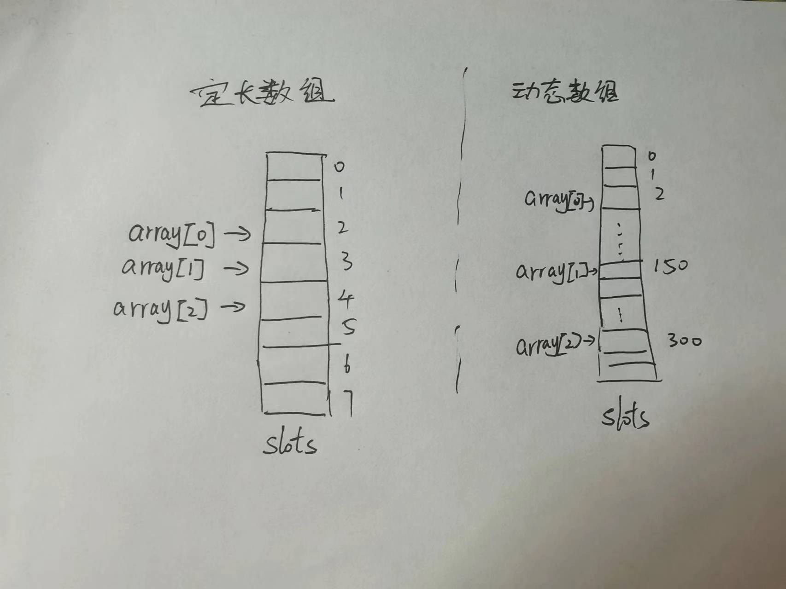

# Content/概念

### Concept

在前几节的内容中，我们学习了如何定义一个动态数组以及动态数组的赋值。

在本节当中，我们将介绍一个新的数组定义形式——定长数组。

- 比喻
    
    当你在Solidity中声明一个定长数组，可以将其比喻为一个有固定大小的盒子。这个盒子只能容纳特定数量的项目，无法改变大小。
    
- 真实用例
    
    固定长度的数组在solidity当中很少使用，因为该方式非常不灵活。一般在定义数组时是不知道这个数组究竟有多少个元素的。
    
    但是当我们想要表示某个集合时，就可以使用固定长度的数组：
    
    ```solidity
    
    string[4] public seasons;
    seasons[1] = spring;
    seasons[2] = summer;
    seasons[3] = autumn;
    seasons[4] = winter;
    ```
    

### Documentation

在定义定长数组时，需要在`[]`中指定数组的长度：

```solidity
uint256[3] public numbers; // 定义一个长度为3的定长数组

//我们需要使用[元素，元素，元素]的形式为定长数组赋值。
//需要特别注意的是，所有元素的类型必须一致。
//因此在定长数组的定义中，只需要在方括号中指定第一个元素的类型即可（对应下方的[uint256(10), 20, 30]）。
function setNumbers() public {
  uint256[3] memory tempArray = [uint256(10), 20, 30]; // 定义一个临时的长度为3的定长数组
  numbers = tempArray; // 将临时数组赋值给定长数组
}
```

### FAQ

- 为什么要使用定长数组？它有哪些优势？
    1. 确定长度：定长数组的固定长度使得编译器能够在编译时进行更多的优化。
    2. 更高的效率：定长数组的存储方式是在插槽中连续存储，这使得对数组的访问速度更快，因为可以通过偏移量直接访问元素，而无需进行额外的计算（例如动态数组中的哈希）。
        
        
        
    3. 节省存储空间：由于定长数组的长度是确定的，存储每个元素所需的空间也是已知的。这使得在存储定长数组时更加高效，因为不需要为存储数组长度而额外分配空间。
    4. 避免越界错误：定长数组在编译时会检查数组的访问是否越界，并在必要时引发错误。这可以提供更好的安全性，避免在运行时出现数组越界的问题。
- 定长数组 vs 动态数组
    
    定长数组常用于存储固定长度的数据，例如当我们需要存储班级学生信息时，我们就可以使用定长数组，因为我们明确的知道班级有多少个学生。
    
    当我们不知道存储的数据的具体长度时，就使用动态数组，这样我们可以动态为数组增添元素
    
    <aside>
    💡 定长数组没有pop()，push()等语法，只能一次性赋值（见documentation）
    
    </aside>
  
# Example/示例代码

```solidity
contract GradeBook {
  uint256[5] public grades; // 存储学生成绩的定长数组，长度为5

  function setGrade(uint256 index, uint256 grade) public {
    require(index < grades.length, "Invalid index"); // 确保索引不超过数组长度
    grades[index] = grade;
  }

  function getGrade(uint256 index) public view returns (uint256) {
    require(index < grades.length, "Invalid index"); // 确保索引不超过数组长度
    return grades[index];
  }
}
```
