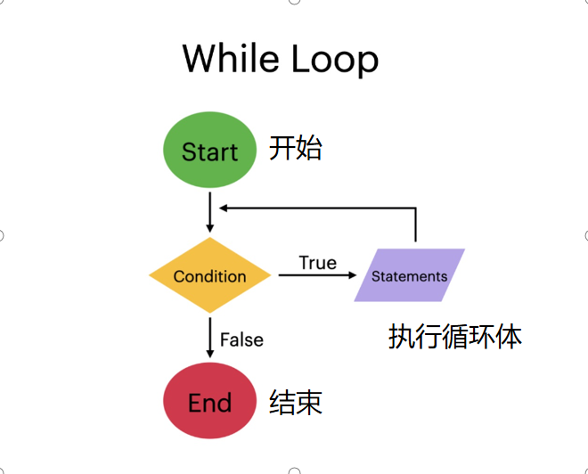

# Content/概念

### Concept

刚刚我们学习了*if - else*条件语句，现在，我们将介绍另一种控制程序流程的结构：while循环。

while循环语句是一种常见的流程控制语句，用于反复执行一段代码块，直到指定的条件表达式不再为真为止。



- 比喻
    
    假设你有一瓶水，想把它喝完。每次你喝一口，就会喝掉一定量的水，直到水瓶变空。这就是while循环可以使用的地方。
    
    while循环从一个满瓶开始，你喝一口，然后检查是否还有水剩余。如果有，你再喝一口，重复这个过程直到水瓶变空。
    
- 真实用例
    
    ***Strings*** 库提供了一系列用于字符串操作的函数。 它提供了各种实用程序，用于将数值转换为字符串、比较字符串以及执行其他与字符串相关的任务。 该库中的函数之一 ***toString*** 使用 while 循环将 *uint256* 值转换为其 ASCII 字符串十进制表示形式。
    
    让我们仔细看看 while 循环是如何在 [***toString***](https://github.com/OpenZeppelin/openzeppelin-contracts/blob/9e3f4d60c581010c4a3979480e07cc7752f124cc/contracts/utils/Strings.sol#L33) 中使用的*功能*：
    
    ```solidity
    
    function toString(uint256 value) internal pure returns (string memory) {
        unchecked {
            uint256 length = Math.log10(value) + 1;
            string memory buffer = new string(length);
            uint256 ptr;
            /// @solidity memory-safe-assembly
            assembly {
                ptr := add(buffer, add(32, length))
            }
            while (true) {
                ptr--;
                /// @solidity memory-safe-assembly
                assembly {
                    mstore8(ptr, byte(mod(value, 10), _HEX_DIGITS))
                }
                value /= 10;
                if (value == 0) break;
            }
            return buffer;
        }
    }
    ```
    
    在此函数中，while 循环迭代直至值变为零。 在每次迭代期间，循环提取值的最后一位数字，将其转换为字符，并将其存储在缓冲区中。 然后将该值除以 *10* 以删除最后一位数字。 此过程一直持续到整个值已转换为*字符串*。
    
    该库中 while 循环的使用有助于将数值有效转换为字符串。 这个真实的用例演示了如何在 Solidity 中使用 while循环来创建高效的字符串操作函数。
    

### Documentation

使用关键字`while`定义while循环，后跟用括号`()`括起来的条件。要执行的代码块用`{}`括起来。

只要条件仍然为真，代码块就会不断被执行。

```solidity
uint i = 0;
while (i < 10) {
  i++;
  // 每次迭代执行的代码
}
```

### FAQ

- while里如果是一个无法完成的条件怎么处理？
    
    这是一个好问题，在写while的时候需要谨慎，避免出现死循环（永远无法达成跳出while的条件，导致一致循环）的情况发生。

# Example/示例代码

```solidity
// SPDX-License-Identifier: MIT
pragma solidity ^0.8.0;

contract WhileLoopExample {
  uint[] public numbers;

  function fillNumbers(uint n) public {
    uint i = 0;
    while (i < n) {  // 当 i 小于传入的参数 n 时执行循环
      numbers.push(i);  // 向动态数组中添加 i
      i++;
    }
  }

  function getNumbers() public view returns(uint[] memory) {
    return numbers;
  }
}
```