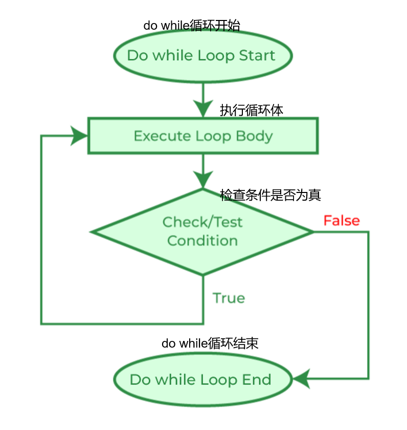

# Content/概念

### Concept

学习了if和while两种流程控制语句后，我们现在探讨另一个流程控制结构：do-while循环。

do-while 循环语句使得一段代码块可以重复执行，只要某个特定条件保持为真。while循环和 do-while 循环的关键区别在于后者在执行代码块后再判断条件，因此它保证至少执行一次代码块。



- 比喻
    
    让我们再次用水瓶的比喻。你有一整瓶水，并且想喝光它。你不会在喝水之前检查瓶子中是否还有水，只有在喝了一口之后，你才会去检查水是否被喝完。这时就可以使用 do-while 循环。
    
    ```solidity
    uint water = 500; // 初始水量（毫升）
    uint sips = 0;
    do {
      water -= 30; // 每一口是 30 毫升
      sips++;
    } while (water > 0);
    ```
    
    在这段代码中，只要瓶子里还有水（***water > 0***），循环就会继续执行。每一口都会使水的数量减少 30 毫升，而计数器（***sips***）则会加 *1*。当瓶子里没有水时，循环停止。
    
- 真实用例
    
    do while很少使用，但如果我们需要先执行再判断的循环逻辑，就需要使用这种语法：
    
    ```solidity
    function example() public {
      uint i = 0;
      do {  
        numbers.push(i);
        i++;
      } while (i < 10);  
    }
    ```
    

### Documentation

使用关键字 `do` 定义 do-while 循环，后跟要执行的代码块并用 `{}` 括起来，最后是关键字 `while` 和括在括号 `()` 中的条件。

代码块将至少执行一次，并在条件为真的情况下继续执行。

```solidity
uint i = 0;
do {
  i++;
  // 每次迭代要执行的代码
} while (i < 10);
```

### FAQ

- Do while和while有什么区别？
    
    while 循环先检查条件再执行循环体，而 do-while 循环先执行循环体再检查条件。

# Example/示例代码

```solidity
// SPDX-License-Identifier: MIT
pragma solidity ^0.8.0;

contract DoWhileLoopExample {
  uint[] public numbers;

  function fillNumbers(uint n) public {
    uint i = 0;
    do {  // 执行至少一次的循环，直到 i 大于等于 n
      numbers.push(i);
      i++;
    } while (i < n);  // 当 i 小于 n 时继续循环
  }

  function getNumbers() public view returns(uint[] memory) {
    return numbers;
  }
}
```