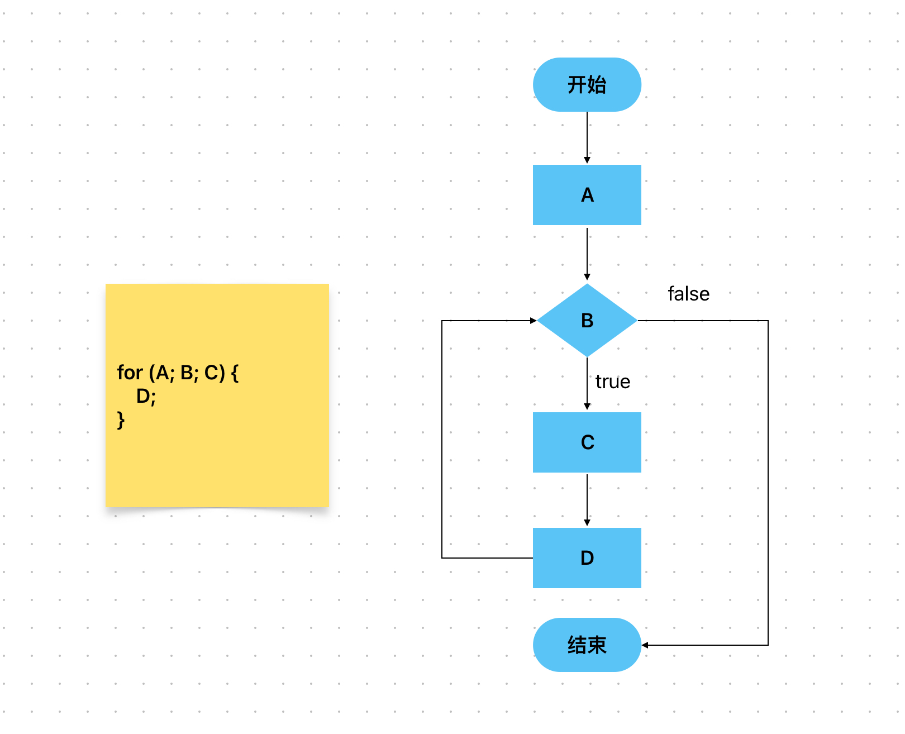

# Content/概念

### Concept

在学了这么多控制流语句后，最后我们学习一个非常常见的流程控制结构：for循环。

for循环语句和while和do-while一样。它根据特定条件反复执行一个代码块，直到满足某个条件为止。



- 比喻
    
    假设你是一位老师，你想计算班级的平均成绩。你需要将每个学生的成绩相加，然后除以学生人数。这时for循环可以派上用场。
    
    for循环从第一个学生开始，将他们的成绩加到总分中，然后转移到下一个学生，重复这个过程，直到把整个班级的成绩加起来。
    
    ```solidity
    uint total = 0;
    for (uint i = 0; i < students.length; i++) {
      total += students[i].score;
    }
    ```
    
- 真实用例
    
    在OpenZepplin的***[Multicall](https://github.com/OpenZeppelin/openzeppelin-contracts/blob/9ef69c03d13230aeff24d91cb54c9d24c4de7c8b/contracts/utils/Multicall.sol#L18)***合约中，使用了for循环来“遍历***data***数组”，而这也是for循环的最大用处之一。
    
    ```solidity
    function multicall(bytes[] calldata data) external virtual returns (bytes[] memory results) {
        results = new bytes[](data.length);
        for (uint256 i = 0; i < data.length; i++) {
            results[i] = Address.functionDelegateCall(address(this), data[i]);
        }
        return results;
    }
    ```
    

### Documentation

我们使用`for`关键字来定义for循环，后面跟着一个初始化语句、一个条件和一个增量语句。所有这些都被括在圆括号`()`中。要执行的代码块被括在`{}`中。

只要条件保持为真，代码块就会不断执行。

```solidity
for (uint i = 0; i < 10; i++) {
  // 每次迭代执行的代码
}
```

在这个例子中，初始化部分将变量 *i* 设置为 *0*，条件部分检查 *i* 是否小于 *10*，迭代部分使 *i* 递增。重复执行循环体代码直到 *i* 不再满足条件为止，即 *i* 大于 等于*10*。

### FAQ

- for与while的区别
    
    从功能上讲，for循环和while循环是完全相同的，也就是说，while可以做到的，for也可以做到，反之亦然。它们之间的关键区别在于代码风格：for循环更具结构化，它清晰地阐述了初始条件、增量过程和最终条件。

# Example/示例代码

```solidity
// SPDX-License-Identifier: MIT
pragma solidity ^0.8.0;

contract ForLoopExample {
  uint[] public numbers;

  function fillNumbers(uint n) public {
    // 将数字0-n-1添加到数组中
    for (uint i = 0; i < n; i++) {
      numbers.push(i);
    }
  }

  function getNumbers() public view returns(uint[] memory){
    return numbers;
  }
}
```