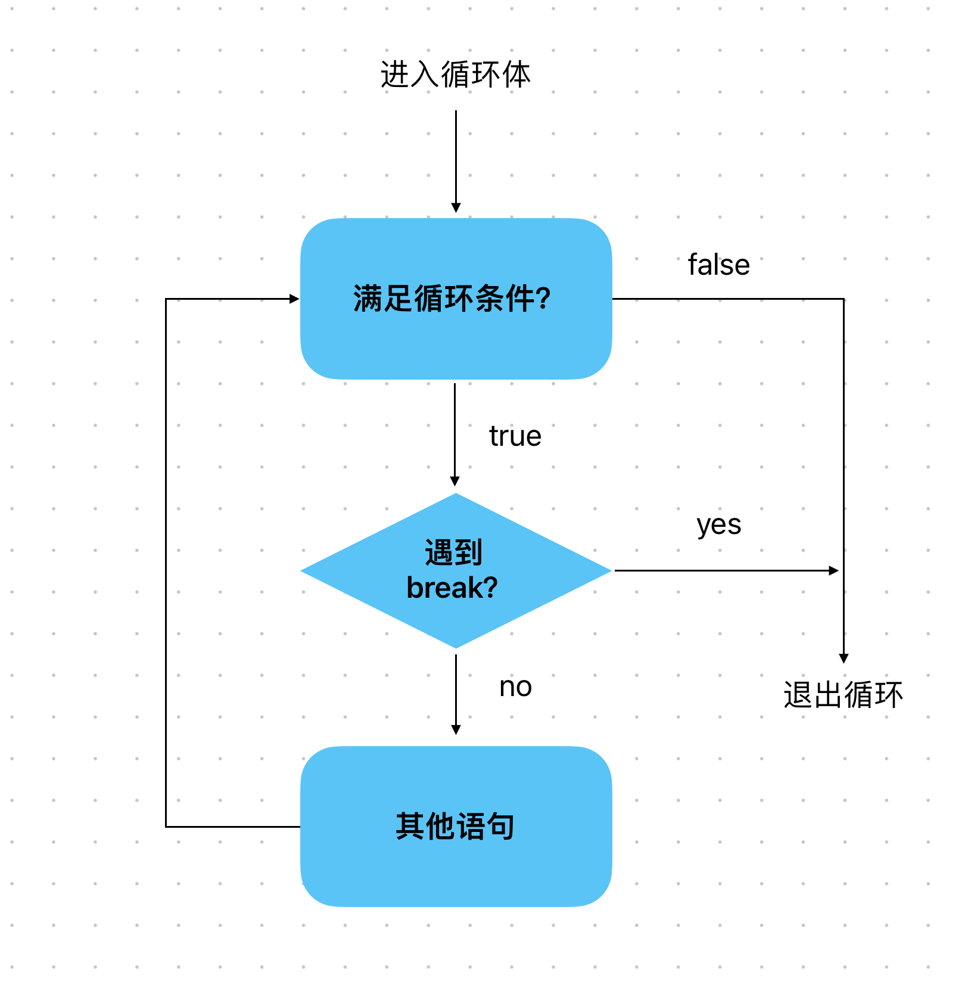

# Content/概念

### Concept

在讨论了*continue*之后，本节我们将讨论break。

*break*允许我们在满足特定条件时完全终止循环，然后继续执行循环后面的代码。



- 比喻
    
    还是用上节的例子。假设我们想要计算多个书籍的总价格，我们需要遍历每一本书并累加它们的价格。
    
    然而，如果总价格超过了*100*，我希望停止计数，这时，就可以使用`break`语句直接退出遍历。
    
- 真实用例
    
    在OpenZepplin的***[Strings](https://github.com/OpenZeppelin/openzeppelin-contracts/blob/9ef69c03d13230aeff24d91cb54c9d24c4de7c8b/contracts/utils/Strings.sol#L40C1-L40C39)***合约中，使用了`break`函数来退出`while`循环
    
    ```solidity
    function toString(uint256 value) internal pure returns (string memory) {
        ...        
        while (true) {
            ptr--;
            ...
            value /= 10;
            if (value == 0) break;
        }
    }
    ```
    

### Documentation

如果要跳出该循环的执行体，继续执行循环后面的代码。我们只需使用`break`关键字。

```solidity
for (int a = 0; a < 10; a++) {
  //如果a等于5，跳出循环
  if (a == 5) { break; }
  //如果a不等于5，执行其他操作
}
```

<aside>
💡 如果大括号{}内只有break语句，那么我们可以将{}省略。例如，上段代码中的 if (a == 5) {break;} 我们可以替换成 if (a == 5)  break;

</aside>

### FAQ

- 什么时候使用break？
    
    当我们在循环中，想要退出该循环时，可以使用*break*语句，一般配合if语句一起使用。

# Example/示例代码

```solidity
// SPDX-License-Identifier: GPL-3.0
pragma solidity ^0.8.4;
contract Example {
  uint[] prices = [1,2,13,4,200];

  function countPrice() public view returns(uint) {
    uint totalPrice = 0;

    for (uint i = 0; i < prices.length; i++) {
      if (prices[i] == 13) {
        continue;
      }
      if(totalPrice > 200) {
        break;
      }
      
      totalPrice += prices[i];
    }

    return totalPrice;
  }
}
```
