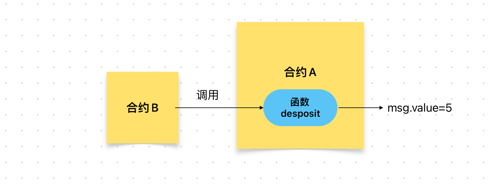

# Content/概念

### Concept

在前面几节中，我们学习了payable修饰的函数以及使用msg.value来获取用户调用函数时所附加的ETH。

那么接下来，我们学习如何在调用函数时，附加ETH。

- 比喻
    
    我们可以想象一个购物场景。假设你去商店买一件商品，你需要支付商品的价格给商店。在这个例子中，合约就好比是商店，而附加ETH则相当于你支付给商店的现金。
    
- 真实用例
    
    在OpenZepplin的[***Address***](https://github.com/OpenZeppelin/openzeppelin-contracts/blob/9ef69c03d13230aeff24d91cb54c9d24c4de7c8b/contracts/utils/Address.sol#L83)合约中，使用了`address.call{value :}`的方式在调用函数的同时附加ETH。
    
    ```solidity
    function functionCallWithValue(address target, bytes memory data, uint256 value) internal returns (bytes memory) {
        ...
        (bool success, bytes memory returndata) = target.call{value: value}(data);
        ...
    }
    ```
    

### Documentation

在调用函数时，只需要在`函数名`和`()`之间插入一个`{value : xx}`语法即可，其中*xx*代表你需要附加的ETH数量。

```solidity
//这里在调用deposit的时候附加了5wei的ETH。
deposit{value: 5}();
```

<aside>
💡 要允许用户在调用某个函数时发送以太币。则该函数应为`payable`函数。

</aside>

### FAQ

- 如何附加ETH？
    
    调用一个函数并附加ETH，在调用函数时使用`{value: 发送的以太币数量}`的语法，并确保函数具有*payable*修饰符。
    
    例如，在一个智能合约中有一个接收以太币的存款函数`deposit`， 若要调用这个合约的`deposit`函数，并向其发送5个单位的以太币，可以通过以下语法实现：
    
    ```solidity
    deposit{value: 5}()*;*
    ```
    
    
    
    调用成功的前提是:在调用该函数时，合约B中有大于5wei的余额。

# Example/示例代码

```solidity
pragma solidity ^0.8.0;

// 定义 Bank 合约
contract Bank {
  mapping(address => uint256) public balances;

  // 定义带有 payable 修饰符的 deposit 函数，以便接收以太币
  function deposit() public payable {
    balances[msg.sender] += msg.value;
  }
}

// 定义用于与 Bank 合约进行交互的 User 合约
contract User {
  Bank public bank;

  // 构造函数，用于设置 Bank 合约地址
  constructor(address _bankAddress) {
    bank = Bank(_bankAddress);
  }

  // 调用 Bank 合约的 deposit 函数并发送以太币
  function depositToBank() public payable {
    // 调用deposit函数并传入ETH
    // 调用成功的前提是:在调用该函数时，该合约里有大于5wei的余额。
    bank.deposit{value: 5}();
  }
}
```
