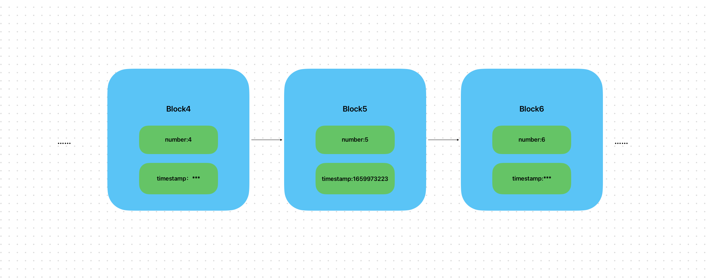

# Content/概念

### Concept

在上一节中，我们学习了*block.number*这个全局变量，用于获取当前的区块高度。

在这一节中，我们将学习另一个block的全局变量timestamp,它是指当前区块的时间戳，即当前区块生成时距离1970年1月1日的秒数。它反映了从1970年1月1日00:00:00 UTC到当前区块生成时经过的时间。



- 比喻
    
    *block.timestamp*类似于产品的生产日期，记录了区块被创建的时间戳。它表示了特定区块在区块链上的生成时间，就像产品上标注的生产日期表示了产品的制造时间。
    
- 真实用例
    
    在OpenZepplin的[***ERC20Permit***](https://github.com/OpenZeppelin/openzeppelin-contracts/blob/9ef69c03d13230aeff24d91cb54c9d24c4de7c8b/contracts/token/ERC20/extensions/ERC20Permit.sol#L44)合约中，设置了一个过期时间，在执行***permit***时会判断当前时间是否已经过期，如果已经过期则将会`revert`回滚。
    
    ```solidity
    function permit(
        ...
    ) public virtual {
        ...
        if (block.timestamp > deadline) {
            revert ERC2612ExpiredSignature(deadline);
        }
    }
    ```
    

### Documentation

使用`block.timestamp`来获取当前区块的时间戳。

```solidity
//通过block.timestamp返回当前区块的时间戳，并赋值给了变量blockTimestamp。
uint256 blockTimestamp = block.timestamp;
```

### FAQ

- timestamp和block.number有什么区别？
    
    一个是以秒为单位，一个以区块号为单位，他们度量的单位不一致。
    
    需要注意的是在不同的链上，*block.number*不同。
    
    而timestamp和现实世界挂钩，所以不管在哪条链上都是统一的。

# Example/示例代码

```solidity
pragma solidity ^0.8.0;

contract TimestampExample {
  function getCurrentTimestamp() public view returns (uint) {
    return block.timestamp;
  }
}
```
