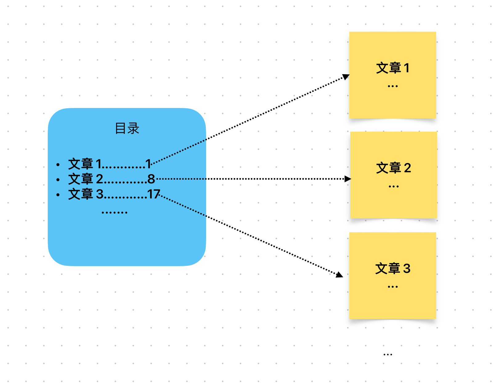

# Content/概念

### Concept

上一节中，我们学习了事件的广播。在这一节中，我们会接着学习事件专属的一个关键字`indexed`。

在Solidity中，事件的参数默认是*不可搜索*的，也就是说，你不能直接根据事件参数的值来过滤和搜索事件。然而，当你将某个参数标记为*indexed*时，Solidity会为该参数创建一个额外的索引，使得你可以根据该参数的值进行过滤和搜索。

- 比喻
    
    例如，我们有一本书，记录了多篇文章。我们如何快速找到某一篇文章呢？我们可以根据文章名建立目录，也就是索引：
    
    通过这个目录（索引），我们能快速定位这篇文章所在位置。
    
    
    
- 真实用例
    
    在上一节的***[Transfer](https://github.com/OpenZeppelin/openzeppelin-contracts/blob/9ef69c03d13230aeff24d91cb54c9d24c4de7c8b/contracts/token/ERC20/IERC20.sol#L16C77-L16C77)***事件中，***from***和***to***参数都被`indexed`修饰，这是为了大家可以使用地址来查询该地址的转账记录。
    
    ```solidity
    event Transfer(address indexed from, address indexed to, uint256 value);
    ```
    

### Documentation

在Solidity中，可以在事件声明中的参数类型后面添加`indexed`关键字，使参数可搜索。

```solidity
event LogChange(uint indexed id);
```

### FAQ

- 什么是索引？
    
    索引可以被看作是一个目录，其中包含了数据中某个特定列（或多个列）的值与其在数据中位置的映射关系。就好像我们可以根据图书目录中的页码快速找到所需的内容。在Solidity和智能合约中，"索引"一词通常用在事件（Events）的上下文中。在Solidity中，你可以在事件的参数上添加`indexed`关键字，这样这些参数就会成为“索引参数”。这样做有助于外部应用更快、更有效地搜索这些特定的事件。

# Example/示例代码

```solidity
pragma solidity ^0.8.0;

contract EventExample {
  // 定义事件，其中sender可被搜索
  event MessageSent(address indexed sender, string message);

  // 发送消息函数
  function sendMessage(string memory message) public {
    // 触发事件
    emit MessageSent(msg.sender, message);
  }
}
```
