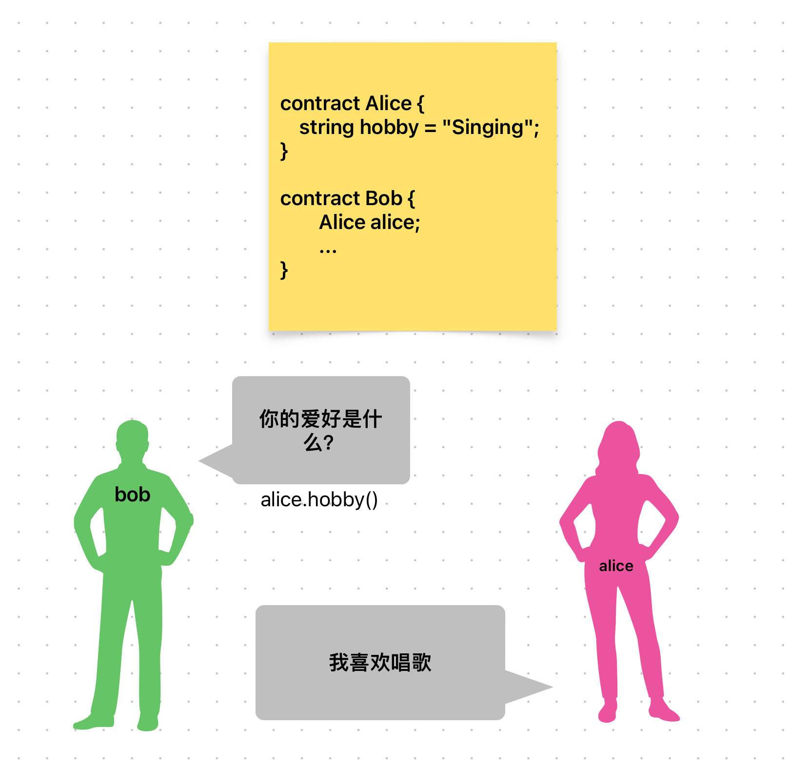

# Content/概念

### Concept

接下来，我们开启新的一章的学习，定义一个合约变量。

*合约类型*是Solidity中的一种变量类型，用于存储对其他合约的引用。

合约类型的变量就是一个合约的实例。这个实例可以访问合约的所有公共函数和变量。

- 比喻
    
    通过在合约中创建合约变量，我们可以与其他合约建立关联和联系。这就像是在现实生活中的合作伙伴，例如，有两个人：Alice和Bob。Alice拥有某个资源，而Bob希望利用Alice的资源与Alice合作完成某项任务。
    
    将Alice和Bob看作两个合约，Bob合约可以定义一个Alice合约类型的变量。
    
    通过这个合约变量，Bob合约可以访问Alice合约的公共函数和变量，从而实现信息和资源的共享。
    
    
    
- 真实用例
    
    在OpenZepplin的[***GovernorTimelockControl***](https://github.com/OpenZeppelin/openzeppelin-contracts/blob/9ef69c03d13230aeff24d91cb54c9d24c4de7c8b/contracts/governance/extensions/GovernorTimelockControl.sol#L25) 抽象合约中，定义了一个类型为***[TimelockController](https://github.com/OpenZeppelin/openzeppelin-contracts/blob/9ef69c03d13230aeff24d91cb54c9d24c4de7c8b/contracts/governance/TimelockController.sol#L24)***的变量***_timelock***。
    
    ```solidity
    abstract contract GovernorTimelockControl is Governor {
        TimelockController private _timelock;
    }
    ```
    

### Documentation

要定义一个合约类型的变量，需要按照合约类型+合约名称的格式进行声明。

```solidity
MyContract mycontract;

//合约实例需要通过new的方式实例化
mycontract = new MyContract(); 

//同样也可以通过指定地址的方式实例化
MyContract mycontract = MyContract(contractAddress); 
```

### FAQ

- 合约类型的变量和其他变量有什么不同吗？
    
    该变量可以调用其对应的合约，并且可以与地址类型address相互转换。
    
    从类型来讲，他是一个引用类型的变量。

# Example/示例代码

```solidity
// SPDX-License-Identifier: MIT
pragma solidity ^0.8.0;

// 合约A
contract ContractA {
    uint256 public data;
}

// 合约B
contract ContractB {
    //定义了一个ContractA的合约类型变量
    ContractA public contractA;
    ContractA public contractAA;

    constructor(address _contractA) {
        //将传入的合约地址实例化为ContractA合约，并将其赋值给contractA变量
        contractA = ContractA(_contractA);
        contractAA = new ContractA();
    }
}
```
