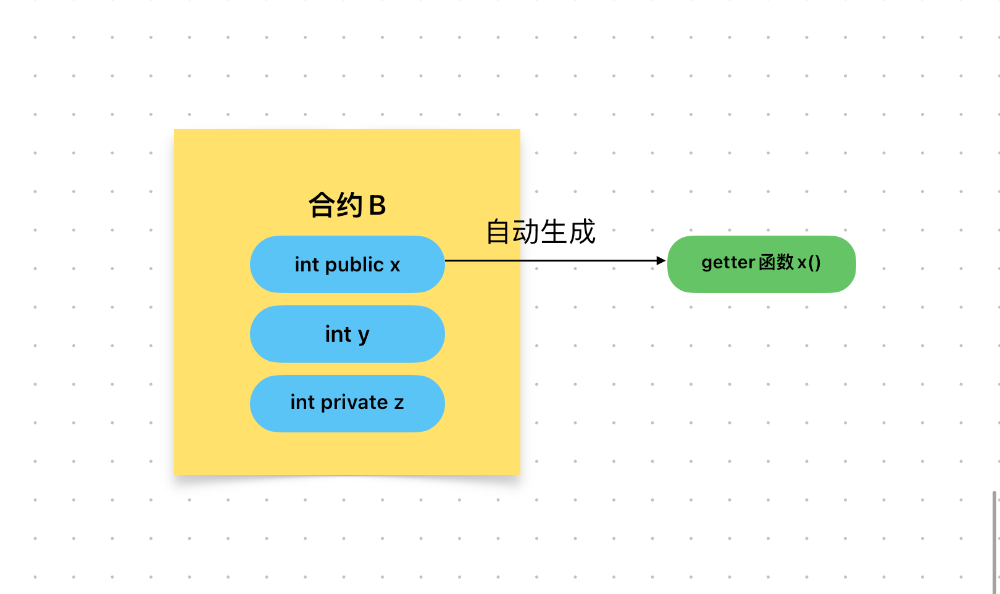

# Content/概念

### Concept

上一节中，我们学习了学习如何调用其他合约的函数。

在这一节中我们将更进一步，学习如何获取其他合约的状态变量。

在有合约类型的变量后，即可通过该变量与相应的合约交互。而在solidity当中，会自动为每个公共变量生成一个查询函数，命名为变量名本身。



- 比喻
    
    如果把人比作一个合约，那么如果我们想要知道这个人的基础信息，就需要通过函数提供的变量查询函数来查询。
    
- 真实用例
    
    还是用上一个例子，如果我们想要获取***[TimelockController](https://github.com/OpenZeppelin/openzeppelin-contracts/blob/9ef69c03d13230aeff24d91cb54c9d24c4de7c8b/contracts/governance/TimelockController.sol#L24)*** 合约的***_minDelay***变量的值，可以使用以下方式：
    
    ```solidity
    _timelock._minDelay();
    ```
    

### Documentation

在获取基础类型时使用`ContractName.stateVariableName()`的形式来获取外部合约的状态变量值。

```solidity
contract NFTContract {
  uint public totalSupply;
}

contract MarketplaceContract {
  NFTContract public nft;

  function getTotalSupply() public view returns (uint) {
    return nft.totalSupply();
  }
}
```

### FAQ

- 能获取什么样的状态变量？
    
    值得一提的是，只有*public*的变量是可以通过合约名.参数名()的方式获取。*private*修饰的变量是不可以的，这是因为*private*修饰的变量对外部是不可见的。

# Example/示例代码

```solidity
// SPDX-License-Identifier: MIT
pragma solidity ^0.8.0;

// 合约B
contract B {
  uint public result;

  function foo(uint _input) public {
    result = _input * 2;
  }
}

// 合约A
contract A {
  B public b;

  constructor(address _bAddress) {
    b = B(_bAddress);
  }

  function callBFunction(uint _input) public {
    b.foo(_input);
  }
  //接着上一节中的例子，我们来获取B合约的result变量的值
  function getBResult() public view returns (uint) {
    return b.result();
  }
}
```