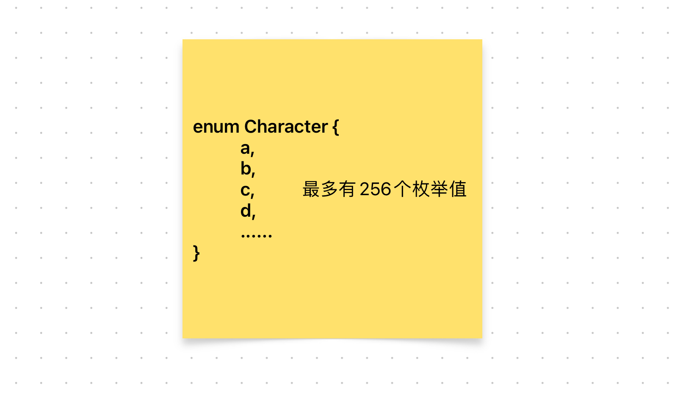

# Content/概念

### Concept

在上一节中，我们学习了如何定义一个枚举类型。现在我们来学习solidity中的枚举类型是如何赋值的。

和之前讲过的变量赋值一样，枚举变量赋值意味着将*枚举集合*中的某个值放到你的*变量*容器里。

这种机制提供了一种结构化和易读的方式来管理和表达合约内部的状态或其他固定值集合。它确保只能从已经定义的集合中赋予有效值，为代码增加了额外的安全性和可读性。

- 比喻
    
    如果还是用春夏秋冬举例子，那么：
    
    ```solidity
    enum Season {
      Spring,
      Summer,
      Autumn,
      Winter
    }
    ```
    
    在上述示例中，***Season***枚举类型中的每个枚举值将被映射为一个整数值。在上面的例子中，***Spring***的整数值为0，***Summer***的整数值为1，***Autumn***的整数值为2，***Winter***的整数值为3。
    
- 真实用例
    
    在OpenZepplin开发的[***GovernorCountingSimple***](https://github.com/OpenZeppelin/openzeppelin-contracts/blob/9ef69c03d13230aeff24d91cb54c9d24c4de7c8b/contracts/governance/extensions/GovernorCountingSimple.sol#L15)合约中，***_countVote***函数将*support*参数分情况讨论，将*support*分别与*VoteType*对应的枚举属性比较。
    
    ```solidity
    function _countVote(
        uint8 support,
        ...
    ) internal virtual override {
            ...
            if (support == uint8(VoteType.Against)) {
                proposalVote.againstVotes += weight;
            } else if (support == uint8(VoteType.For)) {
                proposalVote.forVotes += weight;
            } else if (support == uint8(VoteType.Abstain)) {
                proposalVote.abstainVotes += weight;
            } else {
                revert GovernorInvalidVoteType();
            }
        }
    ```
    

### Documentation

要将值分配给枚举，请引用枚举名称，后跟点`.`运算符，然后是所需的值。

```solidity
enum State { Waiting, Ready, Active }
State s = State.Active;
```

### FAQ

- 枚举能和整型进行类型转换吗？
    
    枚举类型可以与整数进行显式转换，但不能进行隐式转换。
    
    ```solidity
    Season public season = 1;  // 隐式转换，报错
    Season public season = Season(1);  // 显式转换
    ```
    
    显式转换在运行时会检查数值范围（0-255），如果不匹配，将引发异常。
    
- 一个枚举类型最多有多少个值？
    
    256个。因为枚举类型是以`uint8`存储的，而`uint8`的最大值为2的8次方就是0-255。所以一个枚举类型最多可以定义256个值，分别对应到`uint8` 的 0到255 。
    
    
# Example/示例代码

```solidity
pragma solidity ^0.8.0;

contract Example {
  enum City {
    BeiJing,
    HangZhou,
    ChengDu
  }

  City public selectedCity;

  constructor() {
    selectedCity = City.BeiJing;
  }
  
  //赋值，其实是通过数字传递的
  function changeCity1(City _newCity) public {
    selectedCity = _newCity;
  }

  //显式类型转换
  function changeCity2(uint8 _newCity) public {
    selectedCity = City(_newCity);
  }
}
```