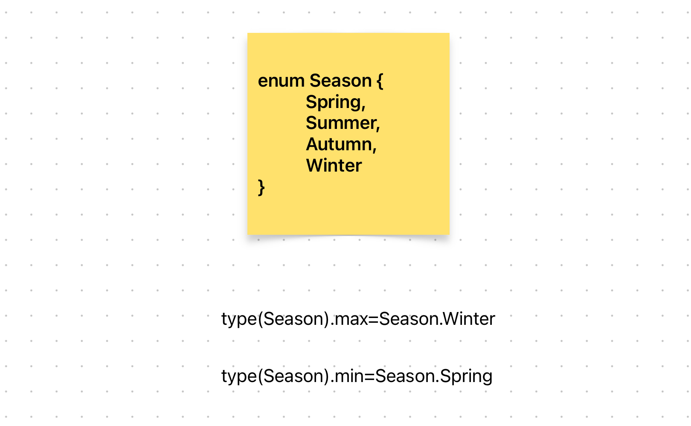

# Content/概念

### Concept

在上一节中，我们学习了枚举类型是如何赋值的。在这一节中，我们接着学习枚举类型的两个自带值——min/max。

使用`type(NameOfEnum).min`and`type(NameOfEnum).max`可以获得给定枚举的第一个值和最后一个值。

- 比喻
    
    假设一个建筑物只有三层，电梯可以到达 1 楼、2 楼和 3 楼。在这种情况下，你可以将这个电梯的楼层用 Solidity 的 `enum` 类型来表示：
    
    ```solidity
    enum Floor { First, Second, Third }
    
    ```
    
    在这个 `enum` 中，*First*（1 楼）是“最小”的楼层，因为它是第一个被定义的，并且在枚举里对应于数字 0。相对地，*Third*（3 楼）是“最大”的楼层，因为它是最后一个被定义的，并且在枚举里对应于数字 2。
    
    就像你不能让电梯去到低于 1 楼或高于 3 楼的位置，使用 `enum` 也确保了电梯（或者说合约）只能处于预定义的有效状态之一。
    
    所以，在这个电梯楼层的比喻里，*First* 和 *Third* 分别充当了枚举 `Floor` 的“最小”和“最大”值，即使 Solidity 本身没有内建的 *min* 和 *max* 函数或属性。这样的设计能在逻辑或功能上给出明确的最小和最大界限。
    
- 真实用例
    
    还是相同的例子，在[***GovernorCountingSimple***](https://github.com/OpenZeppelin/openzeppelin-contracts/blob/9ef69c03d13230aeff24d91cb54c9d24c4de7c8b/contracts/governance/extensions/GovernorCountingSimple.sol#L15)合约中，如果想要获取***VoteType***的最大值，可以使用max语法。
    
    ```solidity
    uint256 maxValue = type(VoteType).max;
    ```
    

### Documentation

使用`type(枚举名).min/max`的语法来获取一个枚举的最小值和最大值。

```solidity
//我们使用type(枚举名).max的语法获取到了Color这个枚举的最大值。
Color a = type(Color).max;
Color b = type(Color).min;
```

### FAQ

- 为什么有min/max来表示第一个和最后一个值？
    
    这是因为在Solidity底层是使用`unit8`来存储信息的，而min是0，max则是这个枚举变量里最大的合法值。
    
    由于枚举类型的整数值是从左到右依次递增的，0是第一个，最大的合法值就是最后一个。
    
- 可以给个示例再讲讲吗？
    
    当然！还是以Season枚举类型举例：
    
    ```solidity
    enum Season {
      Spring,
      Summer,
      Autumn,
      Winter
    }
    ```
    
    在上述示例中，*Season*枚举类型中的最大值为Winter，对应的底层值为3；最小值为Spring。对应的底层值为0。
    

# Example/示例代码

```solidity
pragma solidity ^0.8.0;

contract EnumExample {
  enum ExampleEnum {
    Value1,
    Value2,
    Value3
  }

  function getMinMax() public pure returns (uint, uint) {
    uint minValue = uint(type(ExampleEnum).min);
    uint maxValue = uint(type(ExampleEnum).max);

    return (minValue, maxValue);
  }
}
```
