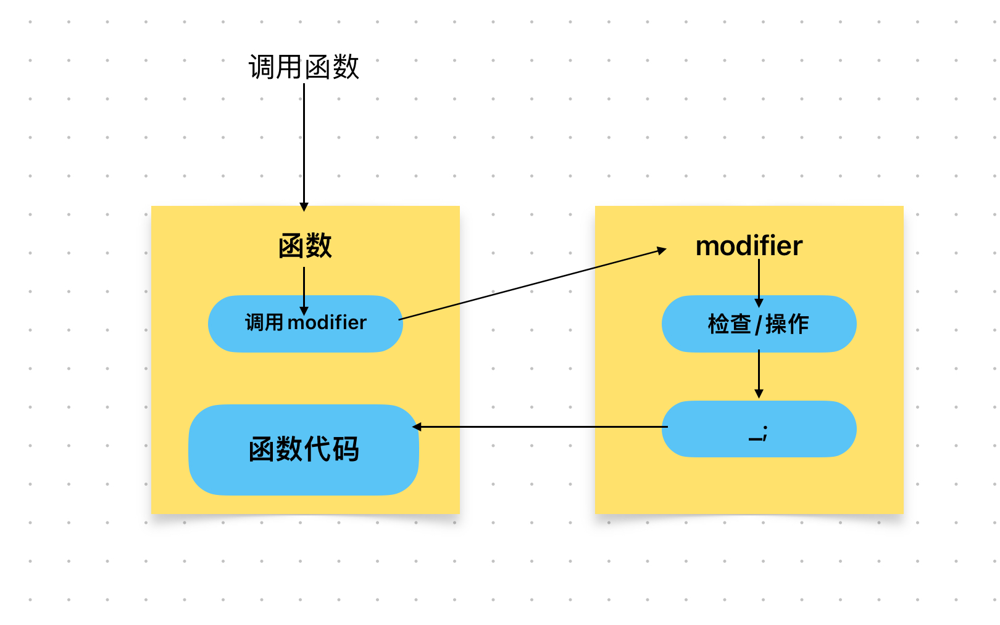

# Content/概念

### Concept

在这一节中，我们将开始学习solidity特有的语法——函数修饰符（modifier ）。

*函数修饰符*允许开发人员在函数执行前后或期间插入代码，以便修改函数的行为或确保特定的条件得到满足，函数修饰符内的代码的不能被独立执行。



*函数修饰符*在修饰的函数执行之前被调用，允许在函数执行之前进行额外的检查或操作。

- 比喻
    
    当我们在商店购买商品时，收银员会检查顾客给出的钱款是否足够支付商品的价格，确保顾客给出的钱足够支付商品后，才允许购买。这个检查过程就可以通过一个名为***checkBalance***的修饰符实现：
    
    ```solidity
    modifier checkBalance(uint amount) {
      require(balances[msg.sender] >= amount, "Insufficient balance");
      _;  //表示继续执行被修饰的函数（在下一节中会讲）
    }
    ```
    
    在上述示例中，如果账户余额满足要求，修饰符允许函数继续执行；否则，将抛出异常并显示"Insufficient balance"错误消息。
    
- 真实用例
    
    在OpenZepplin给出的***[Ownable](https://github.com/OpenZeppelin/openzeppelin-contracts/blob/9ef69c03d13230aeff24d91cb54c9d24c4de7c8b/contracts/access/Ownable.sol#L48)***合约中，给出了***onlyOwner***修饰符，该修饰符会在合约执行前检查调用者是否是owner。
    
    ```solidity
    modifier onlyOwner() {
        _checkOwner();
        _;
    }
    ```
    

### Documentation

在定义函数修饰符时，我们可以通过`modifier`关键字来定义，其定义方式和函数一样，唯一的区别在于`modifier`关键字取代了`function`关键字。

*modifier*相较于*function*而言，没有关键字，返回值，可见性的概念。

```solidity
//例如在这里我们定义了一个名为onlyOwner的函数修饰符，其参数为空。
modifier onlyOwner(uint a, bool b) {

}
```

### FAQ

- 函数修饰符在什么时候用？
    
    函数修饰符在Solidity中主要用于封装重复的逻辑和进行权限控制，以简化代码并提高可维护性。常用于多个函数需要执行相同的前置检查或条件验证时。

# Example/示例代码

```solidity
pragma solidity ^0.8.0;

contract Example {
  address public owner;
  uint public value;

  // 定义了一个名为onlyOwner的函数修饰符（如果没有参数，可以省略()
  modifier onlyOwner {
    require(msg.sender == owner, "Only the contract owner can call this function.");
    _; // 继续执行被修饰的函数（在下一节中会讲）
  }

  constructor() {
    owner = msg.sender;
  }
  // 被onlyOwner修饰的函数（后面会讲）
  function setValue(uint _newValue) public onlyOwner {
    value = _newValue;
  }
}
```
