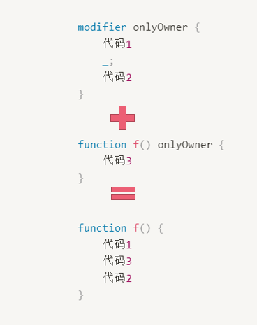

# Content/概念

### Concept

在上一节中，我们学习了函数修饰符modifier的定义，并且在Example中提到了一个语法`**_;**`在这一节中，我们将深入探讨该语法的作用。

*modifier*的执行是在函数执行之前的。`**_;`** 表示继续执行被修饰的函数。

<aside>
💡 在一个*modifier*中，如果缺少`**_;**`语句，编译器会报错。因为你必须明确的告诉编译器在什么时候需要重新执行被修饰的函数代码。

</aside>

- 比喻
    
    还是以商店买东西为例子，收营员在顾客买东西的前后可能都需要做出检查，这就要求我们可以在函数结束时也可以进入修饰符进行检查或者执行一些操作。
    
- 真实用例
    
    还是同样的***[Ownable](https://github.com/OpenZeppelin/openzeppelin-contracts/blob/9ef69c03d13230aeff24d91cb54c9d24c4de7c8b/contracts/access/Ownable.sol#L48)***合约，在***onlyOwner***修饰符中，`_;`表示运行函数体的代码，而`_checkOwner();`在`_;`前，证明该检查是在函数执行前运行的。
    
    ```solidity
    modifier onlyOwner() {
        _checkOwner();
        _;
    }
    ```
    

### Documentation

`_;`被用来在modifier中指定一个地方执行被修饰的函数的代码。

```solidity
modifier lock() {
	require(locked == 0);
	locked = 1;
	_;
	locked = 0;
}
```

### FAQ

- 设计`_;`语法的目的是什么？
    
    这样的设计也让modifier能够在函数执行结束后执行一段代码，只需要将需要执行的代码放在`_;`之后即可。如下代码：
    
    ```solidity
    modifier demo() {
      ...  // 函数执行前执行的代码
      _;   // 执行被修饰的函数
      ...  // 函数执行结束后执行的代码
    }
    ```
    
    