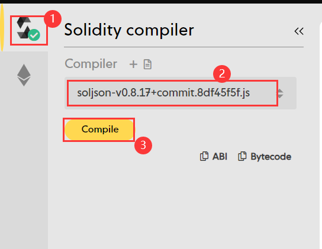
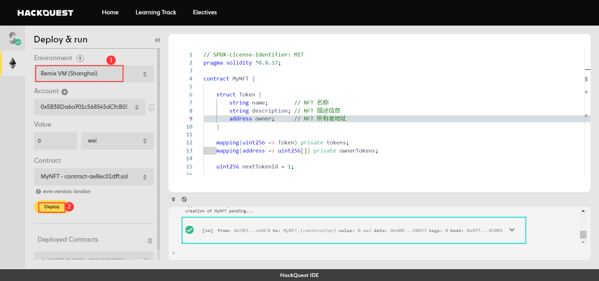
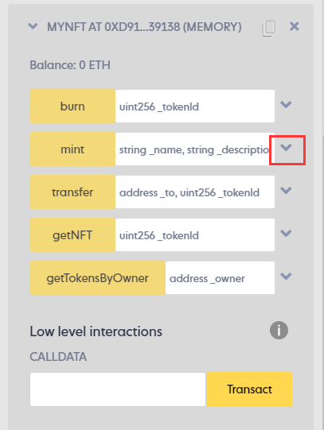
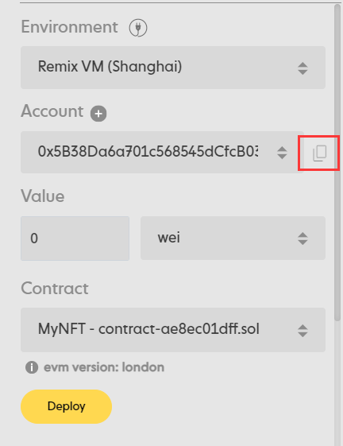
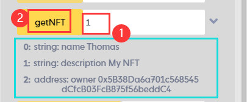
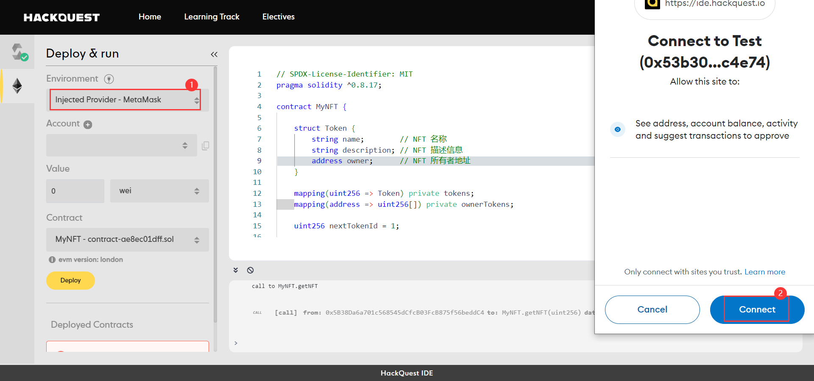
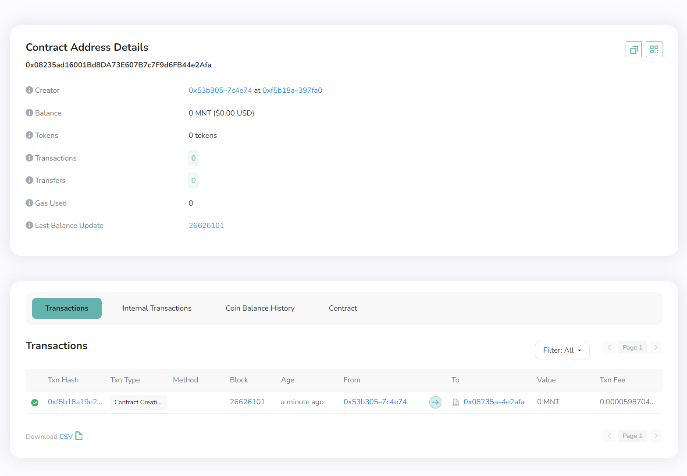

# Content/部署合约

由于合约中添加了功能，所以我们需要重复之前的合约部署步骤来部署新的合约。

我们先在本地使用 Remix VM 部署合约测试。

---

**TODO**

1. 点击左侧第一个按钮，再点击“**Compile**”编译合约
2. 点击左侧第二个按钮，再点击“**Deploy**”部署合约

（如果忘了怎么部署，可以翻看之前的教程）





# Content/铸造



为了完成burn步骤，我们首先需要先将NFT铸造出来，还记得铸造的步骤吗？

让我们来试试吧，如果你对此有困惑，请参阅Mint章节。

---

1. 在IDE中完成NFT的铸造

# Content/查询




好了，在铸造后，我们已经拥有了一个NFT。

在burn之前，先让我们确认一下我们的钱包状态，如果你对此有困惑，请参阅getTokensByOwner章节。

---

1. 复制当前地址
2. 将其粘贴到***getTokenByOwner***的参数字段
3. 点击函数名调用
    
    > 可以看到我们的钱包目前是有一个TokenId为*1*的NFT
    > 



知道了我们拥有这个NFT后，我们再来查询一下这个TokenId为*1*的NFT的详细信息吧！

---

1. 在***getNFT***的参数框输入*1*
2. 点击函数名进行调用
    
    > 可以看到目前这个NFT的信息
    > 

# Content/burn


到此为止，你应该确认的是“*0x5B38……*”这个账户拥有1个NFT。

接下来我们要将这1个NFT销毁，将该NFT的TokenId传入***burn***函数调用即可

---

1. 在***burn***函数的参数字段填入*1*
2. 点击函数名调用

# Content/查询


非常好！刚刚我们已经完成了销毁，

随后我们可以重复在转帐前做两次查询，来比较销毁前后的变化。

首先我们先查询***getNFT**函数*，由于该NFT已经被删除，所以在查询时应该是返回空值。

让我们来验证一下吧！

---

1. 在***getNFT***的参数框输入*1*
2. 点击函数名进行调用
    
    > 可以看到目前这个NFT的的信息已经全部为空了
    > 


接下来我们再来验证一下我们的钱包状态。

---

1. 将我们的地址复制到***getTokensByOwner***的参数框中
2. 点击函数名调用
    
    > 可以看到我们现在的钱包已经是空的了
    > 

# Content/连接账户

很好！到这一步我们已经成功完成了合约的功能测试，确定我们的合约编写无误。我们可以将合约真正部署到链上了！（如果暂时没有部署需求可以跳过接下来的步骤。）

在部署之前，我们需要先连接钱包。本教程中使用 MetaMask 做演示，要完成接下来的步骤，请确保您的浏览器已安装 MetaMask 钱包插件。

---

**TODO**

1. 点击左侧第二个图标
2. 选择 Injected Provider - MetaMask
3. 在Metamask弹出框内点击**Connect**确认将钱包与IDE连接



# Content/链上部署合约

在连接钱包后，我们准备开始将合约部署上链。本教程使用 Mantle 测试链做演示，要完成接下来的步骤，请确保您的钱包配置并切换到了 Mantle 链，且与 IDE 连接的钱包账户中拥有一定的 MNT 测试币。（当然，如果这些操作不太熟悉的话，可以去翻看我们之前教程，有更加详细的介绍。）

---

**TODO**

1. 点击 Deploy
2. 在 MetaMask 弹出框内点击confirm确认交易


# Content/查询合约信息

这是一个真正部署上链的合约！你可以去 Mantle 提供的区块链浏览器中查询相关合约信息。 

查看我们部署的合约，让我们把刚刚部署的合约展开，我们应该可以看到里面的所有公开函数和公开变量。

**TODO**

1. 在Deployed Contracts中复制部署的合约地址。
2. 打开 [Mantle 区块链浏览器](https://explorer.testnet.mantle.xyz/)，查询合约信息




# Example/示例代码

```solidity
// SPDX-License-Identifier: MIT
pragma solidity ^0.8.17;

contract MyNFT {
    
    // 定义 Token 结构体，用于存储 NFT 信息
    struct Token {
        string name;        // NFT 名称
        string description; // NFT 描述信息
        address owner;      // NFT 所有者地址
    }
    
    // 使用 mapping 存储每个 NFT 的信息
    mapping(uint256 => Token) private tokens;
    // 使用 mapping 存储每个地址所拥有的 NFT ID 列表
    mapping(address => uint256[]) private ownerTokens;

    // 记录下一个可用的 NFT ID
    uint256 nextTokenId = 1;
    
    // 创建 NFT 函数，用于创建一个新的 NFT，并将其分配给调用者
    function mint(string memory _name, string memory _description) public returns(uint256){ 
        Token memory newNFT = Token(_name, _description, msg.sender);
        tokens[nextTokenId] = newNFT;
        ownerTokens[msg.sender].push(nextTokenId);
        nextTokenId++;
        return nextTokenId-1;
    }

    // 获取指定 NFT 的信息
    function getNFT(uint256 _tokenId) public view returns (string memory name, string memory description, address owner) {
        require(_tokenId >= 1 && _tokenId < nextTokenId, "Invalid token ID");
        Token storage token = tokens[_tokenId];
        name = token.name;
        description = token.description;
        owner = token.owner;
    }

    // 获取指定地址所拥有的所有 NFT ID
    function getTokensByOwner(address _owner) public view returns (uint256[] memory) {
        return ownerTokens[_owner];
    }

    // 转移指定 NFT 的所有权给目标地址
    function transfer(address _to, uint256 _tokenId) public {
        require(_to != address(0), "Invalid recipien");
        require(_tokenId >= 1 && _tokenId < nextTokenId, "Invalid TokenID");
        Token storage token = tokens[_tokenId];
        require(token.owner == msg.sender, "You don't own this token");
        
        // 将 NFT 的所有权转移给目标地址
        token.owner = _to;
        
        deleteById(msg.sender, _tokenId);
        ownerTokens[_to].push(_tokenId);
    }

    function deleteById(address account, uint256 _tokenId) internal {
        uint256[] storage ownerTokenList = ownerTokens[account];
        for (uint256 i = 0; i < ownerTokenList.length; i++) {
            if (ownerTokenList[i] == _tokenId) {
                // 将该 NFT ID 与数组最后一个元素互换位置，然后删除数组最后一个元素
                ownerTokenList[i] = ownerTokenList[ownerTokenList.length - 1];
                ownerTokenList.pop();
                break;
            }
        }
    }

    function burn(uint256 _tokenId) public {
        require(_tokenId >= 1 && _tokenId < nextTokenId, "Invalid TokenID");
        Token storage token = tokens[_tokenId];
        require(token.owner == msg.sender, "You don't own this token");
        
        deleteById(msg.sender, _tokenId);
        delete tokens[_tokenId];
    }

}
```