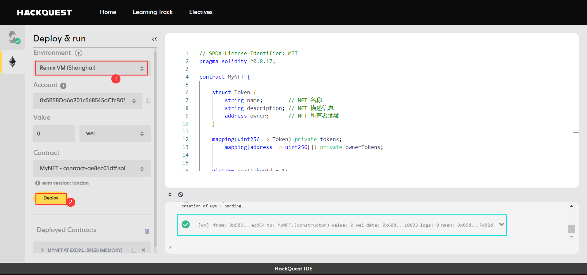
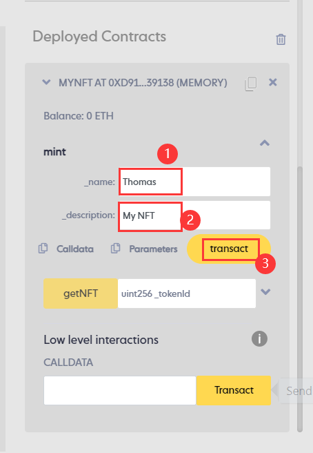
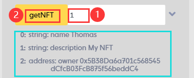
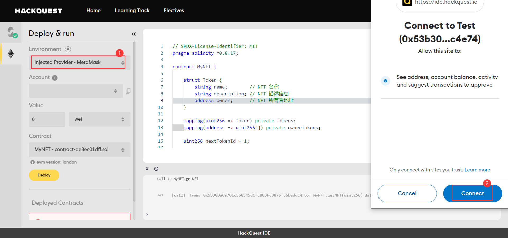
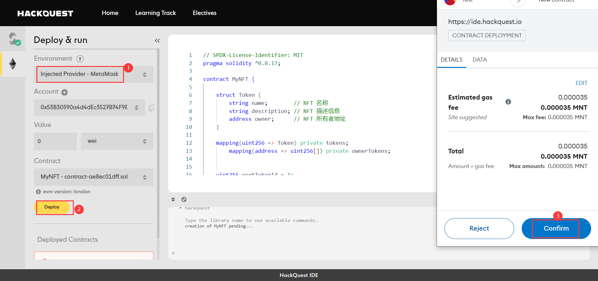
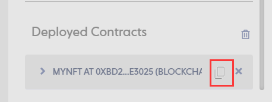
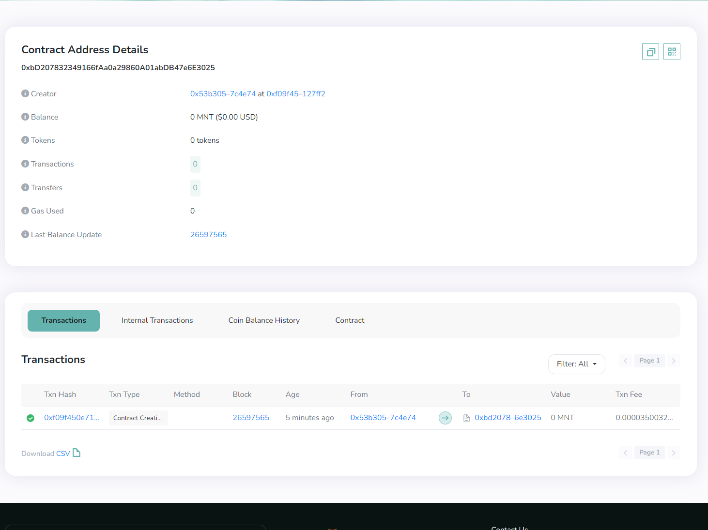

# Content/编译合约

让我们来编译合约 

> 这会检查我们合约中有没有语法错误
> 

---

**TODO**

1. 选择对应编译器版本
2. 然后点击“**Compile**”编译合约


# Content/本地部署合约

我们首先对我们所写的合约进行功能测试，因此在这一步中，我们不需要将合约直接部署上链，那样每一步操作都会消耗 gas，所以我们先在本地使用 Remix VM 部署合约测试，确认无误后再进行将合约真正部署到区块链上。（合约一旦部署上链后就不可修改，所以一定要谨慎部署。）

---

**TODO**

1. 部署环境选择 Remix VM. (这里我们选择的是 Remix VM（Shanghai）)。
2. 点击 “**Deploy**” 部署合约。



# Content/铸造NFT



在查询之前，我们首先来回顾一下上一节中学习的内容——Mint。

---

1. 在***mint***的第一个参数字段填你想要铸造NFT的名字
2. 在第二参数字段填写NFT的描述信息
3. 点击**transact**发送交易并在metamask的弹出框中确认交易

> 如果你忘了怎么铸造，可以倒回去参阅上一节的内容
> 

# Content/查看NFT




在复习了铸造的流程后，让我们来尝试查询我们刚刚铸造出来的TokenId为*1*的NFT吧！

---

1. 在***getNFT***的参数框输入*1*
2. 点击函数名进行调用
    
    > 随即可以在*函数*下方看到我们NFT的信息，这里就是我们刚刚定义的*返回值*了
    > 

# Content/连接账户

很好！到这一步我们已经成功完成了合约的功能测试，确定我们的合约编写无误。我们可以将合约真正部署到链上了！（如果暂时没有部署需求可以跳过接下来的步骤。）

在部署之前，我们需要先连接钱包。本教程中使用 MetaMask 做演示，要完成接下来的步骤，请确保您的浏览器已安装 MetaMask 钱包插件。

---

**TODO**

1. 点击左侧第二个图标
2. 选择 Injected Provider - MetaMask
3. 在Metamask弹出框内点击**Connect**确认将钱包与IDE连接




# Content/链上部署合约

在连接钱包后，我们准备开始将合约部署上链。本教程使用 Mantle 测试链做演示，要完成接下来的步骤，请确保您的钱包配置并切换到了 Mantle 链，且与 IDE 连接的钱包账户中拥有一定的 MNT 测试币。（当然，如果这些操作不太熟悉的话，可以去翻看我们之前教程，有更加详细的介绍。）

---

**TODO**

1. 点击 Deploy
2. 在 MetaMask 弹出框内点击confirm确认交易




# Content/查询合约信息

这是一个真正部署上链的合约！你可以去 Mantle 提供的区块链浏览器中查询相关合约信息。 

查看我们部署的合约，让我们把刚刚部署的合约展开，我们应该可以看到里面的所有公开函数和公开变量。

**TODO**

1. 在Deployed Contracts中复制部署的合约地址。
2. 打开 [Mantle 区块链浏览器](https://explorer.testnet.mantle.xyz/)，查询合约信息





# Example/ **示例代码**

```solidity
// SPDX-License-Identifier: MIT
pragma solidity ^0.8.17;

contract MyNFT {
    
    struct Token {
        string name;        // NFT 名称
        string description; // NFT 描述信息
        address owner;      // NFT 所有者地址
    }
    
    mapping(uint256 => Token) private tokens;
		mapping(address => uint256[]) private ownerTokens;

    uint256 nextTokenId = 1;
    
    function mint(string memory _name, string memory _description) public returns(uint256){ 
        Token memory newNFT = Token(_name, _description, msg.sender);
        uint256 tokenId = nextTokenId;
        tokens[tokenId] = newNFT;
        ownerTokens[msg.sender].push(tokenId);
				nextTokenId++;
        return tokenId;
    }

    function getNFT(uint256 _tokenId) public view returns (string memory name, string memory description, address owner) {
			require(_tokenId >= 1 && _tokenId < nextTokenId, "Invalid token ID");
			Token memory token = tokens[_tokenId];
			name = token.name;
			description = token.description;
			owner = token.owner;
		}

}
```