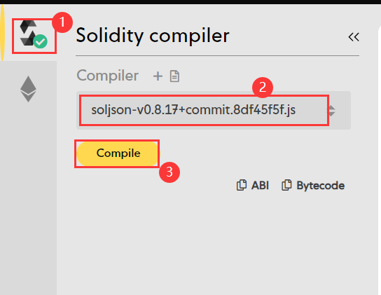
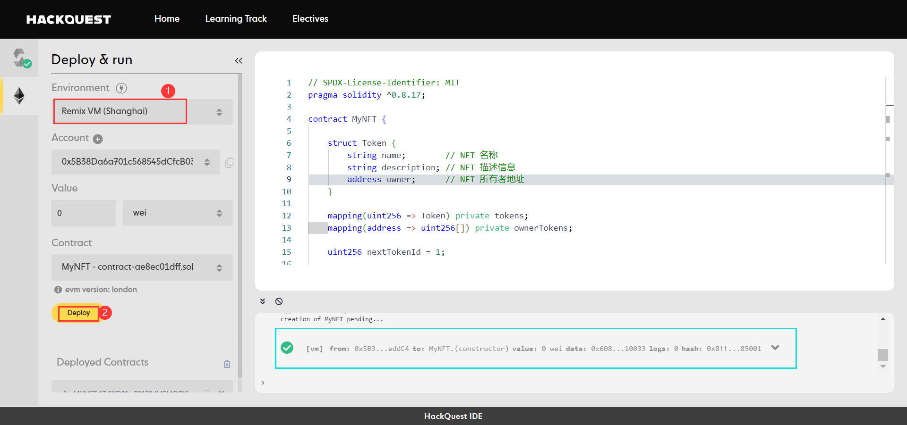
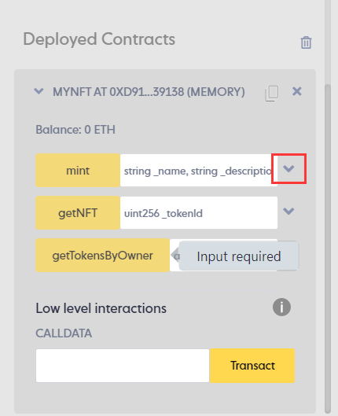
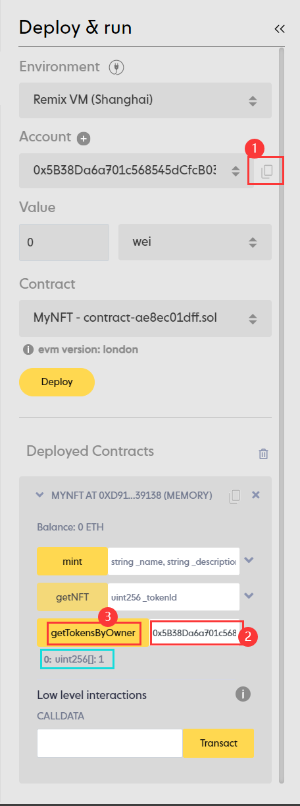
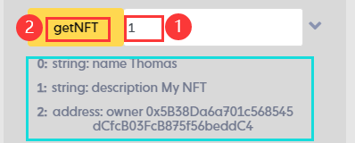
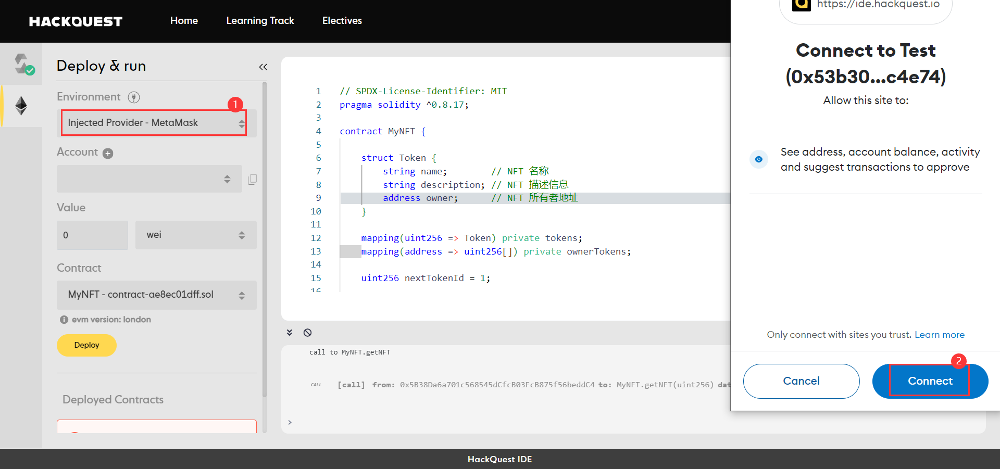
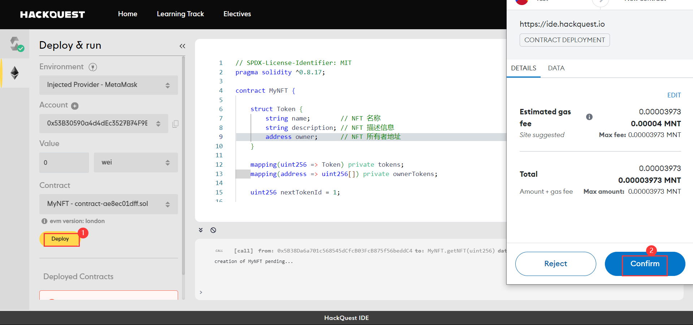
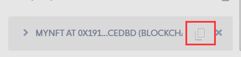
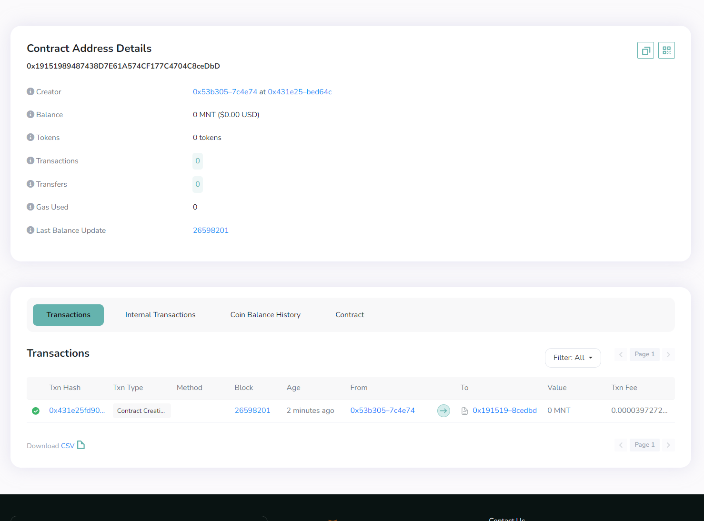

# Content/部署合约

由于合约中添加了功能，所以我们需要重复之前的合约部署步骤来部署新的合约。

我们先在本地使用 Remix VM 部署合约测试。

---

**TODO**

1. 点击左侧第一个按钮，再点击“**Compile**”编译合约
2. 点击左侧第二个按钮，再点击“**Deploy**”部署合约

（如果忘了怎么部署，可以翻看之前的教程）






# Content/mint函数



为了完成转账，我们首先需要先将NFT铸造出来，还记得铸造的步骤吗？

让我们来试试吧，如果你对此有困惑，请参阅Mint章节。

---

1. 在IDE中完成NFT的铸造

# Content/复制地址并查询NFT



好了，在铸造后，我们已经拥有了一个NFT。在转账之前，先让我们确认一下我们的钱包状态，如果你对此有困惑，请参阅***getTokensByOwner***章节。

---

1. 复制当前地址
2. 将其粘贴到***getTokenByOwner***的参数字段
3. 点击函数名调用
    
    > 可以看到我们的钱包目前是有一个***TokenId***为*1*的NFT的
    > 

# Content/查询NFT详细信息




知道了我们拥有这个NFT后，我们再来查询一下这个***TokenId***为*1*的NFT的详细信息吧！

---

1. 在***getNFT***的参数框输入*1*
2. 点击函数名进行调用
    
    > 可以看到目前NFT的拥有者是”*0x53B3…*”这个地址
    > 

# Content/连接账户

很好！到这一步我们已经成功完成了合约的功能测试，确定我们的合约编写无误。我们可以将合约真正部署到链上了！（如果暂时没有部署需求可以跳过接下来的步骤。）

在部署之前，我们需要先连接钱包。本教程中使用 MetaMask 做演示，要完成接下来的步骤，请确保您的浏览器已安装 MetaMask 钱包插件。

---

**TODO**

1. 点击左侧第二个图标
2. 选择 Injected Provider - MetaMask
3. 在Metamask弹出框内点击**Connect**确认将钱包与IDE连接



# Content/链上部署合约

在连接钱包后，我们准备开始将合约部署上链。本教程使用 Mantle 测试链做演示，要完成接下来的步骤，请确保您的钱包配置并切换到了 Mantle 链，且与 IDE 连接的钱包账户中拥有一定的 MNT 测试币。（当然，如果这些操作不太熟悉的话，可以去翻看我们之前教程，有更加详细的介绍。）

---

**TODO**

1. 点击 Deploy
2. 在 MetaMask 弹出框内点击confirm确认交易




# Content/查询合约信息

这是一个真正部署上链的合约！你可以去 Mantle 提供的区块链浏览器中查询相关合约信息。 

查看我们部署的合约，让我们把刚刚部署的合约展开，我们应该可以看到里面的所有公开函数和公开变量。

**TODO**

1. 在Deployed Contracts中复制部署的合约地址。
2. 打开 [Mantle 区块链浏览器](https://explorer.testnet.mantle.xyz/)，查询合约信息





# Example/示例代码

```solidity
// SPDX-License-Identifier: MIT
pragma solidity ^0.8.17;

contract MyNFT {
    
    struct Token {
        string name;        // NFT 名称
        string description; // NFT 描述信息
        address owner;      // NFT 所有者地址
    }
    
    mapping(uint256 => Token) private tokens;
    mapping(address => uint256[]) private ownerTokens;

    uint256 nextTokenId = 1;
    
    function mint(string memory _name, string memory _description) public returns(uint256){ 
        Token memory newNFT = Token(_name, _description, msg.sender);
        uint256 tokenId = nextTokenId;
        tokens[tokenId] = newNFT;
        ownerTokens[msg.sender].push(tokenId);
				nextTokenId++;
        return tokenId;
    }

    function getNFT(uint256 _tokenId) public view returns (string memory name, string memory description, address owner) {
        require(_tokenId >= 1 && _tokenId < nextTokenId, "Invalid token ID");
        Token storage token = tokens[_tokenId];
        name = token.name;
        description = token.description;
        owner = token.owner;
    }

		function getTokensByOwner(address _owner) public view returns (uint256[] memory) {
				return ownerTokens[_owner];

		}
}
```