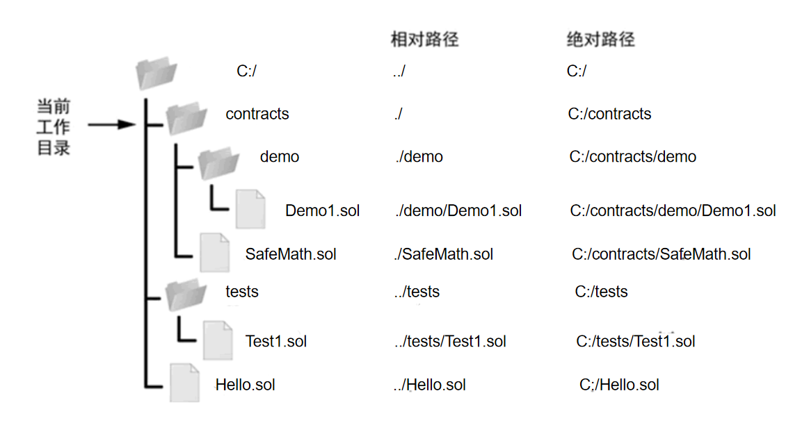
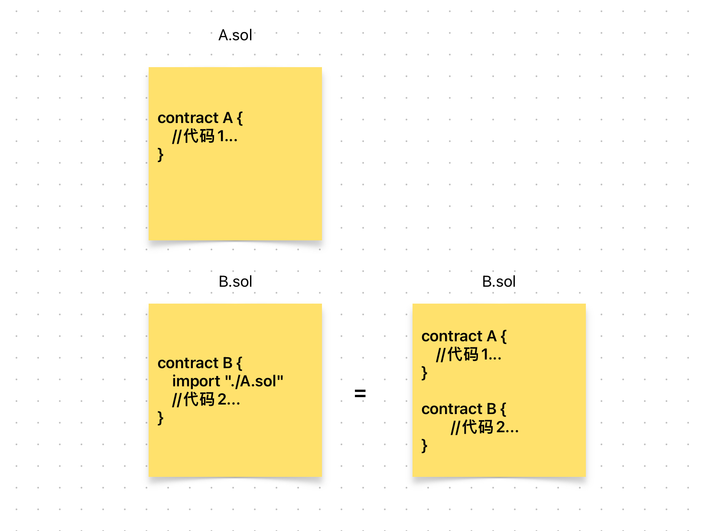

# Content/概念

### Concept

在学习了*库合约*之后，让我们来学习一个solidity当中常用的语法，`import`。

它用于在一个 Solidity 合约中**导入**其他合约或库。举个例子，假如你想使用名为***MathLibrary***的库中的函数，但它在另一个`.sol`文件中。*编译器*无法知道你要调用的函数是什么。

这时，你可以使用`import`将库合约导入合约。使编译器知道你要调用的库合约长什么样。

```solidity
import "./MathLibrary.sol"
```

- 比喻
    
    就像是准备一道复杂菜肴时，你需要各种不同的食材和调料。在这个例子中，合约就像是菜肴，而 `import`语句就是告诉人们去哪里找到相关的食材和调料。
    
- 真实用例
    
    还是刚刚的library，我们需要将其引入合约才可使用。
    
    ```solidity
    import './libraries/SafeCast.sol';
    ```
    

### Documentation

使用`import`关键字加文件路径（相对路径和绝对路径均可）即可将某个合约文件导入。

```solidity
//将同级目录下的SafeMath.sol合约文件引入
//这样写在SafeMath.sol中的函数就可以直接被使用了
//同样，该合约中的其他类型，我们可以直接获取了。
import "./SafeMath.sol"
```

<aside>
💡 *绝对路径*指的是从根目录（/）开始写起的文件或目录名称，而*相对路径*则指的是相对于当前路径的写法。

</aside>



### FAQ

- import的效果
    
    其实import就相当于将另一个`.sol`文件的代码拷贝到该合约文件中。
    
    
    
- import的好处
    
    import允许我们把不同的*contract*放在不同的文件中，这样方便管理，毕竟你也不想要一个6000行的文件对吧？

# Example/示例代码

```solidity
pragma solidity ^0.8.0;

contract OtherContract {

    function someFunction() external view returns (string memory) {
        return 'this is otherContract';
    }
}
```

```solidity
pragma solidity ^0.8.0;

// 导入其他合约
import "./OtherContract.sol";

contract ExampleContract {
    // 使用导入的合约
    OtherContract public otherContract;

    // 构造函数
    constructor(address _otherContractAddress) {
        // 创建其他合约实例
        otherContract = OtherContract(_otherContractAddress);
    }

    // 调用其他合约的函数
    function callOtherContractFunction() external view returns (uint256) {
        // 使用导入的合约实例调用函数
        return otherContract.someFunction();
    }
}
```