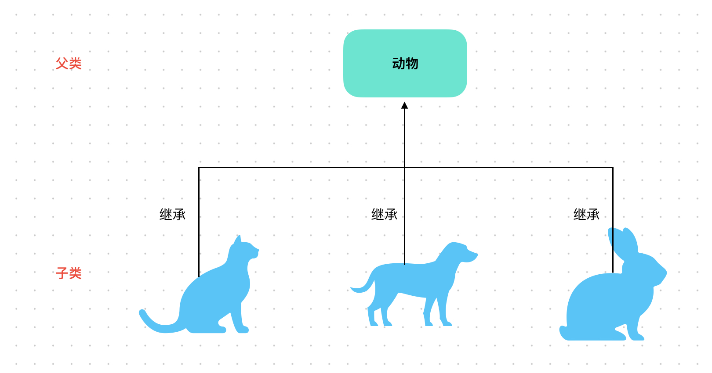

# Content/概念

### Concept

在之前的教程中，我们学习了*库合约*的使用方法，这让我们可以像借用朋友的工具一样，使用其他合约中的函数来增强我们的合约功能。

现在，让我们来学习继承的概念，这就像在编程世界中进行家族扩张一样！

- 比喻
    
    继承可以理解为一种家族关系，就像父母将自己的特征传给孩子一样，一个合约（父合约）可以将自己的属性和函数传递给另一个合约（子合约）。继承的合约可以访问所有非 `private` 的成员。
    
- 真实用例
    
    在上一节中提到的***[UniswapV3Pool](https://github.com/Uniswap/v3-core/blob/d8b1c635c275d2a9450bd6a78f3fa2484fef73eb/contracts/UniswapV3Pool.sol#L30C1-L30C59)***合约同时也继承了一个接口***IUniswapV3Pool***和一个合约***NoDelegateCall***。
    
    ```solidity
    contract UniswapV3Pool is IUniswapV3Pool, NoDelegateCall {
    ```
    

### Documentation

使用`is`关键字可以继承任意一个合约或接口。

例如这里我们定义了一个***ChildContract***合约并继承了***ParentContract***合约。

```solidity
contract ChildContract is ParentContract { }
```

### FAQ

- 可以再举一个例子解释继承吗？
    
    比如，我们有一个名为***Animal***的合约，里面有一个`eat()`方法。当我们需要编写***Cat***和***Dog***合约时，可以直接从***Animal***类继承：
    
    ```solidity
    // 对于Cat来说，Animal就是它的父合约，
    // 对于Animal来说，Cat就是它的子合约
    contract Cat is Animal { }
    // Dog和Cat类似。
    contract Dog is Animal { }
    ```
    
- 继承有什么好处？
    
    最大的好处是子合约获得了父合约的全部功能。***Animal***实现了`eat()`方法，***Dog***和***Cat***作为它的子合约，不需要做任何事情，就自动拥有了`eat()` 。
    

# Example/示例代码

```solidity
pragma solidity ^0.8.0;

contract ParentContract {
    // 父合约中的状态变量和函数
    uint public parentVariable = 1;

    function parentFunction() public pure returns (string memory) {
        return "Hello from parent contract!";
    }
}

contract ChildContract is ParentContract {
    // 子合约中的状态变量和函数
    uint public childVariable;

		function childFunctionCallParentFunction() public pure returns (string memory) {
				// 调用父合约中的函数
        return parentFunction();
    }

		function childFunctionUsingParentVariable() public {
				// 使用父合约中的状态变量
        childVariable = parentVariable;
    }
}
```