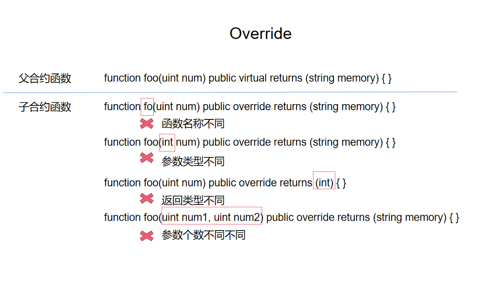

# Content/概念

### Concept

在这一节中，我们将学习继承中的函数的覆盖-`override`。

函数覆盖是指在子合约中**重新实现**从父合约继承的函数。这意味着子合约可以在自己的代码中提供新的函数实现，以**替换**父合约中原有的函数实现。

- 比喻
    
    假设你的父亲是一位著名的厨师，他有一套独特的烹饪方法（函数）。
    
    当你长大后，也成为了一位厨师，你从父亲那里继承了他的烹饪方法。但是，你发现你可以改进这些烹饪方法，使得菜肴更美味。所以，你在自己的厨房（子合约）中，使用新的烹饪方法（函数实现）替换了从父亲那里继承的烹饪方法。这就是`override`的概念。
    
    ```solidity
    function cooking(uint time) public virtual {
            // 祖传配方
    }
    ..............**override**............
    function cooking(uint time) public override {
            // 新的烹饪方法
    }
    ```
    
- 真实用例
    
    同样是在OpenZeppelin给出的***[DemoToken](https://github.com/OpenZeppelin/defender-templates/blob/d101d4a9cd036b98e284d4169acf5959095523ab/defender/contract-wizard-deployer/contracts/DemoToken/DemoToken.sol#L28C4-L34C6)***中，给出以下代码，重写了[ERC20](https://github.com/OpenZeppelin/openzeppelin-contracts/blob/fd81a96f01cc42ef1c9a5399364968d0e07e9e90/contracts/token/ERC20/ERC20.sol#L348)中的***_beforeTokenTransfer***函数以达成Pause的功能。
    
    ```solidity
    contract DemoToken is ERC20, ERC20Burnable, Pausable, Ownable, ERC20Permit, ERC20Votes {
    
        function _beforeTokenTransfer(address from, address to, uint256 amount)
            internal
            whenNotPaused
            override
        {
            super._beforeTokenTransfer(from, to, amount);
        }
        ...
    }
    ```
    

### Documentation

在函数的定义中使用`override`关键字，即可覆盖父合约中的函数。

```solidity

//这里定义了一个foo函数,并使用override关键字覆盖了父合约中的foo函数。
function foo() public override {
    
}
```

### FAQ

- 如果我想要覆盖某个函数，必须使其和之前的函数名相同吗？
    
    覆盖函数必须使用与被覆盖函数**相同**的函数名称、参数列表和返回类型，否则该合约会编译失败。
    
    
    
    <aside>
    💡 *构造函数*是不能够被覆盖的。你只能在父合约构造函数的基础上增加内容。
    
    </aside>

# Example/示例代码

```solidity
pragma solidity ^0.8.0;

contract Animal {
		//virtual 关键字将在下节内容中讲到
    function makeSound() public virtual returns (string memory) {
        return "Animal sound";
    }
}

contract Cat is Animal {
		//覆盖父函数的makeSound函数
    function makeSound() public override returns (string memory) {
        return "Meow";
    }
}

contract Dog is Animal {
		//覆盖父函数的makeSound函数
    function makeSound() public override returns (string memory) {
        return "Woof";
    }
}

contract AnimalSounds {
    Animal public animal;

    constructor(Animal _animal) {
        animal = _animal;
    }

    function makeAnimalSound() public returns (string memory) {
        return animal.makeSound();
    }
}
```