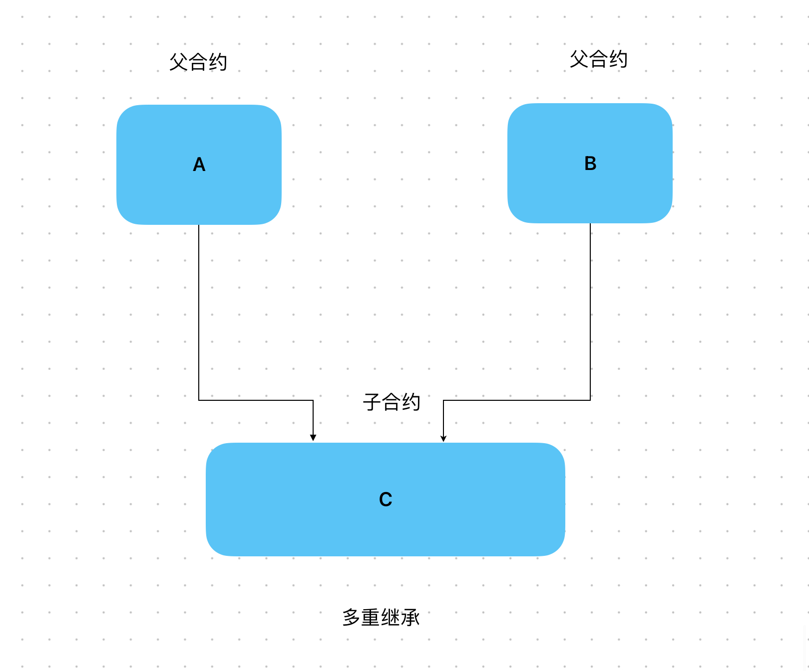

# Content/概念

### Concept

在之前的学习中，我们已经将solidity中的继承学习得差不多了，接下来我们将学习继承章节的最后一个内容——多重继承。

多重继承是指一个合约可以从多个父合约继承功能和属性。当一个合约通过多重继承从多个父合约继承功能和属性时，它可以像拼图一样将这些不同的功能和属性组合在一起，形成一个更为复杂和功能丰富的合约。



- 比喻
    
    想象一下，你正在编写你自己的个人菜谱。在市面上有两本菜谱可供选择：一本是川菜菜谱，另一本是粤菜菜谱。现在，你希望在自己的菜谱中包含川菜和粤菜的烹饪技巧。
    
    为了实现这一目标，你可以创建一本新的菜谱，让它继承川菜菜谱和粤菜菜谱。通过这种多重继承的方式，你的菜谱将具备川菜和粤菜的烹饪技巧。
    
    ```solidity
    contract Recipe is Sichuan_cuisine, Cantonese_cuisine { }
    ```
    
- 真实用例
    
    在OpenZepplin给出的***[DemoToken](https://github.com/OpenZeppelin/defender-templates/blob/d101d4a9cd036b98e284d4169acf5959095523ab/defender/contract-wizard-deployer/contracts/DemoToken/DemoToken.sol#L11C1-L11C89)***中同时继承了多个合约，即多重继承
    
    ```solidity
    contract DemoToken is ERC20, ERC20Burnable, Pausable, Ownable, ERC20Permit, ERC20Votes {
    ```
    

### Documentation

在多重继承中使用`is`关键字，将要继承的合约写在后面，用**`，`**分隔即可。

```solidity
//值得一提的是在多重继承时，super究竟指向哪一个父合约呢？
//事实是写在最后面的合约会被super调用。
contract Child is Parent1, Parent2 { 

		function foo() public {
				super.foo(); // 这会调用Paren2的foo函数
		}	
}

```

### FAQ

- 为什么需要多重继承
    
    为了方便管理合约，当项目复杂度较高时，可以使用多继承的方式使代码结构变得更加清晰，也使代码模块化，方便维护。

# Example/示例代码

```solidity
pragma solidity ^0.8.0;

contract Parent1 {
    function foo() public virtual returns (string memory) {
        return "Parent1";
    }
}

contract Parent2 {
    function foo() public virtual returns (string memory) {
        return "Parent2";
    }
}

contract Child is Parent1, Parent2 {
		//在这里会返回Parent2。
    function foo() public override(Parent1, Parent2) returns (string memory) {
        return super.foo();
    }
}
```