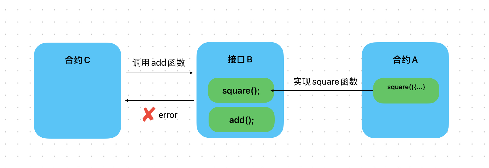
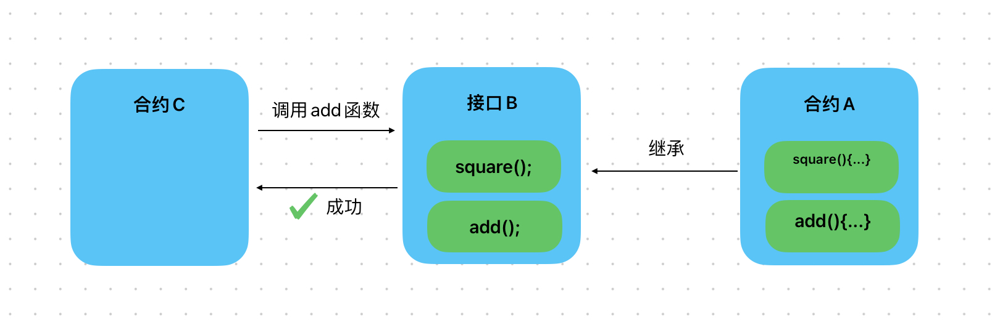

# Content/概念

### Concept

在本节中，我们将学习接口中的最后一个知识点——接口的*继承*。

合约的继承是指子合约继承了父合约的状态变量和函数，子合约可以直接使用父合约的资源和功能。而接口的继承完全不同——它不提供任何功能和变量，而是定义了一组等待在子合约中实现的函数。

- 比喻
    
    这种继承关系类似于学校制定的学习计划，学生必须按照学习计划的规定来完成学业。学校并不关心学生是如何学习的，只关心学生是否按照学习计划的要求来完成学业。
    
    ```solidity
    interface Plan {
        function learningEnglish() external;
        function learningHistory() external;
    }
    
    contract Students is Plan {
        function learningEnglish() external override {
            // 英语计划
            ...
        }
        function learningHistory() external override {
            // 历史计划
            ...
        }
    }
    ```
    
- 真实用例
    
    在***UniswapV3Pool***的实现中，继承了***[IUniswapV3Pool](https://github.com/Uniswap/v3-core/blob/d8b1c635c275d2a9450bd6a78f3fa2484fef73eb/contracts/UniswapV3Pool.sol#L30C1-L30C59)***接口，即表明其含有所有接口中定义的函数。
    
    ```solidity
    contract UniswapV3Pool is IUniswapV3Pool, NoDelegateCall {
    ```
    

### Documentation

我们可以使用`is`关键字继承一个接口。

```solidity
//在这里我们定义了一个合约ContractA并继承了InterfaceA接口，
//这意味着我们必须实现InterfaceA中规定的所有函数。
contract ContractA is InterfaceA { }
```

### FAQ

- 为什么需要继承接口？
    
    我们在前两章已经学习过，即使合约***A***没有继承接口***B***，但是合约***A***如果实现了接口***B***中的某一个函数，那合约***C***依然可以使用接口***B***来和合约***A***交互。那为什么需要继承接口呢？
    
    因为这种情况下，合约A可能没有实现接口B中的所有函数，这可能会导致合约C在调用合约A时出现问题。
    
    
    
    在合约***A***中显式地继承接口***B***可以确保 Solidity 编译器在编译时检查合约***A***是否实现了接口***B***的所有函数。这可以避免因遗漏实现某个函数而导致的潜在问题。
    
