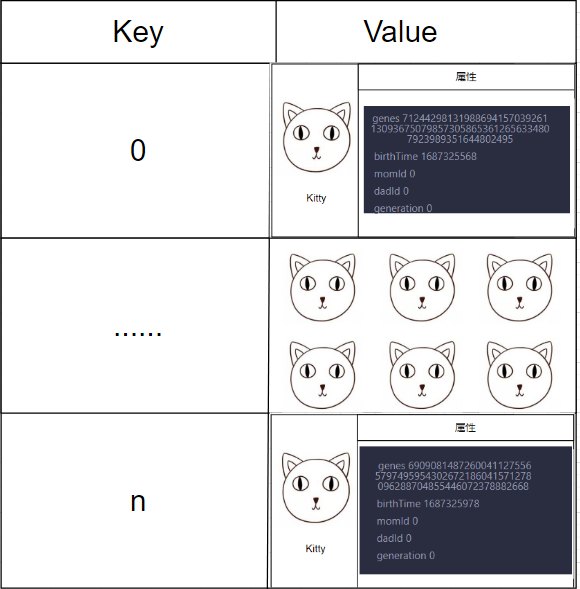

# Content/定义kitties映射

前面我们提到，需要在合约中存储小猫的信息，并确保小猫的信息与TokenId一一对应。

当涉及到一一对应的关系时，我们通常使用mapping来存储。在这里，我们需要一个从***uint256***到***Kitty***的映射。

在可见性方面，我们选择`public`，以便于查询。



**Syntax**

mapping

- 提示
    
    ```solidity
    mapping(uint256 => Kitty) public kitties;
    ```