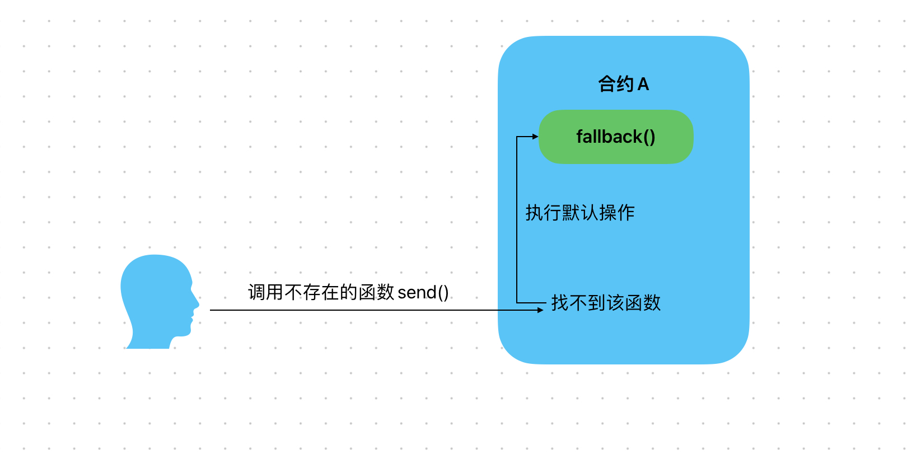
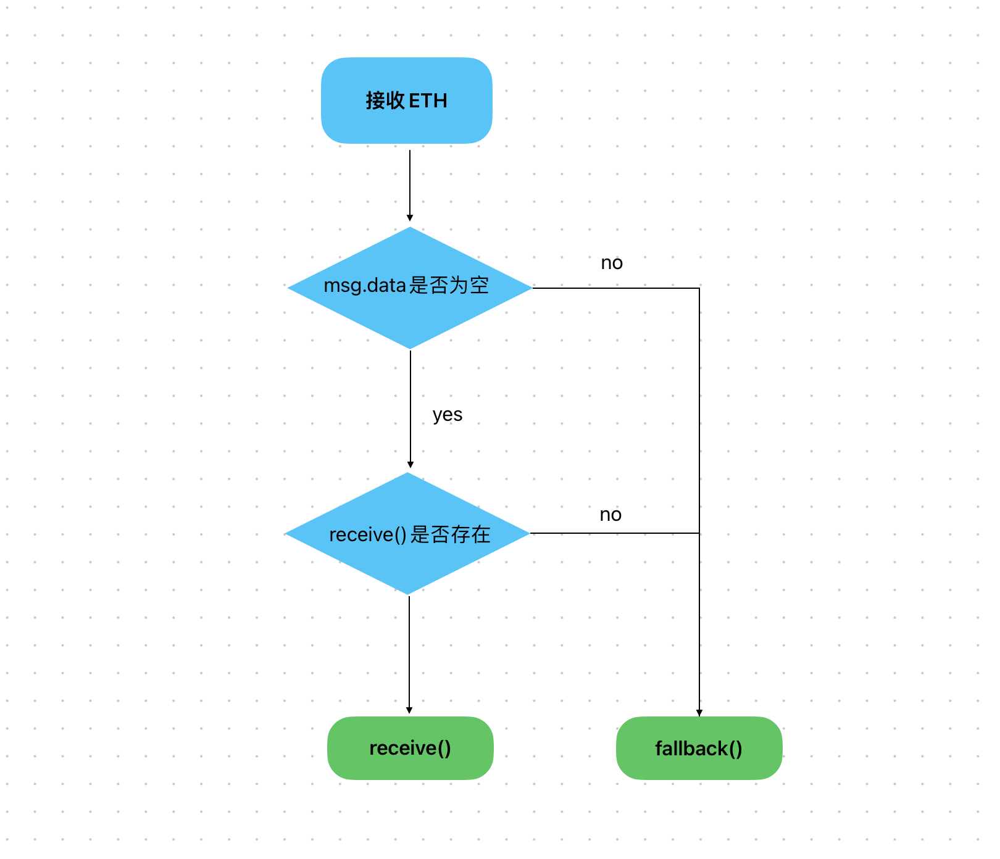

# Content/概念

### Concept

在这一节中，我们来学习一个solidity当中的特殊函数 - fallback。

fallback函数充当了合约的默认处理函数，用于处理没有明确定义处理方式的消息。

*fallback*函数会在三种情况下被调用

1. 调用者尝试调用一个合约中不存在的函数时
2. 用户给合约发Ether但是*receive*函数不存在
3. 用户发Ether，*receive*存在，但是同时用户还发了别的数据（msg.data不为空）
- 比喻
    
    假设合约就像是一个快递员，当快递员收到一个包裹时，如果地址清晰，就按地址送达。如果地址不清晰，就执行默认操作，例如将包裹送回快递站。
    
    在这个比喻中，*fallback函数*就类似于快递员的默认操作。当你在合约中调用一个未定义的函数或者向合约发送以太币但合约中没有*receice*函数时，Solidity会调用*fallback*函数作为默认处理方式。
    
    
    
- 真实用例
    
    在OpenZepplin的[Proxy](https://github.com/OpenZeppelin/openzeppelin-contracts/blob/9ef69c03d13230aeff24d91cb54c9d24c4de7c8b/contracts/proxy/Proxy.sol#L66C1-L68C6)合约中，实现了*fallback函数*，因为*代理合约*需要使用*fallback*来完成调用。(有关代理合约的知识可以关注我们的Mini教程)
    
    ```solidity
    fallback() external payable virtual {
        _fallback();
    }
    ```
    

### Documentation

fallback是solidity中的特殊函数，定义方式为`fallback()`关键字。需要注意的是*fallback*需要被定义为`external`。

```solidity
//这里我们定义了一个空的fallback函数。
fallback() external { }
fallback () external payable {...}
```

### FAQ

- 每个合约都必须写fallback吗？
    
    并不是每个合约都必须编写fallback函数。*fallback* 和 *receive*一样都不是必须的。
    
- fallback和receive的区别？
    
    二者都是处理solidity中默认逻辑的函数。fallback可以不用被payable修饰，而receive必须被payable修饰。当fallback被定义为payable时，也可以充当receive的作用来接收ETH。
    
    receive像一个专门接收现金的收银员。当客户只是想付现金，而不需要任何其他服务时，他们就会去找这个收银员。
    
    > receive不会默认存在在合约中。
    > 
- 什么时候触发fallback函数 | receive函数?
    
    
    
    简单来说，合约接收ETH时，msg.data为空且存在receive()时，会触发receive()；*msg.data*不为空或不存在receive()时，会触发fallback()，此时fallback()必须为payable。
    
    需要注意的是，如果合约中既没有**receive**函数，也没有**payable**修饰的**fallback**函数，那么直接向合约发送以太币的操作将会失败，合约会拒绝接收以太币。但是，你仍然可以通过调用带有**payable**修饰的其他函数来向合约发送以太币。
    

# Example/示例代码

```solidity
pragma solidity ^0.8.0;

contract ContractA {
    bool public flag;
    
    fallback() external {
        flag = true;
    }
}

contract ContractB {
    function callFallback(address _contract) external payable {
        // 调用ContractA中不存在的函数
        bytes memory encodedData = abi.encodeWithSignature("nonExistentFunction()");
        (bool suc,) = _contract.call(encodedData);
        require(suc, "call fail");
    }
}
```