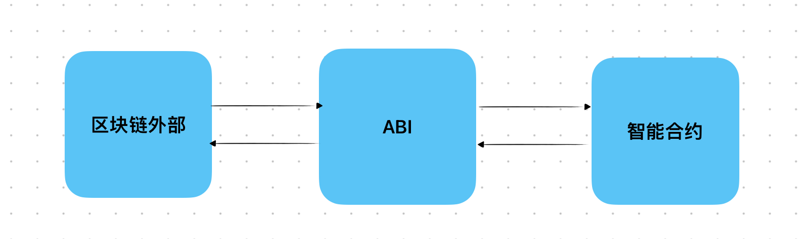

# Content/概念

### Concept

从这章开始，我们将开始介绍 Solidity 当中特殊的全局变量 abi。

首先，我们将学习全局函数 abi.encode，它用于对给定的参数进行 **ABI** 编码，返回一个*字节数组*。

ABI (Application Binary Interface，应用二进制接口)是与以太坊智能合约交互的标准。在 **EVM** 处理数据时，所有的数据根据 **ABI** 标准进行编码。

- 比喻
    
    就像人们在交流时需要共同的语言和规则一样，智能合约与外部世界进行交互时也需要一种共同的语言和规则。**ABI** 提供了这种共同的语言和规则，使得智能合约的函数调用和数据交换能够被正确编码和解码。
    
    
    
- 真实用例
    
    在[EIP712](https://github.com/OpenZeppelin/openzeppelin-contracts/blob/9ef69c03d13230aeff24d91cb54c9d24c4de7c8b/contracts/utils/cryptography/EIP712.sol#L88)中，使用abi.encode函数将该合约的很多信息编码后进行哈希运算。
    
    ```solidity
    function _buildDomainSeparator() private view returns (bytes32) {
        return keccak256(abi.encode(_TYPE_HASH, _hashedName, _hashedVersion, block.chainid, address(this)));
    }
    ```
    

### Documentation

可以直接在函数中调用`abi.encode()`函数对数据进行编码。

```solidity
bytes memory encodedData = abi.encode(param1, param2);
```

- ***param1*** 和 ***param2***：这是要编码的参数。根据参数的类型，它们将被编码为**字节数组**。
- ***encodedData***：这是一个 *bytes* ****类型的变量，用于存储通过 `abi.encode(param1, param2)` 对参数进行编码后的数据。编码后的数据将按照参数的类型和顺序进行紧凑的编码，形成一个动态*字节数组*。

### FAQ

- 为什么要使用abi.encode？
    
    abi.encode 是 Solidity 提供的一个非常有用的工具，用于将多个参数或变量编码为一个连续的字节数组，这在与智能合约交互时尤为重要。以下是使用abi.encode 的几个主要原因：
    
    1. **标准化编码**：当与智能合约交互时，需要确保数据以特定的格式进行编码和解码。abi.encode 确保了数据按照 **Ethereum** 的 **ABI** 规范进行编码，从而确保数据的正确性和一致性。
    2. **提高代码可读性**：直接使用abi.encode 可以使代码更加简洁和可读，因为开发者不需要手动进行复杂的编码操作。
    3. **安全性**：手动编码数据可能会导致错误，而 abi.encode 提供了一种安全、一致的方法来编码数据，从而减少了出错的可能性。
    4. **灵活性**：abi.encode 可以用于编码各种不同的数据类型，包括结构体、数组和基本数据类型，这为开发者提供了很大的灵活性。
    5. **与其他函数和库的兼容性**：许多Ethereum的函数和库都期望数据以特定的ABI格式进行编码。使用 abi.encode 可以确保与这些函数和库的兼容性。
    
    abi.encode 是一个强大的工具，它简化了与智能合约交互的过程，确保了数据的正确性和一致性。
    

# Example/示例代码

```solidity
pragma solidity ^0.8.0;

contract AbiEncodeExample {
		
    function encodeParameters(uint256 param1, string memory param2) public pure returns (bytes memory) {
        //对函数的两个参数进行编码。
				bytes memory encodedData = abi.encode(param1, param2);
				//将编码的结果作为函数返回值返回。
        return encodedData;
    }
}
```