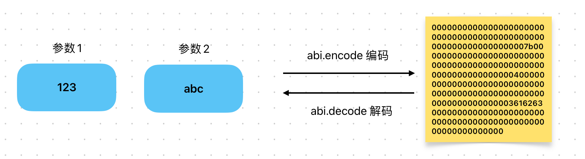

# Content/概念

### Concept

上一节我们学习了**ABI** 编码，这节我们将介绍如何使用 abi.decode 把 **ABI** 编码后的*字节数组*还原为其原始参数。

对于所有使用abi.encode编码的内容，我们都可以使用abi.decode解码。

- 比喻
    
    假设我们需要与一个朋友交换保密信息。在发送信息之前，我们会先使用一种编码方法（**ABI** 编码）对信息（函数参数）进行加密，将其转换成复杂的密文。这个加密过程类似于 abi.encode。然后我们将这段密文发送给我们的朋友。 
    当朋友收到密文后，他需要使用相同的编码方法对密文进行解密，还原出原始的信息（函数参数）。这个解密过程类似于 abi.decode。
    
    
    
- 真实用例
    
    在 OpenZepplin 的 ***[SignatureChecker](https://github.com/OpenZeppelin/openzeppelin-contracts/blob/9ef69c03d13230aeff24d91cb54c9d24c4de7c8b/contracts/utils/cryptography/SignatureChecker.sol#L36)*** 合约中，abi.decode **用于检查解签名后的结果 ***result*** ，是否与 ***isValidSignature*** 函数的选择器一致。
    
    ```solidity
    function isValidERC1271SignatureNow(
        address signer,
        bytes32 hash,
        bytes memory signature
    ) internal view returns (bool) {
        (bool success, bytes memory result) = signer.staticcall(
            abi.encodeCall(IERC1271.isValidSignature, (hash, signature))
        );
        return (success &&
            result.length >= 32 &&
            abi.decode(result, (bytes32)) == bytes32(IERC1271.isValidSignature.selector));
    }
    ```
    

### Documentation

使用 `abi.decode()` 函数可以对编码后的数据进行解码。第一个参数是编码数据的*字节数组*，第二个参数是解码后的数据类型。

```solidity
address decodedAddress = abi.decode(encodedData, (address));

//多个参数
(uint256 decodedUint, address decodedAddress, string memory decodedString) = abi.decode(encodedData, (uint256, address, string));
```

在上述代码中，我们使用了 abi.decode 函数对编码后的数据 *encodedData *****进行了解码，将其解码为一个*address* 类型。

### FAQ

- 什么时候需要使用 abi.decode？
    
    当我们与智能合约交互或在合约之间传递数据时，为了确保数据的完整性和一致性，我们经常使用abi.encode 对数据进行编码。编码后的数据是一个*字节数组*，它代表了原始数据的 **ABI** 编码形式。
    
    *abi.decode* 的使用场景主要包括：
    
    1. **数据验证**：当我们从外部源（如其他合约或外部调用）接收到编码的数据并需要验证其内容时，我们会使用 abi.decode。
    2. **事件日志解析**：当我们从智能合约的事件日志中获取编码的数据并希望解析它以获取具体的参数值时。
    3. **跨合约调用**：当一个合约向另一个合约发送编码的数据，并且接收方合约需要解码这些数据以进行进一步的处理。
    4. **存储和恢复**：当我们在合约的存储中保存编码的数据并在以后需要恢复原始数据时。
    
    当我们面对已经被 abi.encode 编码的数据并需要访问其原始形式时，我们就会使用 abi.decode。
    

# Example/示例代码

```solidity
pragma solidity ^0.8.0;

contract DecodeExample {
    function decodeAddress(bytes memory encodedData) public pure returns (address) {
        // 解码编码数据为 address 类型
        address decodedAddress = abi.decode(encodedData, (address));

        // 返回解码结果
        return decodedAddress;
    }
} 
```