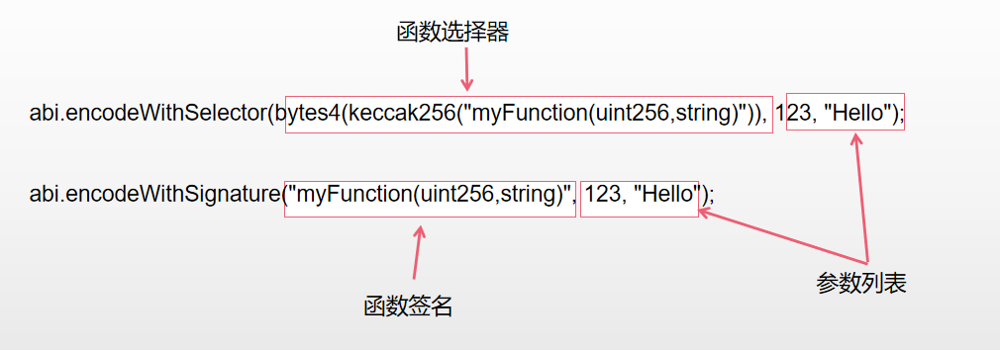

# Content/概念

### Concept

在本节我们学习另一个数据编码函数 abi.encodeWithSelector。

- 比喻
    
    使用 abi.encodeWithSelector 就像制作一个签名印章，它不仅代表你的身份（函数），还包含了你书写的确切模式，这使得你可以在智能合约的上下文中精准而真实地授权和执行特定操作（函数调用）。
    
- 真实用例
    
    在[OpenZeppelin](https://github.com/OpenZeppelin/openzeppelin-contracts/blob/9ef69c03d13230aeff24d91cb54c9d24c4de7c8b/test/utils/ShortStrings.t.sol#L28)的 ***[ShortStringsTest](https://github.com/OpenZeppelin/openzeppelin-contracts/blob/9ef69c03d13230aeff24d91cb54c9d24c4de7c8b/test/utils/ShortStrings.t.sol#L28)*** 合约中，有一个 ***testRevertLong*** 函数，该函数使用 abi.encodeWithSelector 来尝试调用***ShortStrings.StringTooLong***函数。
    
    这里是这段代码的简化解释：
    
    ```solidity
    contract ShortStrings {
        function StringTooLong(string memory input) external pure {
            require(bytes(input).length >= 32, "String is not too long");
        }
    }
    
    contract TestShortStrings {
        ShortStrings public shortStrings;
    
        constructor(address _shortStringsAddress) {
            shortStrings = ShortStrings(_shortStringsAddress);
        }
    
        function testRevertLong(string memory input) external {
            require(bytes(input).length >= 32, "Input should be a long string");
    
            // 使用 abi.encodeWithSelector 来尝试调用 ShortStrings 的 StringTooLong 函数
            bytes memory data = abi.encodeWithSelector(shortStrings.StringTooLong.selector, input);
            (bool success,) = address(shortStrings).call(data);
    
            require(!success, "Function did not revert as expected");
        }
    }
    ```
    
    在这个简化的例子中，我们有一个 ***ShortStrings*** 合约，其中包含一个***StringTooLong***函数，该函数会在输入字符串长度小于*32*时失败。
    
    *TestShortStrings* 合约有一个 *testRevertLong* 函数，该函数使用abi.encodeWithSelector来尝试调用 *ShortStrings* 中的 *StringTooLong* 函数，并检查其是否如预期那样失败。
    

### Documentation

可以直接在函数中调用 abi.encodeWithSelector 函数对数据进行编码。并通过`bytes4(keccak256("函数名(参数列表)"))`的方式获取函数的选择器。

```solidity
abi.encodeWithSelector(bytes4(keccak256("myFunction(uint256,string)")),123, "Hello");

//可以通过函数名.selector()的方式获取函数的选择器。
bytes4 selector = this.myFunction.selector;
abi.encodeWithSelector(selector, 123, "Hello");
```

### FAQ

- abi.encodeWithSelector 和 abi.encodeWithSignature 有什么区别？
    - abi.encodeWithSelector 函数需要手动提供函数的选择器作为第一个参数。选择器是为*函数签名*哈希后的前*4*个字节，由*函数名称*和*参数类型*进行计算得到的。
    - abi.encodeWithSignature 函数只需要提供*函数签名*的字符串形式作为第一个参数，不需要手动提供选择器。
    
    使用 abi.encodeWithSelector 就像是你已经知道了菜名的简写（函数选择器），并把制作材料（*参数*）写在菜谱上。
    
    
    

# Example/示例代码

```solidity
pragma solidity ^0.8.0;

contract EncodeWithSelectorExample {
    function getEncodedData() public pure returns (bytes memory) {
        // 使用 functionName.selector 获取函数选择器
        bytes4 selector = this.myFunction.selector;

        // 使用 abi.encodeWithSelector() 编码函数调用数据
        bytes memory encodedData = abi.encodeWithSelector(selector, 123, "Hello");

        // 返回编码结果作为函数的返回值
        return encodedData;
    }

    function myFunction(uint256 amount, string memory message) public pure {
        // 函数逻辑
    }
}
```