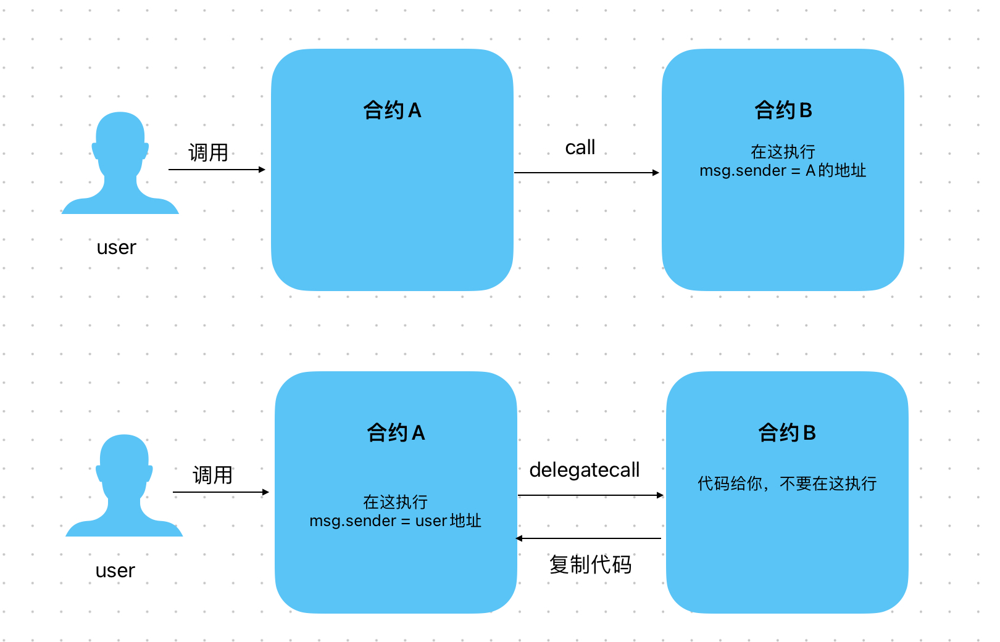

# Content/概念

### Concept

在上一节中,我们学习了低级调用中的 call。本节将为你介绍 call 的一个孪生兄弟delegatecall。

- 比喻
    
    顾名思义，delegatecall **是委托调用。就像你委托了一个任务给另一个人来完成，而这个人将以你的名义执行任务。
    
    在 Solidity 中体现为：它允许你将另外一个合约的代码拷贝到当前合约，并执行。
    
    
    
- 真实用例
    
    参考OpenZeppelin 的[***Address library](https://github.com/OpenZeppelin/openzeppelin-contracts/blob/9ef69c03d13230aeff24d91cb54c9d24c4de7c8b/contracts/utils/Address.sol#L105)*** 合约。
    
    ```solidity
    function functionDelegateCall(address target, bytes memory data) internal returns (bytes memory) {
    		(bool success, bytes memory returndata) = target.delegatecall(data);
    		return verifyCallResultFromTarget(target, success, returndata);
    }
    ```
    
    这个 ***functionDelegateCall*** 函数使用 delegatecall **来调用目标地址 ***target*** 上的指定函数。由于使用了 delegatecall，虽然函数逻辑来自目标合约，但所有的状态变化都会发生在当前合约中。
    

### Documentation

delegatecall 的语法与 call 语法一致，使用`address.delegatecall()` 来实现。 

```solidity
(bool success, bytes memory data) = address(targetAddress).delegatecall(abiEncodedData);
```

在上述语法中：

- ***targetAddress***：是目标合约的地址。
- ***abiEncodedData***：是目标合约函数的 *ABI* 编码数据。

### FAQ

- 使用delegatecall需要注意！
    
    当使用 delegatecall 时，它实际上是将要调用的函数的代码复制到当前合约中进行执行。这意味着被调用的函数将在当前合约的上下文环境下执行，允许外部合约来改变当前合约的存储布局。
    
    <aside>
    💡 这种调用模式非常危险！在以太坊的历史上，由于对delegatecall的错误使用而引发了许多安全漏洞和黑客攻击。
    
    </aside>
    
- 什么时候需要这么做？
    
    由于部署的 Solidity 合约不可更改，那我们希望更新函数功能的话怎么办呢？我们先部署一个代理合约A，在里面 delegatecall 合约B的功能。
    
    更新时，只需要更改合约B的地址变成合约C，这样合约A就可以使用新版合约C的功能。
    

# Example/示例代码

```solidity
pragma solidity ^0.8.0;

contract StorageContract {
    uint public data;

    function setData(uint _data) external {
        data = _data;
    }
}

contract DelegateCallContract {
    uint public storedData;
    address public storageContract;

		//StorageContract的地址
    constructor(address _storageContract) {
        storageContract = _storageContract;
    }

    function dosome(uint _data) external {
        // 使用delegatecall在本合约的上下文中中执行setData函数逻辑
        (bool success, ) = storageContract.delegatecall(abi.encodeWithSignature("setData(uint256)", _data));
        require(success, "DelegateCall failed");

        //执行结束后可以发现StorageContract中的data字段并没有被赋值，而本合约的storedData字段被赋值了。
        //这就是因为delegatecall执行代码的上下文在本合约中，访问的是本合约的存储空间，而data对应着第一个参数(slot0)
        //刚好对应本合约的storedData变量。
    }
}
```