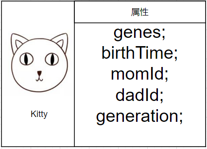

# Content/定义Kitty结构体

到目前为止，我们已经搭建好了ERC721合约的基本框架。接下来，我们需要在ERC721的基础上添加自己的逻辑。

每只小猫的样子都是独特的，那么我们应该如何记录小猫的这些差异呢？我们需要一个变量来存储小猫的基础信息，这包括基因、出生时间、猫妈妈的***TokenId***、猫爸爸的***TokenId***以及迭代次数。

这些基础信息其实就是小猫的属性。为了表示某个物体的属性，我们选择使用结构体。这种数据结构非常适合存储物体的各种属性信息。

对于这些属性，我们选择使用*uint256*类型来表示。选择*uint256*来表示基因的原因是，我们可以根据正整数的大小以及一些奇偶属性来模拟基因的特性。而在Solidity中，时间通常是用*uint256*来表示的，因此出生时间也采用了这种类型。



**Syntax**

struct

- 提示
    
    ```solidity
    //例如这个结构体就表示了每个学生的基础信息
    struct Student {
      uint256 studentid;
      string name;
      uint256 classid;
    }
    ```