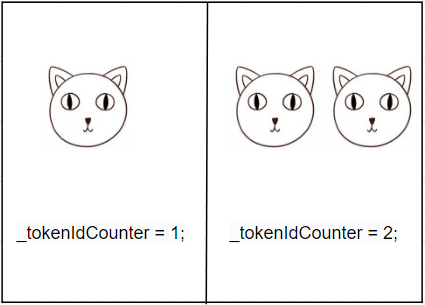

# Content/定义_tokenIdCounter变量

在上一步中，我们已经了解了如何定义小猫。那么，我们该如何记录小猫的数量呢？我们需要引入一个名为***_tokenIdCounter***的变量。这个变量的主要作用是记录当前可用的TokenId，也即小猫的数量。每当成功铸造一个NFT，***_tokenIdCounter***的值都会自动加*1*，指向下一个即将被铸造的NFT的TokenId。这样，我们就能确保每个CryptoKitty都拥有唯一的TokenId，并且我们还可以通过这个变量轻松地追踪NFT的数量和顺序。

由于TokenId是非负的，我们选择使用*uint256*来存储它。

在变量的可见性方面，我们希望所有人都能知道他们即将创建的小猫的TokenId大概是多少，所以我们将其定义为public。

最后，我们需要将这个值初始化为*1*，因为我们希望NFT的TokenId从*1*开始，而不是从*0*。



**Syntax**

variable

- 提示
    
    ```solidity
    uint256 public TokenId = 1;
    ```