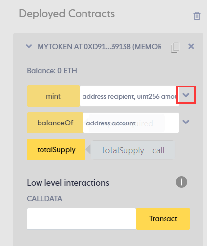

# Content/打开编译器

首先，点击Try it Out来到HackQuest IDE.

---

**TODO**

1. 点击Try it Out 按钮，打开编译器HackQuest IDE.


# Content/编译合约

让我们来编译合约 

> 这会检查我们合约中有没有语法错误
> 

---

**TODO**

1. 选择对应编译器版本
2. 然后点击“**Compile**”编译合约


# Content/本地部署合约

我们首先对我们所写的合约进行功能测试，因此在这一步中，我们不需要将合约直接部署上链，那样每一步操作都会消耗 gas，所以我们先在本地使用 Remix VM 部署合约测试，确认无误后再进行将合约真正部署到区块链上。（合约一旦部署上链后就不可修改，所以一定要谨慎部署。）

---

**TODO**

1. 部署环境选择 Remix VM. (这里我们选择的是 Remix VM（Shanghai）)。
2. 点击 “**Deploy**” 部署合约。


# Content/打开mint函数

还记得之前完成的“铸造”函数吗？现在我们可以通过***mint***函数来铸造代币。

而在铸造之后，我们通常会通过查询函数去查询我们的余额，以确定铸币真的成功了，所以让我们来试试吧~

---

**TODO**

1. 将***mint***函数的下拉框打开



# Content/复制地址并交易

现在我们将调用 ***mint***函数，通过交易来铸造代币。

**TODO**

1. 复制我们的当前的账户地址
2. 将地址填写到***mint***的第一个参数字段
3. 在***mint***的第二个参数字段填写“*100*”
4. 点击**transact**


# Content/查询余额

由于我们刚刚给自己铸造了100个代币，所以我们现在的余额应该是100。让我们来检查一下。

**TODO**

1. 将刚刚***mint***处填写的***recipent***参数复制
2. 填写到***balanceOf***的参数框中
3. 点击***balanceOf***按钮
    
    > 查看返回值应该为100
    > 


# Content/连接账户

很好！到这一步我们已经成功完成了合约的功能测试，确定我们的合约编写无误。我们可以将合约真正部署到链上了！（如果暂时没有部署需求可以跳过接下来的步骤。）

在部署之前，我们需要先连接钱包。本教程中使用 MetaMask 做演示，要完成接下来的步骤，请确保您的浏览器已安装 MetaMask 钱包插件。

---

**TODO**

1. 点击左侧第二个图标
2. 选择 Injected Provider - MetaMask
3. 在Metamask弹出框内点击**Connect**确认将钱包与IDE连接


# Content/链上部署合约

在连接钱包后，我们准备开始将合约部署上链。本教程使用 Mantle 测试链做演示，要完成接下来的步骤，请确保您的钱包配置并切换到了 Mantle 链，且与 IDE 连接的钱包账户中拥有一定的 MNT 测试币。（当然，如果这些操作不太熟悉的话，可以去翻看我们之前教程，有更加详细的介绍。）

---

**TODO**

1. 点击 Deploy
2. 在 MetaMask 弹出框内点击confirm确认交易


# Content/查询合约信息

这是一个真正部署上链的合约！你可以去 Mantle 提供的区块链浏览器中查询相关合约信息。 

查看我们部署的合约，让我们把刚刚部署的合约展开，我们应该可以看到里面的所有公开函数和公开变量。

**TODO**

1. 在Deployed Contracts中复制部署的合约地址。
2. 打开 [Mantle 区块链浏览器](https://explorer.testnet.mantle.xyz/)，查询合约信息


# Example/Code

```solidity
// SPDX-License-Identifier: MIT
pragma solidity 0.8.17;

contract MyToken {
    //mapping类型的变量，用于存储每个地址对应的余额
    mapping (address => uint256) private balances;
    //uint256类型的变量，用于存储Token的总发行量。定义为public，可以被任何人查询。
    uint256 public totalSupply;
    //address类型的变量，用于存储此Token的发行者。用于一些权限控制
    address private owner;

    constructor(){
        owner = msg.sender;
    }

    //用于铸造Token的函数
    function mint(address recipient, uint256 amount) public {
        //权限控制
        require(msg.sender == owner);
        balances[recipient] += amount;
        totalSupply += amount;
    }

    //用于查询对应地址的余额
    function balanceOf(address account) public view returns (uint256) {
        return balances[account];
    }

}
```

