# Content/重新部署合约

由于合约中添加了转账函数，所以我们需要重复之前的合约部署步骤来部署新的合约。

我们先在本地使用 Remix VM 部署合约测试。

---

**TODO**

1. 点击左侧第一个按钮，再点击“**Compile**”编译合约
2. 点击左侧第二个按钮，再点击“**Deploy**”部署合约

（如果忘了怎么部署，可以翻看之前的教程）

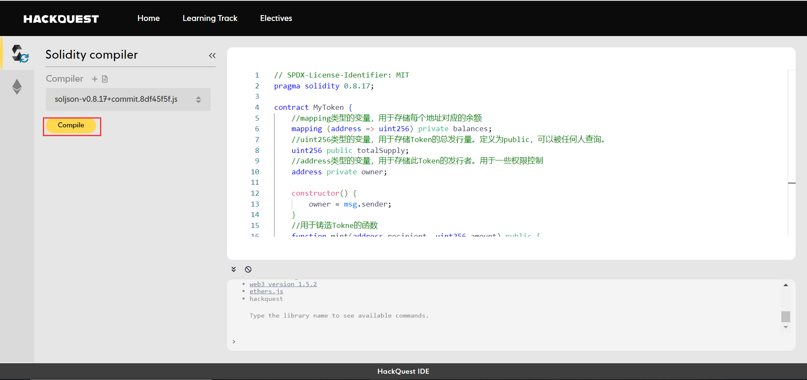

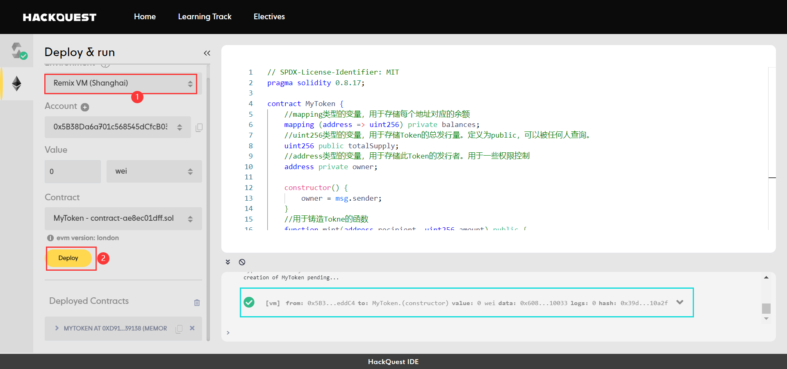

# Content/打开mint函数

要想完成转账，我们需要现拥有代币。所以我们仍然需要重复之前的交互操作-“铸造”

---

**TODO**

1. 将***mint***函数的下拉框打开


# Content/铸造代币

现在我们将调用***mint***函数，通过交易来铸造代币。

**TODO**

1. 复制我们当前的账户地址
2. 将地址填写到***mint***的第一个参数字段
3. 在***mint***的第二个参数字段填写“*100*”
4. 点击**transact**


# Content/查询余额

由于我们刚刚给自己铸造了100个代币，所以我们现在的余额应该是100。让我们来检查一下。

**TODO**

1. 将刚刚***mint***处填写的***recipent***参数复制
2. 填写到***balanceOf***的参数框中
3. 点击***balanceOf按钮***
    
    > 查看返回值应该为100
    > 

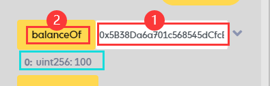

# Content/切换到新账号

到此为止，你应该确认的是“*0x5B38……*”这个地址拥有*100*枚你的自定义代币。

接下来我们要将40枚代币转出，首先我们在**Account**中找到第二个默认地址“*0xAb8…*”。

> 目的是为了复制这个账户的地址
> 

**TODO**

1. 点击**ACCOUNT**的展开框
2. 切换到第二个默认账号
3. 复制第二个账号的地址


# Content/切换到原账号

接下来，我们需要切换回第一个账号。

**TODO**

1. 切换回原账号

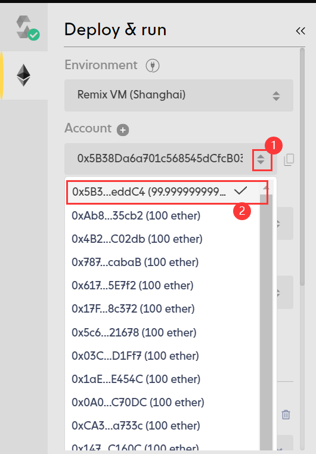

# Content/开始转账

此时我们应该已经切换回了第一个部署者地址，随后就可以使用该地址对刚刚复制的第二个地址转账了！

**TODO**

1. 打开***transfer***函数的下拉框
2. 将刚刚复制的第二个地址填入第一个参数
3. 第二个参数填40

> 这是要转账的金额，大家也可以自己设定，但**不能超过**我们的余额*100*
> 
1. 点击**transact**提交交易

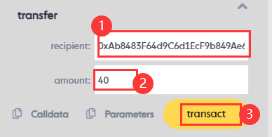

# Content/查询当前地址余额

随后我们可以使用查询函数查询两个账号的余额，以确定转账已经成功了。

首先我们先查询转账者账号的余额，理论上来讲，在转账前其拥有*100*枚代币，转出了*40*，应该还剩*60*。

让我们来验证一下吧！

**TODO**

1. 再次点击***balanceOf***函数
    
    > 查询结果显示该账号的余额已经变为了*60*，验证了我们之前的说法。
    > 
    
    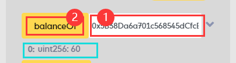
    

# Content/查询另一地址余额

接下来我们再来验证一下收款者是否收到了这笔转账。

**TODO**

1. 将第二个地址复制
2. 粘贴到***balanceOf***的参数框中
3. 点击函数名***balanceOf***调用
    
    > 可以看到收款者的余额确实增加了*40*！
    > 

> 那么到此为止，我们成功的完成了代币的一整套基础流程！
> 

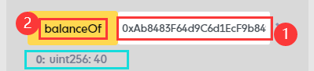

# Content/连接账户

很好！到这一步我们已经成功完成了合约的功能测试，确定我们的合约编写无误。我们可以将合约真正部署到链上了！（如果暂时没有部署需求可以跳过接下来的步骤。）

在部署之前，我们需要先连接钱包。本教程中使用 MetaMask 做演示，要完成接下来的步骤，请确保您的浏览器已安装 MetaMask 钱包插件。

---

**TODO**

1. 点击左侧第二个图标
2. 选择 Injected Provider - MetaMask
3. 在 MetaMask 弹出框内点击 **Connect** 确认将钱包与IDE连接

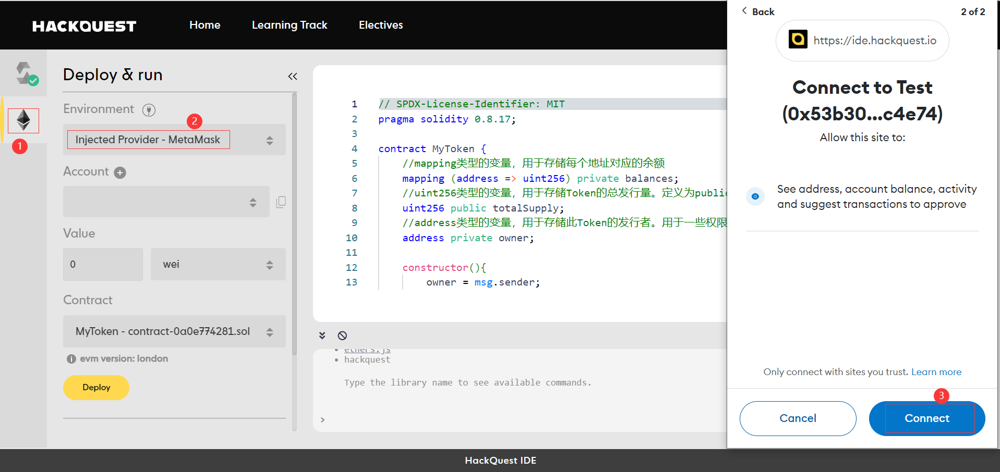

# Content/链上部署合约

在连接钱包后，我们准备开始将合约部署上链。本教程使用 Mantle 测试链做演示，要完成接下来的步骤，请确保您的钱包配置并切换到了 Mantle 链，且与 IDE 连接的钱包账户中拥有一定的 MNT 测试币。（当然，如果这些操作不太熟悉的话，可以去翻看我们之前教程，有更加详细的介绍。）

---

**TODO**

1. 点击 Deploy
2. 在 MetaMask 弹出框内点击confirm确认交易

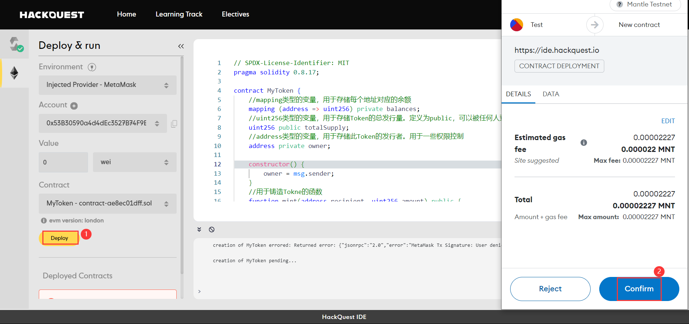

# Content/查询合约信息

这是一个真正部署上链的合约！你可以去 Mantle 提供的区块链浏览器中查询相关合约信息。 

查看我们部署的合约，让我们把刚刚部署的合约展开，我们应该可以看到里面的所有公开函数和公开变量。

**TODO**

1. 在Deployed Contracts中复制部署的合约地址。
2. 打开 [Mantle 区块链浏览器](https://explorer.testnet.mantle.xyz/)，查询合约信息

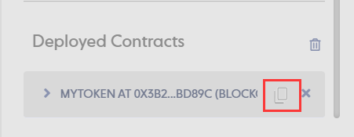

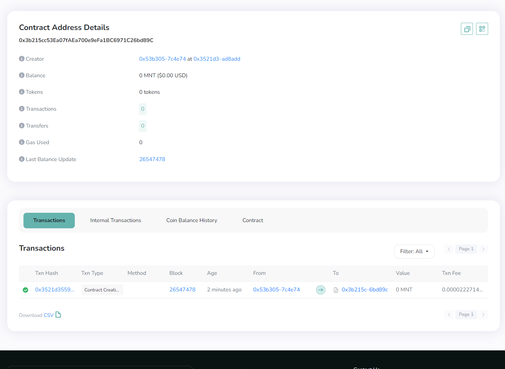

# Example/Code

```solidity
// SPDX-License-Identifier: MIT
pragma solidity 0.8.17;

contract MyToken {
    //mapping类型的变量，用于存储每个地址对应的余额
    mapping (address => uint256) private balances;
    //uint256类型的变量，用于存储Token的总发行量。定义为public，可以被任何人查询。
    uint256 public totalSupply;
    //address类型的变量，用于存储此Token的发行者。用于一些权限控制
    address private owner;

    constructor() {
        owner = msg.sender;
    }
    //用于铸造Tokne的函数
    function mint(address recipient, uint256 amount) public {
        //权限控制
        require(msg.sender == owner,"Only the owner can perform this action");
        balances[recipient] += amount;
        totalSupply += amount;
    }
    //用于查询某个地址对应的Token余额
    function balanceOf(address account) public view returns (uint256) {
        return balances[account];
    }
    //用于转账的函数
    function transfer(address recipient, uint256 amount) public returns (bool) {
        require(amount <= balances[msg.sender], "Not enough balance.");
        balances[msg.sender] -= amount;
        balances[recipient] += amount;
        return true;
    }
    
}
```
