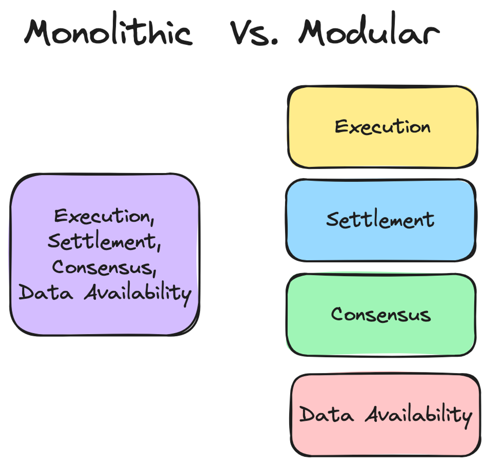

# Content/内容

### 目标

本节的目标是学习 Mantle 公链的模块化架构。

### **模块化架构**

Mantle 团队在实际做设计的时候，考虑到传统 OP Rollups 方案的局限性，于是创新性地引入了模块化 Rollups 设计，旨在提高其效率和性能。

区块链的模块化架构是一种新型的区块链架构，在这种结构中，区块链的主要功能（比如执行交易、达成共识、结算和数据存储）被分散到不同的专业层级上。这就像是在一个大公司里，不同的部门各司其职，负责不同的业务一样。

### 模块化的区块链有什么优势呢？

模块化设计可以让系统更具灵活性和可扩展性。每个层级既专注于特定功能，也可以独立地进行升级和优化，尽可能不影响其他层级的功能运行。例如：

- 共识层：负责区块链网络的共识机制，可以独立于交易处理进行优化，比如我们可以引入更高效的共识算法来提高验证速度，而不影响执行层和数据层的效率。
- 数据层：处理数据存储和传输，比如我们可以采用新的技术来提升数据层的可扩展性，处理和存储更大批量的交易，而不影响共识机制的安全性和执行层的计算速度。

这种模块化架构提升了区块链系统的整体性能，使得各个层级都可以独立优化，提高了整体系统的灵活性和可扩展性，从而能更好地满足未来的发展需求。

### 下一节

Alice 听说 Mantle 公链已经设计完毕了，于是她想来亲自体验一下。
从下一小节开始，我们转换一下视角，把自己当成一笔 Alice 发起的普通交易，看一下我们在 Mantle 公链内部是怎么运转的，整个的生命周期是怎样，又有哪些组件帮助了我们的流转。
这样的话，就是从第一视角学习 Mantle 的技术原理了。怎么样？很期待吧。