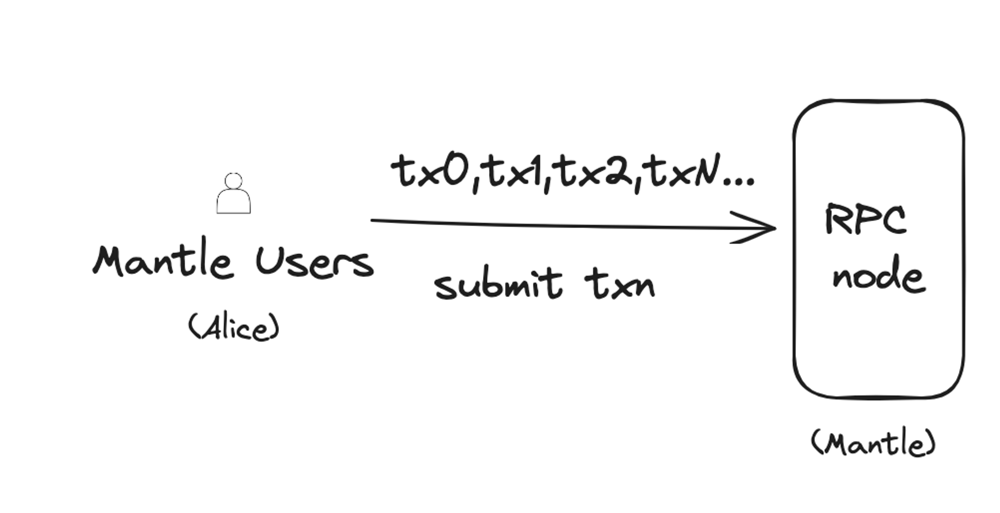
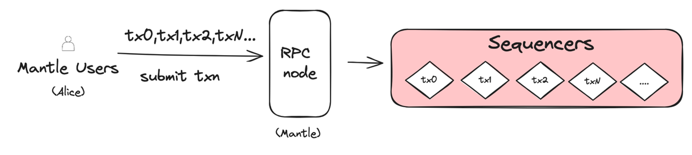

# Content/内容

### 目标

本节的目标是学习一笔交易在 Mantle 公链中是怎么被发起和处理的。

### **发起交易**

1. Alice 首先需要确保她有一个数字钱包能够与 Mantle 网络交互，这个很简单直接从 Mantle 官方网站去下载安装就可以了。钱包里面添加了 Mantle 网络的 RPC（远程过程调用）节点地址，通过 RPC 节点就可以与 Mantle 网络进行通信了，允许她的钱包发送和接收信息。
    - 关于 RPC ：全称是远程过程调用（Remote Procedure Call）。它是一种通信机制，允许一台计算机（客户端）通过网络请求另一台计算机（服务器）上的程序来执行某些特定的任务。简而言之，就是 RPC 允许你的设备通过网络告诉另一台设备去做某件事。
    - RPC 在区块链中的应用：在区块链技术中，RPC 扮演了连接用户（如 Alice）和区块链网络（如 Mantle）的桥梁的角色，Alice 的钱包设备（客户端）通过 RPC 与 Mantle 网络上的节点（服务器）进行交互。
2. 当 Alice 想要在 Mantle 区块链上进行交易时，
    - 她打开自己的数字钱包，选择转账功能，输入了 Bob 的地址和她想要转账的金额；
    - 发送交易前，钱包会检查她的账户余额是否足够。如果余额不足，交易将无法进行；
        - 钱包是怎么知道 Alice 的余额的呢？通常有两种方式
            - 钱包会定期调用 RPC 接口从二层网络获取 Alice 的账户余额，并缓存在钱包本地
            - 有一个钱包提供方的爬块程序会负责爬取一层网络共识的 block，实时 push Alice 在主链上的余额变动信息给钱包应用。
    - 一旦确认余额充足，Alice 点击发送。她的钱包软件（客户端）会通过 RPC 向 Mantle 网络中的节点发送交易请求。这个请求包括了交易的具体细节，如收款人地址、转账金额等。
    - Mantle 节点接收到 Alice 的交易请求后，会开始处理这笔交易，这标志着 Alice 向 Bob 转账的过程正式开始。

### **处理交易**

1. Alice 的转账请求已经通过 RPC 节点发送出去后，Mantle 网络中的一种特殊节点 Sequencer，会接收并处理这个请求。
    - 关于 Sequencer ：Sequencer 的主要任务是将收到的交易（比如 Alice 的转账请求）进行有效的排序和打包。Sequencer 的角色可以比喻成邮局的处理中心，它们会把接收到的所有快递包裹，进行分拣和打包。
    - Mantle 本身是基于 OP Rollup 扩容解决方案实现的，Sequencer 是 OP Rollup 技术中的一个常见组件，它允许 Mantle 网络处理更多的交易，提高交易处理速度和降低成本。在 Mantle 架构中，Sequencer 负责收集、排序和打包交易，之后会有另外一个模块（后面的章节会展开描述）负责将这个打包后的区块提交到一层网络。
2. 交易打包的必要性：
    - 在 Alice 的转账例子中，不仅仅是她一个人在进行交易。在同一时间，可能有成百上千的人也在 Mantle 区块链上执行类似的操作，比如转账、执行智能合约等。
    - 如果 Mantle 网络单独对每一笔交易都立刻进行一次 rollup 到一层网络的操作，那么处理时间会显著增加，网络也可能因此变得拥堵。
    - 因此 Sequencer 将众多交易，例如 Alice 和其他用户的转账请求，打包成一个区块。这种方法类似于将许多小包裹合成一个大包裹，从而减少了 rollup 的总工作量。
3. Squencer 带来的好处分析：
    - 降低网络拥堵：通过累计很多交易再统一提交的方式，大幅减少了新交易在 Layer2 需要等待的时间，从而降低了网络的拥堵。
    - 提高处理速度：当交易被合并并作为一个区块提交时，主链只需验证和确认这一个区块，而不是成百上千的单独交易，这大大加快了整体处理速度。
    - 节省资源：这种方法减少了主链上的计算和存储需求，因为处理一个包含多个交易的区块，比处理相同数量的单独交易更节省资源。
4. Mantle 相比于 Ethreum 对于用户交易的直接影响:
    - 对于 Alice 来说，这意味着她在 Mantle 的转账请求可以更快得到处理，更重要的是，交易费用相比之前在以太坊主网转账要便宜非常多，通过打包，交易费用就会在该区块的所有交易中进行平摊。降低交易费用，对于频繁进行交易的用户和需要大规模交易的场景来说尤为重要。

综上，Sequencer 在 Mantle 网络中不仅提高了交易处理的效率，还通过打包交易降低了单个用户的交易费用，使得整个区块链网络更加经济高效。对于像 Alice 这样的普通用户来说，这种方法不仅加速了她的转账处理，还降低了她的成本负担，提高了区块链技术的实用性。

### 下一节

下一小节我们来学习一下交易在 Mantle 中是怎么传输的，最终又是怎么提交到一层网络的。