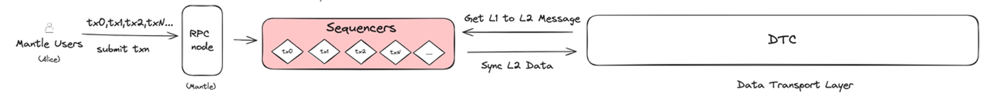

# Content/内容

### 目标

本节的目标是学习一笔交易在 Mantle 公链中是怎么传输的，最终又是怎么被提交到一层网络的。

### **传输交易**

1. 一旦 Alice 的交易被某个 Sequencer 打包进一个区块，这个区块就准备好被进一步处理和验证了。可是别的 Mantle 节点还不知道这个交易呢，因此 Mantle 网络节点之间需要做一个信息传输层来共享新交易的信息。
2. 于是 DTL (Data Transport Layer) Service 出现了，该服务负责同步由 Sequencers 创建的区块数据。DTL 的作用可以比喻为一个高效的信息分发中心，它确保网络中的每个节点都能接收到最新的区块数据。
3. DTL 的同步功能
    - 一旦 Sequencer 完成了一个区块的创建，DTL 会从 Sequencer 获取这些新生成的区块数据。
    - 它不仅会将数据同步到其他普通节点，也会同步到网络中的其他关键组件，比如用于验证和确认交易的节点（后面会学习）；
    - 这个同步过程对于网络的整体运行至关重要，因为它确保了网络中的每个参与者都能基于相同的最新数据进行操作和验证。
4. 对用户的直接影响:
    - 对于 Alice 来说，DTL 的高效运作意味着她的转账请求在整个 Mantle 网络中得到了迅速的传播和确认。
    - 这确保了她的交易不仅被快速处理，而且被网络中的其他组件及时识别和验证，从而提高了交易的可靠性和安全性。

总之，我们可以看到，数据传输层（DTL）在 Mantle 网络中扮演着极其重要的角色。它不仅确保了交易数据在网络中的及时同步，还保证了整个网络可以高效和一致地运作。对于 Alice 和其他用户来说，这意味着他们的交易能够在一个安全、可靠且高效的环境中得到处理。

### **提交交易**

Mantle 中用于提交区块交易到一层网络的组件叫做 Batch Submitter。
在介绍 Batch Submitter 组件之前，我们先学习关于 StateRootData 的概念，这对于我们接下来的学习至关重要。

1. 在区块链系统中，特别是在 Layer 2 解决方案中，直接处理和存储所有交易数据可以非常耗费资源。这会导致处理速度变慢，增加存储需求，降低整体网络效率。
2. 如果能只提交全部数据的压缩版而不是全部数据，而且保证这份压缩版的数据可以有效地验证区块链的当前状态，这将大幅提高了验证过程的效率，而我们接下来要提到的 StateRootData 就是将全部数据做压缩的一种方式。
3. 在目前的 Layer 2 方案中，主要目标之一就是减轻主链的负担。Mantle 也是如此，如果可以通过只提交部分证明数据到主链，就可以减少对主链资源的需求，同时能继续保持 Layer 2 交易的安全性和不可更改性

### **StateRootData**

有了 StateRoot 的前置知识之后，Alice 在 Mantle 区块链上向 Bob 转账的交易会被纳入一个区块，也会生成一个新的 StateRoot 表示当前区块链的状态，这时候我们又有疑问，如何使用 state root data，接下来我们就可以来介绍 batch submitter，

1. Batch Submitter 的职责：
    - Batch Submitter 的主要任务是收集由 Sequencer 处理并打包进区块的所有交易更新后的 StateRoot；
    - Batch Submitter 不会直接提交这些 Stateroot 数据到 Layer1 而是将这些更新的 Stateroot 发送到阈值签名方案（TSS）模块（后面会详细介绍），TSS 模块会通过多方计算并签名，来实现正式提交前的提前验证。
    - TSS 模块中的节点负责验证这些 Stateroot 的有效性并签名。一旦确认这些Stateroot是有效的，就意味着包含在区块中的交易是正确且可以被信任的。
    - 确认 Stateroot 有效后，Batch Submitter 将这些签名后的 Stateroot 数据发布到 Layer 1 上的智能合约 State Commitment Chain（SCC）（后面会详细介绍），以太坊主链上记录这些信息用于后续的验证。
2. 对用户使用的直接影响:
    - 比如对于 Alice 的这次转账来说，Batch Submitter 的运作确保了她的交易状态被准确地记录在 Layer 1上，在本来降低交易费用的基础上，这个功能又增加了交易的透明度和可信度。
    - 本质就是确保 Layer 2 上的交易最终在 Layer 1 上得到确认和验证的关键环节，从而为用户比如 Alice 的转账提供了额外的安全保障。

总结来说，Batch Submitter 在 Mantle 网络中扮演着关键角色，它通过 TSS 的提前验证确保了交易数据的准确性，再通过将数据发布到 Layer 1 的 SCC 合约，提高了整个区块链系统的透明度和可靠性。对于像 Alice 这样的用户来说，这意味着她的转账操作不仅在 Mantle 上得到快速处理，而且在整个以太坊网络中都得到了充分的确认和记录。

### 下一节

下一小节我们来学习一下 TSS 模块是怎么提前验证交易的，以及 Layer1 上的 SCC（State Commitment Chain）是怎么处理 Mantle 提交的新区块的。