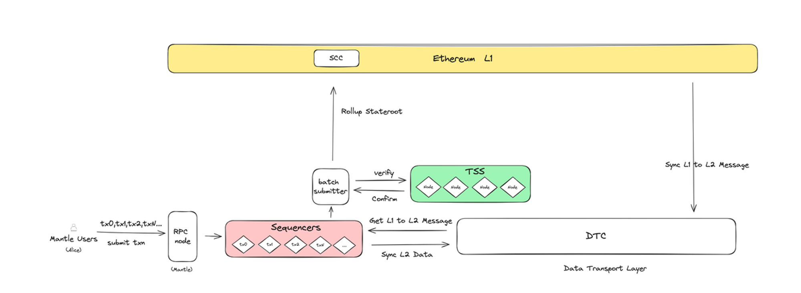
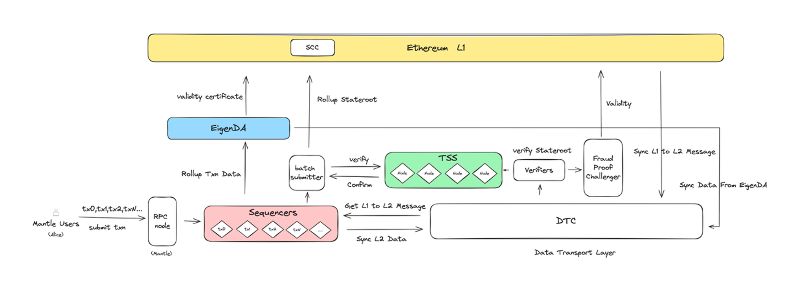

# Content/内容

### 目标

本节的目标是学习 TSS 模块是怎么在 Layer2 提前验证交易的，以及 Layer1 上的 SCC（State Commitment Chain）是怎么处理 Mantle 提交的新区块的。

### **阈值签名方案（TSS）模块**

在探索 Alice 向 Bob 进行转账的过程中，我们已经了解了她的交易如何从一个简单的网络请求，到在 Mantle 区块链网络上成为一个正在被处理的数据。
让我们简单回顾下这个过程，Alice 的交易经过被 Sequencers 成功处理，并添加到一个区块中，再通过 DTL 在整个网络中传播，接下来 Batch Submitter 组件收集了这些交易导致区块链状态更新的 State root，然后发送到阈值签名方案（TSS）模块来验证并签名，最后再发送到 L1。
所以，接下来就让我们一起认识验证交易的关键模块 —— 阈值签名方案（TSS）。

1. 背景介绍:
    - 在传统的 OP Rollups Layer 2 解决方案中，一个突出的问题就是：较长的挑战期。所以，一旦 Mantle 面临长时间的挑战，对希望交易能得到快速确认的用户来说，如 Alice，显然会带来不便
    - 为了应对这一问题，Mantle 网络引入了阈值签名方案（TSS），这个方案的关键并不是说直接缩短挑战期，而是通过在 Layer 2 上提供一个更有效的交易验证机制，实现了在 Layer 2 上的提前验证，从而间接地减少了对长时间挑战期的依赖。
    - 例如，当 Alice 在 Mantle 网络上发起交易时，TSS 就能够在 Layer 2 上快速且提前验证她交易的正确性，这种效率的提高在保证交易安全性的同时，还提高了整个网络的效率。
2. TSS 实现原理
    - 阈值签名方案（TSS），本质就是用分布式密钥与数字签名的结合，TSS 允许网络中的每个验证的参与者利用自己独有的私钥，把同一份输入的信息生成有效的签名，最后只要有足够多的诚实参与者，也就是足够多的签名是被确认为有效的，那这个签名数据也就是输入的信息，就可以被确认是有效的。
        
        这样，私钥不再是单点故障，因为每个TSS客户端只持有私钥的一部分。
        
    - 想象一下，Alice 正在使用一个特别的保险箱，而这个保险箱的开锁密码是分散在多个可信任的朋友手中的。这就类似阈值签名方案（TSS）的基本原理。
        - 这个保险箱的独特之处在于支持协作开锁，每个人都只持有完整密码的一部分，需要验证时，每个持有密码片段的人都输入自己的密码片段，当足够多诚实的人正确输入他们的密码时，保险箱就会打开。
        - 即使有一两个人输入了错误的密码，或者故意误导，只要大多数人正确输入他们的密码片段，保险箱仍然会打开。
        - 当需要验证如 Alice 的转账这样的交易时，这些持有密钥部分的参与者必须共同合作，他们需要各自使用自己的密钥来创建一个完整的签名，实现共同验证。
        - 这就像是他们每个人都提供了保险箱密码的一部分，只有把这些密码片段组合起来，才能打开保险箱。
        - 这种方法的优点在于，即使其中一些参与者不诚信，只要有足够多的诚实参与者，就能正确验证 Alice的交易。
        - 因为完整的密钥不只是掌握在一个人手中，所以就没有单点故障的风险，这使得整个系统更加去中心化，更加安全和可靠。
    
    
    

### **SCC（State Commitment Chain）**

随着 Alice 的交易在Mantle 网络上被 TSS 进一步验证并确认为有效后，Batch Submitter 组件就可以放心提交这些被 TSS 签名确认的 State root 数据了，接下来我们有疑问的是 Batch Submitter 要把这些数据提交到哪里呢？
我们现在转向另一个关键组件 —— SCC（State Commitment Chain）。SCC 是 Mantle 区块链架构中一个至关重要的环节，它在 Layer1 上发挥着桥梁的作用。

1. 背景介绍
    - 在区块链网络中，尤其是像 Mantle 这样的 Layer 2 解决方案里，确保不同层级之间的数据同步和验证是至关重要的。比如，Alice 的转账在 Layer 2 上处理完还不够，同时还要确保在Layer 1（以太坊主链）上得到准确记录。
    - 就需要一种机制来记录 Layer 2 的交易状态并确保可以这些交易可以随时被验证，SCC 正是为了满足这种需求而设计的，它作为一个智能合约，可以确保 Alice 在 Layer 2 上的交易状态能够在 Layer 1 上得到验证和记录。
2. 作为 Layer 2 与 Layer 1 之间的桥梁
    - 我们回顾下刚刚提到的问题：Batch Submitter 要把这些验证成功的 State root 数据提交到哪里呢？没错，就是 SCC ，它是一个部署在以太坊主链上的智能合约，负责接收来自 Batch Submitter 的已签名 State root 并记录保存。
    - Batch Submitter 就好比一个快递员，它的工作是把在 Layer2 验证好的 State root 数据（比如 Alice 发起交易后的 Balance）送到 Layer1 主链。而这些信息被送到的地方叫做 SCC，它像一个收件箱，安装在以太坊主链上，专门用来接收这些信息。
3. 关于记录和验证
    - 一旦 TSS 验证了交易状态并通过 Batch Submitter 提交，SCC 便将这些信息记录在以太坊主链上，因此，像 Alice 交易就实现了不可篡改和永久记录。
    - 任何人都可以通过检查 Layer1 上的 SCC 合约来验证 Layer2 状态更新是否正确，增加了整个过程的透明度和可信度。
4. 作用和好处：
    - 主要是解决争议和提高安全性。如果在 Layer 2 上用户（Alice）的交易数据引起争议，可以随时通过在 SCC 上记录的信息来验证和解决争议，这为 Mantle 网络提供了额外的安全层。

总之，通过 SCC，Mantle 网络不仅在 Layer 2 上有效处理了用户的交易，还在整个以太坊网络中得到了确认和记录，大大增强了用户对整个交易过程的信任。SCC 的存在使得整个系统对于用户如 Alice 来说，是更加可靠、透明和安全。

### **StateRootData**

有了 StateRoot 的前置知识之后，Alice 在 Mantle 区块链上向 Bob 转账的交易会被纳入一个区块，也会生成一个新的 StateRoot 表示当前区块链的状态，这时候我们又有疑问，如何使用 state root data，接下来我们就可以来介绍 batch submitter，

1. Batch Submitter 的职责：
    - Batch Submitter 的主要任务是收集由 Sequencer 处理并打包进区块的所有交易更新后的 StateRoot；
    - Batch Submitter 不会直接提交这些 Stateroot 数据到 Layer1 而是将这些更新的 Stateroot 发送到阈值签名方案（TSS）模块（后面会详细介绍），TSS 模块会通过多方计算并签名，来实现正式提交前的提前验证。
    - TSS 模块中的节点负责验证这些 Stateroot 的有效性并签名。一旦确认这些Stateroot是有效的，就意味着包含在区块中的交易是正确且可以被信任的。
    - 确认 Stateroot 有效后，Batch Submitter 将这些签名后的 Stateroot 数据发布到 Layer 1 上的智能合约 State Commitment Chain（SCC）（后面会详细介绍），以太坊主链上记录这些信息用于后续的验证。
2. 对用户使用的直接影响:
    - 比如对于 Alice 的这次转账来说，Batch Submitter 的运作确保了她的交易状态被准确地记录在 Layer 1上，在本来降低交易费用的基础上，这个功能又增加了交易的透明度和可信度。
    - 本质就是确保 Layer 2 上的交易最终在 Layer 1 上得到确认和验证的关键环节，从而为用户比如 Alice 的转账提供了额外的安全保障。

总结来说，Batch Submitter 在 Mantle 网络中扮演着关键角色，它通过 TSS 的提前验证确保了交易数据的准确性，再通过将数据发布到 Layer 1 的 SCC 合约，提高了整个区块链系统的透明度和可靠性。对于像 Alice 这样的用户来说，这意味着她的转账操作不仅在 Mantle 上得到快速处理，而且在整个以太坊网络中都得到了充分的确认和记录。

### **Verifier Node**

Alice 的交易经历了 Mantle 网络中的多个重要阶段，打包、验证、确认，其实对于这笔交易在 Mantle 网络上的运作已经接近完成了，但接下来我们要来看一个至关重要的环节 —— Verifier Node。这些节点是 Mantle 网络中维护数据完整性和安全性的守护者。

1. 背景介绍:
    - 在我们前面介绍的 Mantle 网络里，虽然 TSS 已经为交易验证提供了一个可靠的 TSS 提前验证层来保证安全性，但还需要一个更全面的验证机制来确保系统的完整性和安全性。这就是 Verifier Node 的职责所在。
    - Verifier Node 的出现，就是为了在 Mantle 网络中提供一层额外的安全保障，确保像 Alice 这样的用户交易还有一群“哨兵守护者”随时来确保每一笔交易的准确性和真实性。
2. 检查方式
    - Verifier Node 会从 DTL 同步 Layer 2 的区块数据，并负责核实这些数据的有效性。
    - 它们也会检查 Sequencer 提交的每个交易块的 StateRoot，以确保其与已知的正确状态相匹配。这是通过与 Layer1 记录的数据进行对比来完成的，从而确保 Layer2 的数据准确无误。
    - 对 Alice 来说，这意味着她的交易不仅得到了 TSS 的验证，还有这个独立的“审计员”来确保其完整性。
3. 处理数据争议
    - 如果 Verifier Nodes 从 数据可用性层（Mantle DA，下一节我们会详细介绍）提取的数据中发现任何问题（可能是引发争议的交易和状态更新），它们可以通过提交 Fraud Proof 来挑战这些数据。这个 Fraud Proof 包含了足够的信息来证明某笔交易或状态更新是错误的。例如，Alice 发起了一笔交易，但一个 Verifier Node 发现交易的处理过程存在问题。该节点就可以生成一个 Fraud Proof 并提交给网络，以指出这个错误。
        - 备注：Fraud Proof 是区块链网络中的一种机制，用于允许参与者在怀疑某笔交易或区块数据存在问题时，提出挑战。这通常在 Layer2 解决方案中被广泛使用，尤其是在 OP Rollups 类型的解决方案中。
    - 当 Fraud Proof 被提交到网络时，Layer1 的智能合约会利用这些证据来检查 Layer2 提交的状态更新是否合法。这个过程就是状态转换验证。
    - 状态转换验证是一种确保区块链网络中状态更新正确性的过程，它涉及到检查特定的交易或一系列操作是否按照原来设定好的规则正确地执行。例如，如果 Alice 的交易被挑战，Layer1 合约会检查提供的数据，以确认这个交易是否真的按照规则改变了区块链网络状态。如果验证失败，说明 Layer2 的状态更新确实有误。
    - 通过这种方式，可以确保即使在 Layer2 发生错误，Layer1 也能作为最终的审查者，提供一个安全网，确保整个系统的准确性和完整性。

综上，Verifier Node 在 Mantle 网络中扮演着至关重要的角色，不仅补充了 TSS 的功能，还为整个系统提供了另一层的数据验证和安全保障。对于普通用户如 Alice 来说，这意味着她的交易不仅快速，还非常安全可靠。通过这种有效的验证机制，Mantle 网络能够在保持高效率的同时，确保了数据的完整性和安全性。

### 下一节

恭喜大家学习完 Mantle 上的交易是怎么验证的，下一小节我们就将学习 Mantle Layer2 数据是怎么存储的。

# **Learn More**

### TSS 技术细节

1. TSS 技术实现步骤:
    - 私钥生成
        - 每个 TSS 客户端节点会运行一个私钥生成函数，产生自己独有的私钥，然后再根据这个私钥生成公钥。TSS 独特的设计会使每个客户端产生相同的公钥，而私钥是独一无二的。
        - 相当于在保险箱例子中，每个人会被分配一个独特的开锁密码，通过这个密码可以生成保险箱的公开编号，也就是这个开锁密码是对应这个编号的密码锁的。
    - 签名过程
        - 签名函数接受所有客户端获取到的公共输入作为要签名的消息，并使用私钥去生成签名数据。 比如在 Alice 发起转账后，他们可以用自己的私钥对这些交易进行签名，这就是 TSS 节点用他们自己的方式确认“是的，这笔交账是有效的，可以进行”。
    - 验证算法
        - 验证算法会把上面签名好的数据，利用公钥进行验证，这个过程就好比是用一个检测器来确保 TSS 节点的回答是正确且一致的，如果匹配，就意味着 Alice 的转账是有效且可以被信任的，最后 TSS 节点管理就可以统一对外说，这些交易已经被确认了。
2. TSS 如何管理不诚实行为
    - 每个参与的 TSS 节点需要在以太坊上抵押固定数量的 $MNT 作为部署的条件，一旦检测到恶意欺诈行为，其抵押将被削减。
    - 综上，我们知道 Mantle 网络引入多个 TSS 节点来验证由 Sequencers 发送的区块数据并对其签名，保证其正确性，多个节点共同参与到交易的验证过程，可以降低交易出错的风险。
    - 对 Alice 或者其他用户来说，这意味着她们的转账不仅能够快速处理，还有额外的安全保障。因为没有单个点的故障能够妨碍或篡改她的交易。
    - 而且这种在 L2 层的提前验证不仅提高了交易确认的速度，可以减少了对Layer 1 验证的依赖，缩短 L1 层的挑战期，也意味着在出现错误或欺诈行为时，系统可以更快地响应并纠正，从而提高整体网络效率。
3. 其他备注：（在主网Alpha阶段，所有TSS节点将由Mantle核心贡献团队授权。）