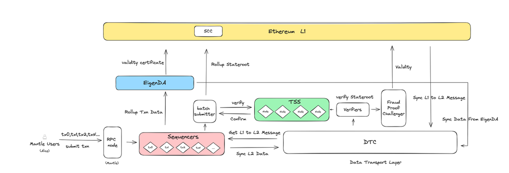

# Content/内容

### 目标

本节的目标是学习 Mantle Layer2 数据是怎么存储的。

### **EigenDA（Mantle DA）**

随着 Alice 的交易在 Mantle 网络上的各个阶段逐步得到处理和验证，交易的验证签名数据我们也由 Batch Submitter 提交到主链上的 SCC 记录存档了，接下来我们关注的是这些原始的交易数据要存储在何处，以及如何确保其完整性和可访问性。
这就引出了Mantle区块链中的另一个关键组件 —— EigenDA（Mantle DA）。

1. 背景介绍:
    - 在传统的区块链系统，尤其是在 OP Rollups 等 Layer2 解决方案中，虽然将计算转移到了链下，提高交易速度并减少了交易费用，但最后还是需要将交易数据打包并发布到 Layer1 ，随着网络参与率的不断增长，需要存储的数据量未来还是会急剧增加，处理和存储所有交易数据是一项挑战。
        
        例如，Alice 的转账虽然在 Layer2 上快速处理，但完整数据最终仍需在 Layer1（例如以太坊主链）上得到记录和确认。
        
    - 因此，我们需要一种既能提高交易吞吐量，还能确保所有交易数据仍然是可访问、可验证的高效数据存储方案，这就是 EigenDA 的诞生原因。我们前面知道了 SCC 是 Layer2 与 Layer1 之间的桥梁，SCC 记录着原始交易数据的压缩数据证明，而 Layer2 上的 EigenDA 存储着原始的交易数据，这就是实现了 Mantle 网络上的交易在这两个层级间无缝对接。
2. 数据存储与完整性保证:
    - EigenDA 作为 Mantle 网络的一个数据可用性层，负责存储所有rollup交易的数据。这就像是一个巨大的数字档案库，保存着 Alice 和其他用户的所有交易记录。
    - 重要的是，EigenDA 不仅存储数据，还保证了数据的完整性和透明性，使得任何人都能验证交易和区块的有效性。
3. 作用和好处
    - EigenDA 的一个主要优势是能够减轻主链上的负载。它通过仅发布很小的压缩数据到主链上，处理和存储更大量的交易数据，从而提高了整个系统的效率。
    - 对于像 Alice 这样的用户来说，她直接感受到体验，不仅是交易快速，而且费用更低。
4. 其他
    - 目前 Mantle 使用的是 EigenLayer 提供技术支持的 MantleDA 方案，等到 EigenLayer 主网上线后，就可以直接使用功能更完整 EigenDA。

总结来说，EigenDA 在 Mantle 网络中扮演着数据可用性层至关重要的角色。它不仅确保了所有交易数据的安全存储和快速访问，还通过其先进的技术极大地提高了数据处理效率和系统的整体性能。对于像 Alice 这样的用户来说，EigenDA 的存在使得她的交易体验更加顺畅，安全和透明。

### 下一节

到此，Alice 在 Mantle 区块链上的转账之旅已经结束，下一小节，我们将回顾 Alice 的交易与 Mantle 的交互过程来总结 Mantle 的架构设计。